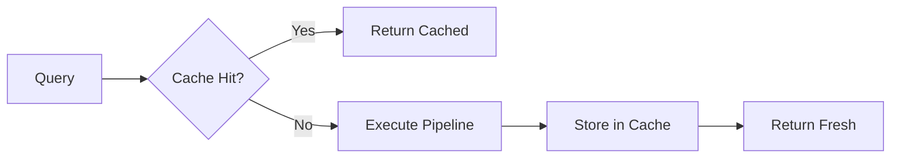

Effective caching reduces latency, lowers inference costs, and improves user experience. Mixpeek supports retriever-level and stage-level caching with configurable TTLs and invalidation strategies.

## Cache Architecture



Cache keys are computed from:
- Retriever ID
- Input parameters (normalized)
- Filters and sort criteria
- Stage configurations (if stage-level caching)

## Cache Levels

### Retriever-Level Caching

Caches entire execution results:

```json
{
  "retriever_name": "product-search",
  "cache_config": {
    "enabled": true,
    "ttl_seconds": 300,
    "cache_key_fields": ["inputs.query", "filters"]
  }
}
```

**When to use:**
- Identical queries are common (e.g., trending searches, popular categories)
- Expensive pipelines with multiple stages
- Results don't change frequently

### Stage-Level Caching

Caches specific stage outputs within a pipeline:

```json
{
  "cache_config": {
    "enabled": true,
    "cache_stage_names": ["web_search", "llm_generation"]
  }
}
```

**When to use:**
- Some stages are expensive (LLM, web search) but others must be fresh (filters, sorts)
- Partial cache hits provide value
- Different queries share intermediate results

### Feature Store Caching

Embeddings are cached implicitly in Qdrant vectors. Re-embedding identical text is avoided automatically.

## TTL Selection Guide

| Use Case | Recommended TTL | Rationale |
|----------|-----------------|-----------|
| **Real-time dashboards** | 10-30 seconds | Balance freshness vs load |
| **Product search** | 5-15 minutes | Inventory changes slowly |
| **Customer support KB** | 30-60 minutes | Documentation is stable |
| **News/trending content** | 1-2 minutes | Content updates frequently |
| **LLM-generated summaries** | 1-24 hours | Expensive to regenerate |
| **Exploratory research** | 5-10 minutes | Users iterate rapidly |

## Cache Key Normalization

### Automatic Normalization

Mixpeek normalizes cache keys to maximize hit rate:

```python
# These produce the same cache key:
query1 = "laptop computers"
query2 = "Laptop Computers"
query3 = "  laptop computers  "

# Normalized to: "laptop computers"
```

### Custom Normalization

Control which inputs affect cache keys:

```json
{
  "cache_config": {
    "cache_key_fields": ["inputs.query"],
    "ignore_fields": ["inputs.session_id", "return_urls"]
  }
}
```

**Example:** Two queries with different `session_id` but identical `query` share the same cache.

## Invalidation Strategies

### Time-Based (TTL)

Default strategy. Cache entries expire after TTL:

```json
{
  "cache_config": {
    "ttl_seconds": 600
  }
}
```

### Manual Invalidation

Invalidate specific retriever caches:

```bash
DELETE /v1/retrievers/{retriever_id}/cache
```

**Triggers:**
- After reindexing documents
- After collection schema updates
- After taxonomy/cluster enrichment

### Event-Driven Invalidation

Use webhooks to invalidate on document updates:

```bash
POST /v1/organizations/webhooks
{
  "event_types": ["document.created", "document.updated", "document.deleted"],
  "url": "https://your-app.com/webhooks/cache-invalidate",
  "filters": {
    "collection_ids": ["col_products"]
  }
}
```

In your webhook handler:
```python
@app.post("/webhooks/cache-invalidate")
def invalidate_cache(event):
    if event["type"] == "document.updated":
        retriever_id = event["metadata"]["retriever_id"]
        mixpeek.retrievers.invalidate_cache(retriever_id)
```

## Optimizing Cache Hit Rate

### 1. Pre-Warm Cache

For predictable queries, warm cache before peak traffic:

```python
popular_queries = ["wireless headphones", "laptop stand", "USB-C cable"]

for query in popular_queries:
    mixpeek.retrievers.execute(
        retriever_id="product-search",
        inputs={"query": query}
    )
```

Schedule as a cron job during off-peak hours.

### 2. Query Canonicalization

Normalize queries before submission:

```python
def canonicalize_query(query: str) -> str:
    return query.lower().strip().replace("  ", " ")

query = canonicalize_query(user_input)
result = mixpeek.retrievers.execute(retriever_id, inputs={"query": query})
```

### 3. Aggregate Similar Queries

Use query clustering to map variants to canonical forms:

```python
query_map = {
    "laptop": ["laptop", "notebook", "laptop computer"],
    "headphones": ["headphones", "headphone", "earphones"]
}

canonical = query_map.get(user_query, user_query)
```

### 4. Cache Partial Results

For multi-stage pipelines, cache expensive stages even if final results differ:

```json
{
  "stages": [
    {
      "stage_name": "web_search",
      "cache_ttl_seconds": 3600  // Cache web results for 1 hour
    },
    {
      "stage_name": "filter",
      "cache_ttl_seconds": 0  // Don't cache filters (change per query)
    },
    {
      "stage_name": "llm_generation",
      "cache_ttl_seconds": 86400  // Cache summaries for 24 hours
    }
  ]
}
```

## Monitoring Cache Performance

### Track Hit Rate

```bash
GET /v1/analytics/cache/performance
```

**Response:**
```json
{
  "hit_rate": 0.73,
  "total_requests": 10000,
  "cache_hits": 7300,
  "cache_misses": 2700,
  "avg_hit_latency_ms": 12,
  "avg_miss_latency_ms": 450
}
```

**Target:** >70% hit rate for stable workloads.

### Per-Retriever Metrics

```bash
GET /v1/analytics/retrievers/{retriever_id}/performance
```

```json
{
  "cache_hit_rate": 0.81,
  "avg_cache_hit_latency_ms": 8,
  "cache_size_mb": 45
}
```

### Optimize Based on Metrics

| Metric | Observation | Action |
|--------|-------------|--------|
| **Hit rate <50%** | Queries too diverse | Increase TTL, add query canonicalization |
| **Hit rate >90%** | Over-caching | Reduce TTL to save memory |
| **High miss latency** | Expensive execution | Enable stage-level caching |
| **Large cache size** | Memory pressure | Reduce TTL or limit cached stages |

## Cost-Performance Trade-Offs

### Scenario 1: High-Volume, Repetitive Queries

**Example:** E-commerce product search with trending queries

**Strategy:**
```json
{
  "cache_config": {
    "enabled": true,
    "ttl_seconds": 900,  // 15 minutes
    "cache_stage_names": ["knn_search", "rerank"]
  }
}
```

**Result:** 80% hit rate → 5x reduction in inference costs

### Scenario 2: Unique, Expensive Queries

**Example:** Research assistant with LLM summarization

**Strategy:**
```json
{
  "cache_config": {
    "enabled": true,
    "ttl_seconds": 3600,  // 1 hour
    "cache_stage_names": ["llm_generation"]  // Only cache LLM outputs
  }
}
```

**Result:** Even 20% hit rate saves significant LLM costs

### Scenario 3: Real-Time Dashboards

**Example:** Live analytics with frequent updates

**Strategy:**
```json
{
  "cache_config": {
    "enabled": true,
    "ttl_seconds": 30,  // 30 seconds
    "cache_key_fields": ["filters.date_range"]
  }
}
```

**Result:** Smooth user experience without excessive staleness

## Advanced Patterns

### Conditional Caching

Cache only if query matches criteria:

```python
def should_cache(query: str) -> int:
    # Cache common queries longer
    if query in popular_queries:
        return 900  # 15 minutes
    # Cache LLM queries very long
    elif "summarize" in query or "explain" in query:
        return 3600  # 1 hour
    # Short cache for unique queries
    else:
        return 60  # 1 minute

ttl = should_cache(user_query)
result = mixpeek.retrievers.execute(
    retriever_id,
    inputs={"query": user_query},
    override_cache_ttl=ttl
)
```

### Cache Warming Pipeline

Pre-populate cache with analytics-driven queries:

```python
# Get top queries from last 24 hours
top_queries = mixpeek.analytics.get_top_queries(
    retriever_id=retriever_id,
    time_range="24h",
    limit=100
)

# Warm cache
for query_data in top_queries:
    mixpeek.retrievers.execute(
        retriever_id,
        inputs={"query": query_data["query"]}
    )
```

### Multi-Tier Caching

Combine local (client-side) and remote (Mixpeek) caches:

```python
# Client-side (Redis)
cached = redis_client.get(f"mixpeek:{retriever_id}:{query_hash}")
if cached:
    return json.loads(cached)

# Mixpeek-side (automatic)
result = mixpeek.retrievers.execute(retriever_id, inputs={"query": query})

# Store locally with shorter TTL
redis_client.setex(
    f"mixpeek:{retriever_id}:{query_hash}",
    60,  # 1 minute
    json.dumps(result)
)
```

## Cache Expiration Strategies

### Passive Expiration

Default behavior. Entries expire when TTL reached:

```json
{ "ttl_seconds": 300 }
```

### Active Refresh

Update cache before expiration (background job):

```python
from apscheduler.schedulers.background import BackgroundScheduler

def refresh_cache():
    for query in critical_queries:
        mixpeek.retrievers.execute(retriever_id, inputs={"query": query})

scheduler = BackgroundScheduler()
scheduler.add_job(refresh_cache, 'interval', minutes=5)
scheduler.start()
```

### Lazy Invalidation

Invalidate on write, but serve stale data during recompute:

```python
# On document update
mixpeek.retrievers.invalidate_cache(retriever_id, allow_stale=True)

# Next request serves stale cache while recomputing in background
```

## Best Practices

<AccordionGroup>
  <Accordion title="Start with conservative TTLs">
    Begin with short TTLs (60-300s) and increase based on observed freshness requirements and hit rate.
  </Accordion>

  <Accordion title="Cache expensive stages selectively">
    Don't cache cheap operations (filters, sorts). Focus on LLM, web search, and reranking stages.
  </Accordion>

  <Accordion title="Monitor cache memory usage">
    Large caches impact performance. Tune TTLs and cache key fields to balance hit rate vs memory.
  </Accordion>

  <Accordion title="Invalidate proactively">
    When reindexing or updating taxonomy, manually invalidate affected retriever caches.
  </Accordion>

  <Accordion title="Normalize queries aggressively">
    Lowercase, trim, remove stop words, and canonicalize synonyms to maximize cache hits.
  </Accordion>

  <Accordion title="Use separate retrievers for different cache behaviors">
    E.g., `product-search-fresh` (TTL=30s) vs `product-search-stable` (TTL=900s) for different UX contexts.
  </Accordion>
</AccordionGroup>

## Troubleshooting

### Low Hit Rate

**Symptoms:** <50% hit rate despite repetitive queries

**Diagnosis:**
```bash
GET /v1/analytics/cache/performance?group_by=cache_key
```

Inspect cache key distribution. High cardinality indicates:
- Unnecessary fields in `cache_key_fields`
- Lack of query normalization
- Session IDs or timestamps affecting keys

**Fix:** Add normalization, reduce key fields, or increase TTL.

### Stale Results

**Symptoms:** Users report outdated search results

**Diagnosis:** Check TTL vs update frequency

**Fix:**
1. Reduce TTL
2. Implement event-driven invalidation
3. Use `allow_stale=false` for critical queries

### Cache Memory Pressure

**Symptoms:** High Redis memory usage, evictions

**Diagnosis:**
```bash
GET /v1/analytics/cache/memory
```

**Fix:**
1. Reduce TTL globally
2. Limit `cache_stage_names` to expensive stages only
3. Implement LRU eviction policy

## Next Steps

- Review [Caching](/overview/caching) architecture overview
- Monitor with [Analytics](/operations/analytics-overview)
- Optimize costs with [Rate Limits & Quotas](/operations/rate-limits-quotas)
- Explore [Retrievers](/retrieval/retrievers) configuration options

