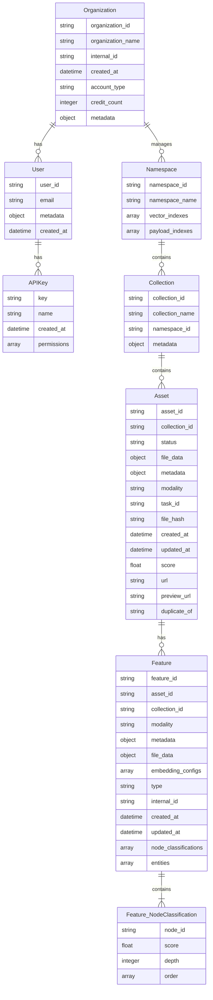

<CardGroup cols={2}>
  <Card title="Assets" icon="file" href="/concepts/assets">
    Individual pieces of content (text, images, videos) that you index and search. Assets are processed to extract features and make them searchable.
  </Card>
  
  <Card title="Collections" icon="folder" href="/concepts/collections">
    Logical groupings of related content that share similar characteristics, search configurations, and access patterns.
  </Card>

  <Card title="Features" icon="puzzle-piece" href="/ingestion/extractors">
    Extracted data points and characteristics from your content that enable advanced search and analysis using AI models.
  </Card>

  <Card title="Namespaces" icon="box" href="/concepts/namespaces">
    Isolated environments for organizing and managing content and search applications with separate configurations and permissions.
  </Card>

  <Card title="Search" icon="magnifying-glass" href="/searching/queries">
    Powerful search capabilities including feature search, asset search, semantic search, and multi-modal search across content types.
  </Card>

  <Card title="Tasks" icon="list-check" href="/concepts/tasks">
    Asynchronous operations for content processing, feature extraction, and index building with status tracking.
  </Card>

  <Card title="Organizations" icon="building" href="/api-reference/organizations">
    Manage organizations, users, API keys, and monitor usage across your account with comprehensive administrative controls.
  </Card>

  <Card title="Embedding Models" icon="database" href="/overview/models/available-models">
    Specialized data structures optimized for similarity search across content embeddings with support for different modalities.
  </Card>
</CardGroup>

## Entity Relationship Diagram

