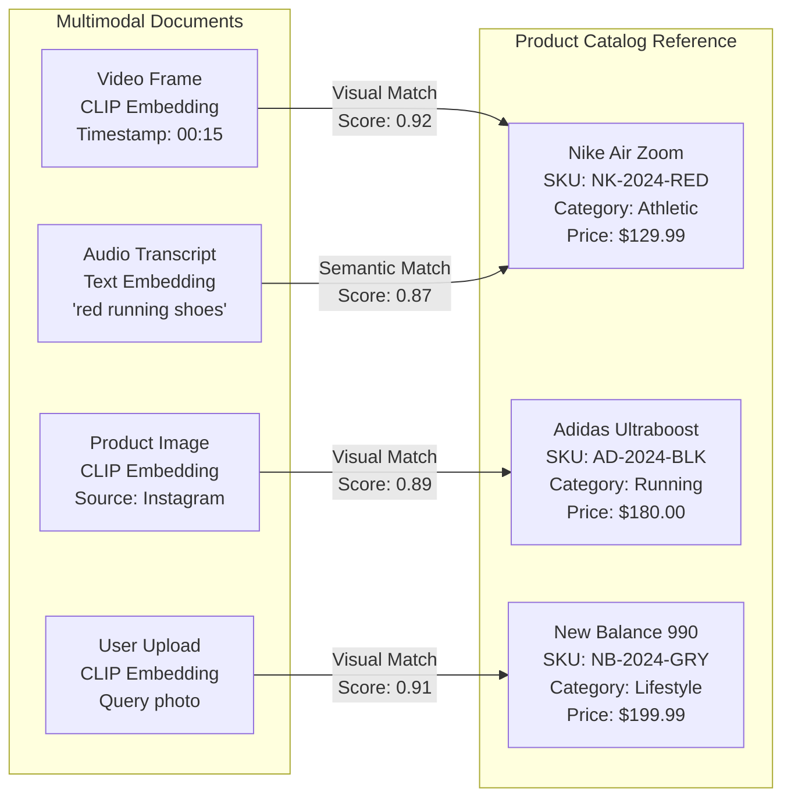
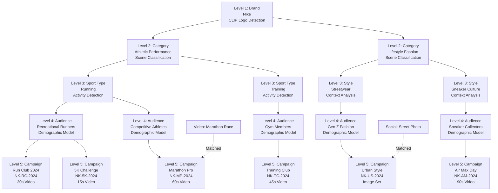

Taxonomies let you attach structured metadata to documents by matching them against a reference collection. They are implemented as retriever-powered joins and can run on demand or be materialized into collections.

## Taxonomy Types

| Type | Structure | When to Use |
|------|-----------|-------------|
| Flat | Single-level reference collection | Face enrollment, entity linking, simple lookups |
| Hierarchical | Parent/child nodes with inheritance | Org charts, product categories, multi-level labeling |

Each node references a collection, retriever, and list of enrichment fields. Child nodes inherit parent properties automatically.

### Flat Taxonomy: Product Catalog Recognition



In a flat taxonomy, documents from any modality (video, image, audio, text) are matched against a single reference collection. Each document uses its appropriate feature embedding (CLIP for visual, text embeddings for audio transcripts) to find the best match. Enrichment fields (SKU, category, price) are attached when similarity exceeds the threshold.

### Hierarchical Taxonomy: Media Content Classification



In a hierarchical taxonomy, documents traverse multiple levels of progressive refinement. Starting from a broad brand classification (1 node), through content category (2 nodes), sport/style type (4 nodes), audience segmentation (5 nodes), to specific campaigns (6 nodes). Each level narrows the classification using different multimodal features—CLIP for brand detection, scene classification for categories, activity detection for sport types, demographic models for audiences, and campaign-specific patterns at the final level. Documents inherit all properties from parent nodes as they traverse down the tree.

## Execution Modes

| Mode | Description | Use Case |
|------|-------------|----------|
| `on_demand` | Enrich documents at query time inside a retriever (`taxonomy@v1` stage) | Exploratory workflows, testing, dynamic reference data |
| `materialize` | Batch enrichment after extraction; results persisted in the collection | Production search, low-latency retrieval, analytics |

Configure execution mode via a collection’s `taxonomy_applications` array or by adding a taxonomy stage to a retriever.

## Internals: JOIN Stage

Taxonomies reuse the `join@v1` stage under the hood:

- **Direct join** – key-based match (`join_type: "direct"`).
- **Retriever join** – similarity match using a nested retriever (`join_type: "retriever"`).
- **Join strategies** – `replace`, `enrich`, `left`, or `append` control how fields merge.

Parallel execution (`asyncio.gather`) makes retrieval joins 10–50× faster than sequential lookups.

## Create a Flat Taxonomy

```bash
curl -sS -X POST "$MP_API_URL/v1/taxonomies" \
  -H "Authorization: Bearer $MP_API_KEY" \
  -H "X-Namespace: $MP_NAMESPACE" \
  -H "Content-Type: application/json" \
  -d '{
    "taxonomy_name": "employee_faces",
    "taxonomy_type": "flat",
    "retriever_id": "ret_face_matcher",
    "input_mappings": {
      "query_embedding": "mixpeek://face_detector@v2/face_embedding"
    },
    "source_collection": {
      "collection_id": "col_employee_embeddings",
      "enrichment_fields": [
        { "field_path": "metadata.name", "merge_mode": "enrich" },
        { "field_path": "metadata.department", "merge_mode": "enrich" }
      ]
    }
  }'
```

## Create a Hierarchical Taxonomy

```bash
curl -sS -X POST "$MP_API_URL/v1/taxonomies" \
  -H "Authorization: Bearer $MP_API_KEY" \
  -H "X-Namespace: $MP_NAMESPACE" \
  -H "Content-Type: application/json" \
  -d '{
    "taxonomy_name": "org_roles",
    "taxonomy_type": "hierarchical",
    "retriever_id": "ret_face_matcher",
    "input_mappings": {
      "query_embedding": "mixpeek://face_detector@v2/face_embedding"
    },
    "hierarchy": [
      {
        "node_id": "employees",
        "collection_id": "col_employee_embeddings",
        "enrichment_fields": ["metadata.employee_id", "metadata.department"]
      },
      {
        "node_id": "executives",
        "collection_id": "col_executives",
        "retriever_id": "ret_executive_face",
        "parent_node_id": "employees",
        "enrichment_fields": ["metadata.executive_level", "metadata.budget_authority"]
      }
    ]
  }'
```

Hierarchical nodes inherit parent enrichment properties; children can override or extend them.

## Attach to a Collection

```json
{
  "taxonomy_applications": [
    {
      "taxonomy_id": "tax_employee_faces",
      "execution_mode": "materialize"
    },
    {
      "taxonomy_id": "tax_org_roles",
      "execution_mode": "on_demand"
    }
  ]
}
```

- Materialized enrichment updates documents ~30 seconds after ingestion completes (debounced to avoid thrashing).
- On-demand enrichment keeps documents untouched; retrievers call the taxonomy join at query time.

## Test On Demand

```bash
curl -sS -X POST "$MP_API_URL/v1/taxonomies/<taxonomy_id>/enrich" \
  -H "Authorization: Bearer $MP_API_KEY" \
  -H "X-Namespace: $MP_NAMESPACE" \
  -H "Content-Type: application/json" \
  -d '{
    "source_documents": [
      {
        "document_id": "doc_scene_123",
        "mixpeek://face_detector@v2/face_embedding": [0.12, 0.34, ...]
      }
    ],
    "mode": "on_demand"
  }'
```

## Inference Strategies

- **Manual** – Define nodes explicitly (IDs, collections, retrievers).
- **Schema-based** – Infer nodes from existing collection schemas (planned).
- **Cluster-based** – Create nodes from clustering output.
- **LLM-based** – Generate hierarchical structure from sample documents.

Combining strategies is encouraged: bootstrap via inference, then fine-tune manually.

## Monitoring

- List taxonomies: `POST /v1/taxonomies/list`
- Inspect hierarchy and node metadata: `GET /v1/taxonomies/{id}?expand_nodes=true`
- Track materialized enrichment progress via webhook events (`collection.documents.written`)
- Use retriever analytics to ensure taxonomy stages don’t dominate latency.

## Best Practices

1. **Start flat** for quick wins; layer hierarchies once value is proven.
2. **Keep enrichment minimal**—copy only fields needed at query time.
3. **Cache taxonomy stages** in retrievers when reference collections rarely change.
4. **Version taxonomies** (via snapshots) before major structural changes.
5. **Combine with clusters** to discover candidate nodes and measure coverage.

Taxonomies let you inject domain knowledge into multimodal search—link documents to canonical entities without relying on brittle key joins.
