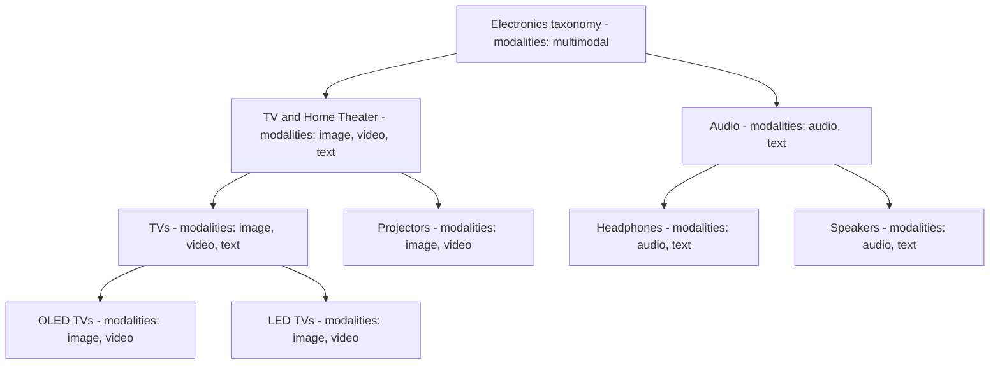

<Note>
  Taxonomies specify information you want to add to each document. For each taxonomy field, you choose how it is populated (usually by running a retriever that searches a reference collection). During enrichment, Mixpeek finds the best match and writes the selected fields from the reference document into the target document or the retrieval result.
</Note>

## Overview

Taxonomies in Mixpeek are specialized structures that allow you to classify, organize, and enrich your data with structured metadata. They function similarly to JOIN operations in traditional databases, but operate on feature similarity rather than exact key matches, making them ideal for multimodal content. Conceptually, each taxonomy functions as a specialized collection with a defined schema. Associated retrievers handle the logic for looking up and enriching documents based on this taxonomy.

[Watch an Intro Video](/studio/taxonomies)

## Example: Product Taxonomy

A simple hierarchical product taxonomy for the Electronics category.



_Modality labels indicate the typical data types used to classify and enrich items at each level._


<Steps>
  <Step title="Select Taxonomy Type">
    Choose between flat or hierarchical taxonomy structure based on your organizational needs and data relationships.
  </Step>
  <Step title="Select Source Collection">
    Select the collection containing the reference data that will be used to enrich your documents.
  </Step>
  <Step title="Select Enrichment Fields">
    Choose which fields from the source collection will be added to enrich your target documents.
  </Step>
  <Step title="Select Retriever">
    Choose the retriever that will match documents from your target collection with the appropriate reference data.
  </Step>
  <Step title="Configure Input Fields">
    Define how the retriever gets its input data. This might involve mapping fields from source data, using outputs from previous processing steps, or incorporating query-time information.
  </Step>
</Steps> 

<CardGroup cols={2}>
  <Card title="Flat vs Hierarchical" icon="diagram-project">
    Single‑level joins or multi‑level trees with inheritance
  </Card>
  
  <Card title="Explicit & Implicit" icon="code-branch">
    Define nodes manually or infer structure (schema/cluster/LLM)
  </Card>
  
  <Card title="Execution Modes" icon="bolt">
    Materialized (batch) or On‑Demand (query‑time)
  </Card>
  
  <Card title="Retriever‑powered" icon="magnifying-glass">
    Matching is driven by a configured retriever and input mappings
  </Card>
</CardGroup>

## Quick start

<Steps>
  <Step title="Create">
    Define a flat or hierarchical taxonomy with retriever and input mappings
  </Step>
  <Step title="Attach">
    - Materialize: add to a collection via <code>taxonomy_applications</code><br/>
    - On‑Demand: add a taxonomy join stage in a retriever
  </Step>
  <Step title="Run">
    - Preview with Execute Taxonomy (on‑demand test)<br/>
    - Or execute the retriever pipeline in production
  </Step>
  <Step title="Inspect">
    Verify enriched fields on documents or in results
  </Step>
</Steps>

## What gets copied

- Selected enrichment fields are copied from the matched reference document into your target document or into the retrieval result, depending on execution mode.
- Use `merge_mode: "replace"` to overwrite a scalar or object field on the target document.
- Use `merge_mode: "append"` to add values to an array field on the target document.

## How it works

<Frame>
  ```mermaid
  graph TD
    T[Taxonomy Definition] --> A[Attach to Collection or Retriever]
    A --> M[Materialized Batch]
    A --> O[On Demand]
    M --> W[Documents Updated]
    O --> R[Enriched Results]
  ```
</Frame>

<Steps>
  <Step title="Define">
    Create a taxonomy (flat or hierarchical) and specify a retriever plus input mappings
  </Step>
  <Step title="Attach">
    Add to a collection (materialize) or a retriever stage (on‑demand)
  </Step>
  <Step title="Execute">
    Run batch enrichment after extraction, or enrich at query‑time during retrieval
  </Step>
</Steps>

## Types and modes

<Tabs>
  <Tab title="Flat">
    - One source collection
    - 1:1 join semantics (best match)
    - Copy configured enrichment fields from the reference document into the target document (replace or append)
  </Tab>
  
  <Tab title="Hierarchical (Explicit)">
    - Multi‑level parent/child tree via `hierarchical_nodes`
    - Node‑level overrides for retriever, input mappings, enrichment fields
    - Child results can inherit or override parent enrichments
  </Tab>
  
  <Tab title="Hierarchical (Implicit)">
    - Infer structure from schema overlap, clustering, or LLM analysis
    - Combine inference with explicit overrides for a hybrid approach
  </Tab>
  
  <Tab title="Execution Modes">
    - **Materialized**: Runs post‑extraction; persists updates to documents (in‑place or to target collection)
      - Tradeoffs: lowest query latency and consistent outputs; requires re‑materialization on source/taxonomy changes, adds batch/compute work and write amplification
    - **On‑Demand**: Executes inside a retriever pipeline at query time; results are not persisted
      - Tradeoffs: freshest results and no write/storage cost; adds query‑time latency and per‑request compute, may need caching for high‑QPS paths
  </Tab>
</Tabs>

## Create a taxonomy

- **API**: Create Taxonomy
- **Method**: POST
- **Path**: `/v1/taxonomies`
- **Reference**: [API Reference](/api-reference/taxonomies/create-taxonomy)

### Flat example
```bash
curl -X POST https://api.mixpeek.com/v1/taxonomies \
  -H "Authorization: Bearer $API_KEY" \
  -H "X-Namespace: ns_123" \
  -H "Content-Type: application/json" \
  -d '{
    "taxonomy_name": "brands_en",
    "description": "Enrich documents with brand metadata",
    "config": {
      "taxonomy_type": "flat",
      "retriever_id": "ret_clip_v1",
      "input_mappings": [
        {"input_key": "image_vector", "path": "features.clip_vit_l_14", "source_type": "vector"}
      ],
      "source_collection": {
        "collection_id": "col_brands_v1",
        "enrichment_fields": [
          {"field_path": "metadata.brand", "merge_mode": "replace"},
          {"field_path": "metadata.tags",  "merge_mode": "append"}
        ]
      }
    }
  }'
```

### Hierarchical (explicit) example
```bash
curl -X POST https://api.mixpeek.com/v1/taxonomies \
  -H "Authorization: Bearer $API_KEY" \
  -H "X-Namespace: ns_123" \
  -H "Content-Type: application/json" \
  -d '{
    "taxonomy_name": "people_hierarchy_v1",
    "description": "Employees → Executives",
    "config": {
      "taxonomy_type": "hierarchical",
      "retriever_id": "ret_face_v1",
      "input_mappings": [
        {"input_key": "face_vec", "path": "features.face", "source_type": "vector"}
      ],
      "hierarchical_nodes": [
        {"collection_id": "col_employees_v1"},
        {"collection_id": "col_executives_v1", "parent_collection_id": "col_employees_v1"}
      ]
    }
  }'
```

## Manage taxonomies

<CardGroup cols={2}>
  <Card title="Get Taxonomy" icon="magnifying-glass" href="/api-reference/taxonomies/get-taxonomy" />
  <Card title="List Taxonomies" icon="list" href="/api-reference/taxonomies/list-taxonomies" />
  <Card title="Create Version" icon="layers" href="/api-reference/taxonomies/create-taxonomy-version" />
  <Card title="List Versions" icon="clone" href="/api-reference/taxonomies/list-taxonomy-versions" />
  <Card title="Delete Taxonomy" icon="trash" href="/api-reference/taxonomies/delete-taxonomy" />
</CardGroup>

### Versions

- **Immutable snapshots**: Create versioned snapshots for reproducible enrichment
- **Manage**: [Create Version]/api-reference/taxonomies/create-taxonomy-version, [List Versions]/api-reference/taxonomies/list-taxonomy-versions, [Get Taxonomy]/api-reference/taxonomies/get-taxonomy
- **Usage**: Pin a specific version when attaching to collections or executing on‑demand to ensure stable outputs; update the reference to roll forward or roll back as needed

## Attach and execute

### Attach to a collection (materialize)

Include `taxonomy_applications` when creating or updating a collection. The engine materializes enrichment after extraction completes.

```json
{
  "collection_name": "ads_v2",
  "taxonomy_applications": [
    {
      "taxonomy_id": "tax_brands_en",
      "execution_mode": "materialize",
      "target_collection_id": "col_ads_enriched"
    },
    {
      "taxonomy_id": "tax_people_hierarchy_v1",
      "execution_mode": "on_demand"
    }
  ]
}
```

- Collections API: [Create](/api-reference/collections/create-collection), [Update](/api-reference/collections/update-collection)

### Execute on‑demand (test/preview)

Use the execute endpoint to validate configuration and preview enrichment (on‑demand only).

- **API**: Execute Taxonomy
- **Method**: POST
- **Path**: `/v1/taxonomies/execute/{taxonomy_identifier}`
- **Reference**: [API Reference](/api-reference/taxonomies/execute-taxonomy)

```bash
curl -X POST https://api.mixpeek.com/v1/taxonomies/execute/tax_brands_en \
  -H "Authorization: Bearer $API_KEY" \
  -H "X-Namespace: ns_123" \
  -H "Content-Type: application/json" \
  -d '{
    "source_documents": [{"document_id": "doc_123", "features": {"clip_vit_l_14": [0.1,0.2,0.3]}}]
  }'
```

For production on‑demand usage, add a taxonomy join stage inside a retriever and call the retriever Execute API.

- Retrievers: [Create](/api-reference/retrievers/create-retriever), [Execute](/api-reference/retrievers/execute-retriever)

## Best practices

<Steps>
  <Step title="Keep mappings precise">
    Ensure input mappings point to existing fields and types in target documents
  </Step>
  <Step title="Minimize copied fields">
    Copy only required enrichment fields; prefer `append` for arrays
  </Step>
  <Step title="Choose the right mode">
    Use materialize for stable, high‑QPS paths; on‑demand for dynamic or exploratory flows
  </Step>
  <Step title="Iterate hierarchies">
    Start with explicit nodes, then add inference or overrides as needed
  </Step>
</Steps>

## FAQ

<AccordionGroup>
  <Accordion title="Flat vs hierarchical – when to choose?" icon="circle-question">
    Use flat when a single reference collection provides all needed fields. Choose hierarchical when enrichment depends on multi‑level concepts (e.g., Employee → Executive → Board).
  </Accordion>
  <Accordion title="Materialized vs on‑demand – which is better?" icon="bolt">
    Materialized is ideal for stable, hot paths and high QPS; on‑demand is better for dynamic reference data or exploratory flows where persistence is not required.
  </Accordion>
  <Accordion title="Can I mix explicit nodes with inferred structure?" icon="code-branch">
    Yes. Hierarchical taxonomies are hybrid by design: infer a base tree via schema/cluster/LLM, then override or extend with explicit nodes as needed.
  </Accordion>
</AccordionGroup>

## See also

<CardGroup cols={2}>
  <Card title="Collections" icon="database" href="/ingestion/collections">
    Attach taxonomy applications to drive enrichment
  </Card>
  
  <Card title="Retrievers" icon="magnifying-glass" href="/retrieval/retrievers">
    Execute on‑demand taxonomy join stages during retrieval
  </Card>
</CardGroup>

<CardGroup cols={2}>
  <Card title="Pipelines & Workflows" icon="diagram-project" href="/processing/pipelines">
    Chain multi‑stage flows and integrate taxonomies
  </Card>
  
  <Card title="Clusters" icon="object-group" href="/enrichment/clusters">
    Discover candidate nodes for implicit hierarchies
  </Card>
</CardGroup>
