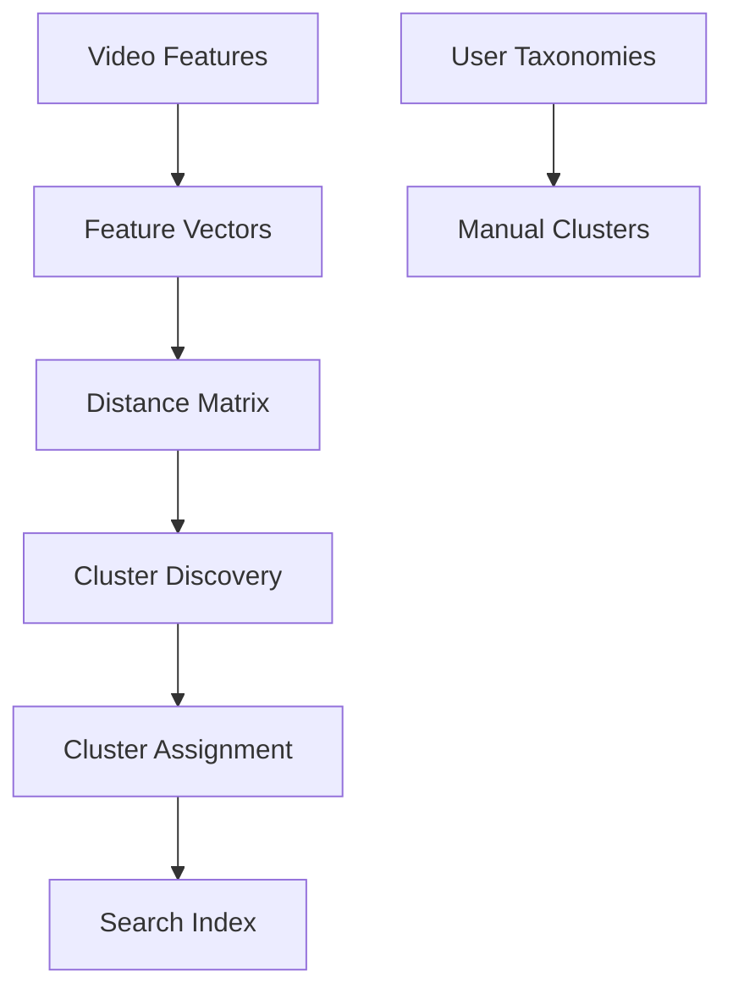

Clusters in Mixpeek are groups of similar features automatically discovered or manually defined. They enable efficient organization, search, and analysis of your multimodal features.

<Accordion title="Why Use Clusters?">
  - **Organization**: Automatically group
  similar content 
  - **Discovery**: Find patterns and relationships in your data
  - **Performance**: Speed up searches by limiting scope 
  - **Analysis**: Understand content distribution and patterns
</Accordion>

<AccordionGroup>
  <Accordion title="Automatic Clustering">
    Mixpeek can automatically discover clusters using: 
    - Distance-based algorithms (DBSCAN) 
    - Dimensionality reduction (UMAP) 
    - Hierarchical methods (BIRCH)
  </Accordion>

  <Accordion title="Manual Clustering">
    Define your own clusters using: 
    - Custom taxonomies 
    - Business rules 
    - Domain expertise
  </Accordion>
</AccordionGroup>

## How Clustering Works

<Steps>
  <Step title="Feature Extraction">
    Assets are processed into features representing: 
    - Visual content
    - Objects
    - Spoken Words 
    - Metadata
    - etc.
  </Step>

<Step title="Similarity Calculation">
  Features are compared using: 
  - Vector similarity 
  - Semantic relationships 
  - Temporal proximity
</Step>

  <Step title="Cluster Formation">
    Similar features are grouped based on: 
    - Distance thresholds 
    - Density patterns 
    - User-defined rules
  </Step>
</Steps>

## Use Cases

<CardGroup>
  <Card title="Content Organization" icon="folder-tree">
    Automatically organize video libraries by: 
    - Content type 
    - Visual similarity 
    - Semantic themes
  </Card>

<Card title="Pattern Discovery" icon="lightbulb">
  Uncover hidden patterns in your content: 
  - Common scenes 
  - Recurring themes 
  - Related sequences
</Card>

  <Card title="Search Enhancement" icon="magnifying-glass">
    Improve search efficiency through: 
    - Cluster-based filtering 
    - Contextual recommendations 
    - Similar content discovery
  </Card>

  <Card title="Quality Control" icon="shield-check">
    Monitor and maintain content quality by: 
    - Identifying outliers 
    - Detecting anomalies 
    - Validating content consistency
  </Card>
</CardGroup>

## Implementation

<Tabs>
  <Tab title="Automatic Discovery">
    ```python
    # Discover clusters automatically
    POST /entities/cluster/discover
    {
      "collection_name": "video_features",
      "method": "dbscan",
      "settings": {
        "sample_size": 1000,
        "neighbor_limit": 20
      }
    }
    ```
  </Tab>
  
  <Tab title="Manual Definition">
    ```python
    # Define clusters manually
    POST /entities/taxonomy/assign
    {
      "collection_name": "video_features",
      "terms": {
        "sports_training": [
          "tennis serve",
          "tennis drills"
        ]
      }
    }
    ```
  </Tab>
  
  <Tab title="Search">
    ```python
    # Search within clusters
    POST /features/search
    {
      "query": "tennis serve",
      "cluster_ids": [1, 2],
      "limit": 10
    }
    ```
  </Tab>
</Tabs>

## Architecture



## Performance Considerations

<Note>
  Clustering large feature sets can be computationally intensive. Mixpeek uses
  Qdrant's optimized distance matrix calculations and supports sample-based
  clustering for better performance.
</Note>

<Warning>
  When using manual clusters, ensure your taxonomy terms are specific enough to
  avoid overlapping clusters that could impact search precision.
</Warning>

## Advanced Features


### Hierarchical Organization

Features can belong to multiple clusters and cluster hierarchies:

```json
{
  "clusters": [
    {
      "cluster_id": "clu_123",
      "path": "sports/tennis/serve",
      "confidence": 0.95
    },
    {
      "cluster_id": "clu_123",
      "path": "training/technique",
      "confidence": 0.88
    }
  ]
}
```

<Tip>
  Use cluster hierarchies to create intuitive navigation structures for your
  content.
</Tip>

## Best Practices

<Steps>
  <Step title="Preparation">
    - Clean and normalize your feature data 
    - Choose appropriate clustering parameters 
    - Define clear taxonomy rules
  </Step>

<Step title="Implementation">
  - Start with sample-based clustering 
  - Validate cluster quality 
  - Monitor cluster distributions
</Step>

  <Step title="Optimization">
    - Adjust parameters based on results 
    - Refine taxonomy terms 
    - Balance cluster sizes
  </Step>
</Steps>

## Updates and Maintenance

<Accordion title="Cluster Maintenance">
  Regular maintenance tasks include: 
  - Recomputing clusters for new content 
  - Adjusting cluster parameters 
  - Updating taxonomies 
  - Merging similar clusters
  - Splitting large clusters
</Accordion>

<Note>
  Keep your clusters up to date by periodically running the clustering process on new content. Mixpeek handles incremental updates efficiently.
</Note>
