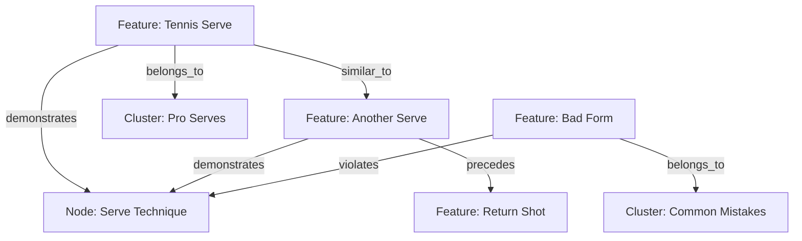

<Warning>
Relationships is only available for enterprise customers, email info@mixpeek.com for a demo. 
</Warning>

Relationships in Mixpeek enable you to define and discover meaningful connections between video segments and other entities. These connections can represent similarity, temporal sequences, demonstrations of concepts, and more. Relationships are best for:

- Connecting specific pieces of content
- Temporal sequences (e.g., one video segment follows another)
- Defining specific types of connections (demonstrates, references, violates)
- Cross-cutting connections that don't fit in hierarchies or clusters

<Accordion title="Why Use Relationships?">
  - **Content Discovery**: Find related video segments automatically
  - **Semantic Connections**: Link content to concepts and techniques
  - **Temporal Organization**: Track sequences and variations
  - **Graph Analysis**: Build and analyze content networks
  - **Quality Control**: Track demonstrations and violations of standards
</Accordion>

## Core Relationship Types

<CardGroup>
  <Card title="Feature-to-Feature" icon="film">
    Connect video segments:
    - similar_to: Visual/semantic similarity
    - precedes/follows: Temporal sequence
    - variant_of: Different versions
    - part_of: Segment containment
  </Card>

  <Card title="Feature-to-Node" icon="sitemap">
    Link to taxonomy concepts:
    - demonstrates: Shows example
    - references: Contains/mentions
    - violates: Shows incorrect example
    - explains: Provides instruction
  </Card>

  <Card title="Feature-to-Cluster" icon="object-group">
    Connect to discovered groups:
    - belongs_to: Cluster membership
    - near: Proximity relationship
  </Card>
</CardGroup>



## Implementation

<Tabs>
  <Tab title="Create Relationship">
    ```python
    POST /entities/relationships
    {
      "from": "feat_123",      // Source video segment
      "to": "feat_456",        // Target entity
      "type": "similar_to",    // Relationship type
      "score": 0.88,          // Optional confidence score
      "metadata": {
        "vector_index": "multimodal",
        "timestamp_range": {
          "start": 10.5,
          "end": 15.2
        }
      }
    }
    ```
  </Tab>

  <Tab title="Search Relationships">
    ```python
    POST /features/search
    {
      "collections": ["training-videos"],
      "filters": {
        "AND": [
          {
            "key": "relationships.type",
            "operator": "eq",
            "value": "demonstrates"
          },
          {
            "key": "relationships.to",
            "operator": "eq",
            "value": "node_abc123"
          }
        ]
      }
    }
    ```
  </Tab>

  <Tab title="Get Relationship Graph">
    ```python
    GET /entities/relationships/graph
    ?feature_id=feat_123
    ?depth=2
    ?types[]=similar_to,demonstrates
    ```
  </Tab>
</Tabs>


## Graph Response Structure

When querying the relationship graph, the API returns a network of connected entities and their relationships:

```json
{
  "nodes": [
    {
      "id": "feat_123",
      "type": "feature",
      "metadata": {
        "title": "Tennis Serve",
        "duration": 15.5,
        "timestamp": 45.2
      }
    },
    {
      "id": "node_abc",
      "type": "node",
      "metadata": {
        "name": "Serve Technique",
        "taxonomy": "sports_training"
      }
    },
    {
      "id": "clu_xyz",
      "type": "cluster",
      "metadata": {
        "name": "Pro Serves",
        "size": 45
      }
    }
  ],
  "edges": [
    {
      "from": "feat_123",
      "to": "node_abc",
      "type": "demonstrates",
      "score": 0.92,
      "metadata": {
        "timestamp_range": {
          "start": 10.5,
          "end": 15.2
        }
      }
    },
    {
      "from": "feat_123",
      "to": "clu_xyz",
      "type": "belongs_to",
      "score": 0.88
    }
  ],
  "metadata": {
    "depth": 2,
    "total_nodes": 3,
    "total_edges": 2,
    "query_time_ms": 45
  }
}
```

The graph response includes:
- **Nodes**: All entities in the graph with their metadata
- **Edges**: All relationships between nodes with scores and metadata
- **Metadata**: Information about the graph query itself

This structure enables visualization and analysis of relationship networks between features, nodes, and clusters.


## Internal Relationship Structure

Features store relationships in a simplified array structure:

```json
{
  "relationships": [
    {
      "from": "feat_123",      // Current feature
      "to": "feat_456",        // Related feature
      "type": "similar_to",
      "score": 0.88,
      "metadata": {
        "vector_index": "multimodal"
      }
    },
    {
      "from": "feat_123",
      "to": "node_abc123",
      "type": "demonstrates",
      "score": 0.92
    }
  ]
}
```

## Best Practices for Video Relationships

<Steps>
  <Step title="Relationship Selection">
    - Choose appropriate relationship types
    - Consider temporal context
    - Use meaningful scores
    - Include relevant metadata
  </Step>

  <Step title="Score Generation">
    - Vector similarity for "similar_to"
    - Temporal proximity for sequences
    - Model confidence for demonstrations
    - Distance metrics for clusters
  </Step>

  <Step title="Performance Optimization">
    - Index frequently queried relationships
    - Batch relationship creation
    - Cache common graph queries
    - Monitor relationship density
  </Step>
</Steps>

<Warning>
  Consider these limitations when creating relationships:
  - Maximum relationships per feature: 1000
  - Maximum graph query depth: 3
  - Rate limits apply to relationship operations
</Warning>

<Note>
  Combine relationships with clusters and taxonomies for the most effective content organization. Each provides different insights into your video content.
</Note>
