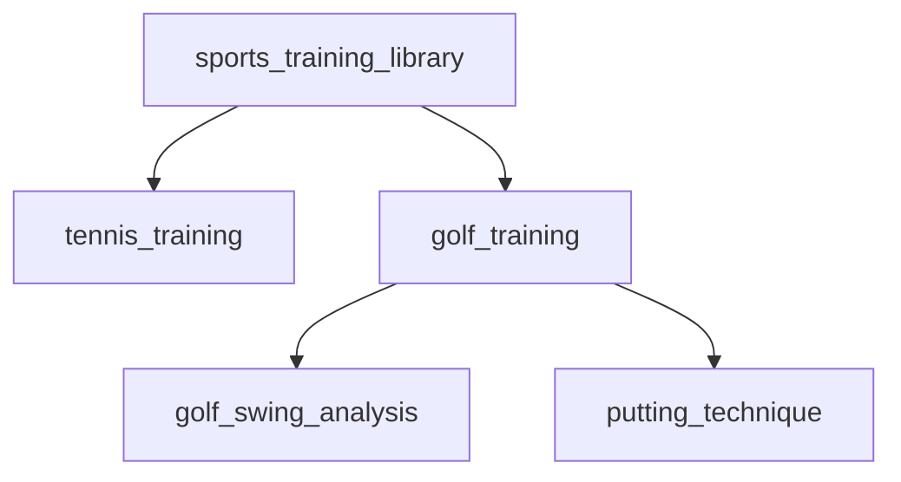

Taxonomies provide a structured way to organize and classify multimodal content using hierarchical categories. Each node can use multiple embedding models to capture both visual and semantic aspects of content. Taxonomies are best used for:

- Predefined categories and hierarchies
- Domain-specific organization
- Manual, expert-driven classification
- When you need strict control over content organization

## Quick Start Video
Watch this 5-minute live walkthrough to see taxonomies in action. The video covers creating, managing, and implementing taxonomies for multimodal content classification.

<iframe
  width="560"
  height="315"
  src="https://www.youtube.com/embed/Absrbi3y-p0?si=DlCPjZzX2OasOgjD"
  title="YouTube video player"
  frameborder="0"
  allow="accelerometer; autoplay; clipboard-write; encrypted-media; gyroscope; picture-in-picture"
  allowfullscreen
></iframe>

---

<Accordion title="Why Use Taxonomies?">
  - **Automated Tagging**: ML-powered categorization
  - **Access Control**: Define granular permissions based on taxonomy nodes
  - **Knowledge Graph Integration**: Build relationships between different content types
  - **Compliance Management**: Enforce content classification policies
  - **Analytics & Reporting**: Track content distribution across categories
</Accordion>

## Sample Multimodal Taxonomy



## Implementation

<Tabs>
  <Tab title="Create Taxonomy">
    ```python
    POST /entities/taxonomies
    {
      "taxonomy_name": "sports_training_library",
      "description": "Hierarchical classification of sports training videos",
      "nodes": [
        {
          "name": "tennis_training",
          "description": "Tennis instruction and training videos",
          "embedding_config": [
            {
              "embedding_model": "vertex-multimodal",
              "type": "video",
              "value": "https://video.mp4"
            },
            {
              "embedding_model": "baai-bge-m3",
              "type": "text",
              "value": "Professional tennis training, serve techniques, court positioning"
            }
          ],
          "children": [
            {
              "name": "serve_technique",
              "parent_node_name": "tennis_training",
              "embedding_config": [
                {
                  "embedding_model": "vertex-multimodal",
                  "type": "video",
                  "value": "https://serving.mp4"
                },
                {
                  "embedding_model": "baai-bge-m3",
                  "type": "text",
                  "value": "Tennis serve mechanics, grip techniques, ball toss training"
                }
              ]
            },
            {
              "name": "return_practice",
              "parent_node_name": "tennis_training",
              "embedding_config": [
                {
                  "embedding_model": "vertex-multimodal",
                  "type": "video",
                  "value": "https://returning.mp4"
                },
                {
                  "embedding_model": "baai-bge-m3",
                  "type": "text",
                  "value": "Tennis return drills, footwork, anticipation training"
                }
              ],
              "children": [
                {
                  "name": "backhand_returns",
                  "parent_node_name": "return_practice",
                  "embedding_config": [
                    {
                      "embedding_model": "vertex-multimodal",
                      "type": "video",
                      "value": "https://backhand.mp4"
                    },
                    {
                      "embedding_model": "baai-bge-m3",
                      "type": "text",
                      "value": "Two-handed backhand return technique and drills"
                    }
                  ]
                }
              ]
            }
          ]
        }
      ]
    }
    ```
  </Tab>


  <Tab title="Assign Classifications">
    ```python
    POST /entities/taxonomies/{taxonomy}/features/classify
    {
      "collections": ["training-videos-sample"],
      "filters": {},
      "confidence_threshold": 0.8,
      "assignment": {
          "enabled": true, # assign classifications to features
      },
      "sample_size": 100
    }
    ```
  </Tab>

  <Tab title="List Classifications">
    ```python
    POST /entities/taxonomies/{taxonomy}/classifications
    {
      "classifications": [
        {
          "feature_id": "feat_abc123",
          "classification_id": "cls_xyz789",
          "matches": [
            {
              "node_id": "node_abc123",
              "score": 0.92,
              "depth": 0,
              "order": [0]
            }
          ]
        }
      ]
    }
    ```
  </Tab>
</Tabs>

## Advanced Implementation

<Tabs>
  <Tab title="Development Setup">
    ```bash
    # Create development namespace
    POST /namespaces
    {
      "namespace_name": "sports_training_dev",
      "embedding_models": ["text", "video", "multimodal"]
    }

    # Create collections
    POST /collections # with X-Namespace: sports_training_dev
    {
      "collection_name": "training-videos-sample"
    }
    ```
  </Tab>

  <Tab title="Testing Classifications">
    ```python
    # Test taxonomy classification
    POST /entities/taxonomies/{taxonomy}/features/classify
    {
      "collections": ["training-videos-sample"],
      "filters": {},
      "confidence_threshold": 0.8,
      "sample_size": 100
    }

    # List classification results
    POST /entities/taxonomies/{taxonomy}/classifications
    ```
  </Tab>

  <Tab title="Assign Classifications">
    ```python
    POST /entities/taxonomies/{taxonomy}/features/classify
    {
      "collections": ["training-videos-sample"],
      "filters": {},
      "confidence_threshold": 0.8,
      "assignment": {
          "enabled": true, # assign classifications to features
      },
      "sample_size": 100
    }
    ```
  </Tab>
</Tabs>

## Searching with Taxonomies

<Tabs>
  <Tab title="Basic Node Search">
    ```python
    POST /features/search
    {
        "collections": ["training-videos-sample"],
        "filters": {
            "AND": [
                {
                    "key": "taxonomy_nodes[].node",
                    "operator": "in",
                    "value": ["serve_technique"]  # Can use node name
                }
            ]
        }
    }
    ```
  </Tab>

  <Tab title="Node ID Search">
    ```python
    POST /features/search
    {
        "collections": ["training-videos-sample"],
        "filters": {
            "AND": [
                {
                    "key": "taxonomy_nodes[].node",
                    "operator": "in",
                    "value": ["node_abc123"]  # Can use node ID
                }
            ]
        }
    }
    ```
  </Tab>

  <Tab title="Complex Search">
    ```python
    POST /features/search
    {
      "collections": ["training-videos"],
      "filters": {
        "AND": [
          {
            "OR": [
              {
                "key": "taxonomy_nodes[].node",
                "operator": "in",
                "value": ["tennis_training", "node_xyz789"]  # Mix of names and IDs
              }
            ]
          },
          {
            "key": "taxonomy_nodes[].score",
            "operator": "gte",
            "value": 0.8
          }
        ]
      }
    }
    ```
  </Tab>

  <Tab title="Hierarchical Path Search">
    ```python
    POST /features/search
    {
      "collections": ["training-videos"],
      "filters": {
        "AND": [
          {
            // Match root node
            {
              "key": "taxonomy_nodes[].node",
              "operator": "eq",
              "value": "tennis_training"
            },
            {
              "key": "taxonomy_nodes[].order",
              "operator": "eq",
              "value": [0]
            }
          },
          {
            // Match specific child node
            {
              "key": "taxonomy_nodes[].node",
              "operator": "eq",
              "value": "return_practice"
            },
            {
              "key": "taxonomy_nodes[].order",
              "operator": "eq",
              "value": [0, 1]
            }
          }
        ]
      }
    }
    ```
  </Tab>
</Tabs>

<Note>
  When filtering by `taxonomy_nodes[].node`, you can use either the node's name (e.g., "serve_technique") or its ID (e.g., "node_abc123"). The system will automatically match either format.
</Note>

## Internal Taxonomy Structure

Features store taxonomy classifications with hierarchical information in a simplified array structure:

```json
{
  "taxonomy_nodes": [
    {
      "node_id": "node_123",
      "depth": 0,
      "score": 0.82,
      "order": [0]
    },
    {
      "node_id": "node_3212",
      "depth": 1,
      "score": 0.91,
      "order": [0, 1]
    }
  ]
}
```

Each classification contains:
- `node_id`: Unique node identifier
- `depth`: Level in the taxonomy tree (0 = root)
- `score`: Classification confidence score
- `order`: Array representing path in tree

This structure enables several filtering patterns:

<Tabs>
  <Tab title="Filter by Depth">
    ```python
    # Find only root-level classifications
    POST /features/search
    {
      "filters": {
        "AND": [
          {
            "key": "taxonomy_nodes[].depth",
            "operator": "eq",
            "value": 0
          }
        ]
      }
    }
    ```
  </Tab>

  <Tab title="Filter by Path">
    ```python
    # Find features that follow specific path
    POST /features/search
    {
      "filters": {
        "AND": [
          {
            "key": "taxonomy_nodes[].id",
            "operator": "eq",
            "value": "tax_tennis_training"
          },
          {
            "key": "taxonomy_nodes[].order",
            "operator": "eq",
            "value": [0]
          }
        ]
      }
    }
    ```
  </Tab>

  <Tab title="Filter by Confidence">
    ```python
    # Find high-confidence classifications
    POST /features/search
    {
      "filters": {
        "AND": [
          {
            "key": "taxonomy_nodes[].score",
            "operator": "gte",
            "value": 0.9
          }
        ]
      }
    }
    ```
  </Tab>
</Tabs>

## Automatic Classification During Ingestion

```python
POST /ingest/videos/url
{
  "url": "https://example.com/tennis-lesson.mp4",
  "collection": "training-videos",
  "feature_extractors": {
    "video": [{
      "embed": [
        {
          "type": "url",
          "embedding_model": "multimodal"
        }
      ],
      "entities": {
        "taxonomies": ["sports_training_library"],
        "confidence_threshold": 0.8
      }
    }]
  }
}
```


## Best Practices for Video Taxonomies

<Steps>
  <Step title="Video Description">
    - Describe key visual elements
    - Include relevant actions and movements
    - Specify important technical details
  </Step>

  <Step title="Multimodal Configuration">
    - Use video embeddings for visual content
    - Add text embeddings for semantic context
    - Combine multiple models for better accuracy
  </Step>

  <Step title="Hierarchy Design">
    - Group similar techniques together
    - Create logical progression paths
    - Maintain consistent categorization
  </Step>
</Steps>

<Warning>
  Video embedding processing can be resource-intensive. Consider using key frames or segments for initial classification.
</Warning>

<Note>
  The vertex-multimodal model can process both video frames and text descriptions, making it ideal for video content classification.
</Note>

## Performance Considerations

<Accordion title="Video Processing Tips">
  - Use appropriate video segments for embedding
  - Consider frame sampling for long videos
  - Cache frequently accessed classifications
  - Batch process similar video content
</Accordion>

## Feature Storage Format

Features store taxonomy classifications in the `taxonomy_nodes` array. Each classification includes:

```json
{
    "taxonomy_nodes": [
        {
            "taxonomy_id": "tax_38c33e0d8f",     // Unique identifier for the taxonomy
            "node_id": "node_9761ac566c6e11",    // Unique identifier for the node
            "score": 0.5,                        // Classification confidence (0-1)
            "depth": 0,                          // Level in hierarchy (0 = root)
            "order": [0]                         // Path representation in the tree
        }
    ]
}
```

Multiple classifications can be stored for a single feature, allowing content to be categorized under multiple nodes or taxonomies.