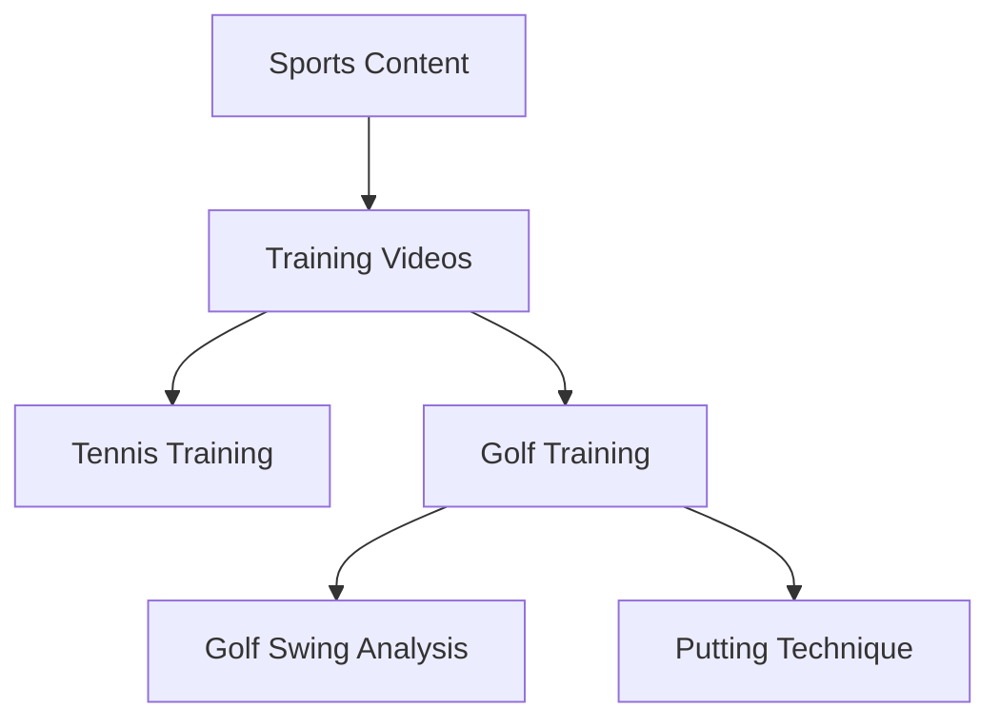

Taxonomies in Mixpeek provide a structured way to organize and classify multimodal content using customizable hierarchical categories. Each node can use multiple embedding models to capture both visual and semantic aspects of content.

<Accordion title="Why Use Taxonomies?">
  - **Content Organization**: Automatically categorize asset libraries
  - **Scene Classification**: Identify and group similar properties
  - **Multimodal Analysis**: Combine visual and text-based, and audio-based classification
  - **Automated Tagging**: ML-powered categorization
</Accordion>

## Sample Taxonomy Structure



## Implementation

<Tabs>
  <Tab title="Create Taxonomy">
    ```python
    POST /entities/taxonomies
    {
      "taxonomy_name": "Sports Training Library",
      "description": "Hierarchical classification of sports training videos",
      "nodes": [
        {
          "name": "Tennis Training",
          "description": "Tennis instruction and training videos",
          "embedding_config": [
            {
              "embedding_model": "vertex-multimodal",
              "type": "video",
              "value": "https://video.mp4"
            },
            {
              "embedding_model": "baai-bge-m3",
              "type": "text",
              "value": "Professional tennis training, serve techniques, court positioning"
            }
          ],
          "children": [
            {
              "name": "Serve Technique",
              "parent_node_name": "Tennis Training",
              "embedding_config": [
                {
                  "embedding_model": "vertex-multimodal",
                  "type": "video",
                  "value": "https://serving.mp4"
                },
                {
                  "embedding_model": "baai-bge-m3",
                  "type": "text",
                  "value": "Tennis serve mechanics, grip techniques, ball toss training"
                }
              ]
            },
            {
              "name": "Return Practice",
              "parent_node_name": "Tennis Training",
              "embedding_config": [
                {
                  "embedding_model": "vertex-multimodal",
                  "type": "video",
                  "value": "https://returning.mp4"
                },
                {
                  "embedding_model": "baai-bge-m3",
                  "type": "text",
                  "value": "Tennis return drills, footwork, anticipation training"
                }
              ],
              "children": [
                {
                  "name": "Backhand Returns",
                  "parent_node_name": "Return Practice",
                  "embedding_config": [
                    {
                      "embedding_model": "vertex-multimodal",
                      "type": "video",
                      "value": "https://backhand.mp4"
                    },
                    {
                      "embedding_model": "baai-bge-m3",
                      "type": "text",
                      "value": "Two-handed backhand return technique and drills"
                    }
                  ]
                }
              ]
            }
          ]
        }
      ]
    }
    ```
  </Tab>
  
  <Tab title="Response">
    ```python
    {
      "taxonomy_name": "Sports Training Library",
      "description": "Hierarchical classification of sports training videos",
      "nodes": [
        {
          "name": "Tennis Training",
          "taxonomy_id": "tax_6cf982d452",
          "parent_id": null,
          "children": [
            {
              "name": "Serve Technique",
              "taxonomy_id": "tax_f7eb5a6491",
              "parent_id": "tax_6cf982d452",
              "children": null
            },
            {
              "name": "Return Practice",
              "taxonomy_id": "tax_dfdf75f884",
              "parent_id": "tax_6cf982d452",
              "children": [
                {
                  "name": "Backhand Returns",
                  "taxonomy_id": "tax_70986498b6",
                  "parent_id": "tax_dfdf75f884",
                  "children": null
                }
              ]
            }
          ]
        }
      ]
    }
    ```
  </Tab>
</Tabs>

## Advanced Implementation

<Tabs>
  <Tab title="Development Setup">
    ```bash
    # Create development namespace
    POST /namespaces
    {
      "namespace_name": "sports_training_dev",
      "vector_indexes": ["text", "video", "multimodal"]
    }

    # Create collections
    POST /collections # with X-Namespace: sports_training_dev
    {
      "collection_name": "training-videos-sample"
    }
    ```
  </Tab>

  <Tab title="Testing Classifications">
    ```python
    # Test taxonomy classification
    POST /entities/taxonomies/{taxonomy_id}/discover
    {
      "collections": ["training-videos-sample"],
      "filters": {},
      "confidence_threshold": 0.8,
      "assign": false,
      "sample_size": 100
    }

    # Check classification results
    GET /entities/taxonomies/history/{task_id}
    ```
  </Tab>

  <Tab title="Manual Classification">
    ```python
    POST /entities/taxonomies/{taxonomy_id}/classify
    {
      "classifications": [
        {
          "feature_id": "feat_789",
          "node_ids": ["tax_6cf982d452"],  # Tennis Training node
          "metadata": {
            "classified_by": "coach@example.com"
          }
        }
      ]
    }
    ```
  </Tab>
</Tabs>

## Searching with Taxonomies

```python
POST /features/search
{
  "collections": ["training-videos"],
  "filters": {
    "AND": [
      {
        "key": "entities.taxonomy_classifications.node_ids",
        "operator": "in",
        "value": ["tax_6cf982d452"]  # Tennis Training videos
      }
    ]
  }
}
```

## Automatic Classification During Ingestion

```python
POST /ingest/videos/url
{
  "url": "https://example.com/tennis-lesson.mp4",
  "collection": "training-videos",
  "feature_extractors": {
    "video": [{
      "embed": [
        {
          "type": "url",
          "vector_index": "multimodal"
        }
      ],
      "entities": {
        "taxonomy_ids": ["tax_6cf982d452"],
        "confidence_threshold": 0.8
      }
    }]
  }
}
```


## Best Practices for Video Taxonomies

<Steps>
  <Step title="Video Description">
    - Describe key visual elements
    - Include relevant actions and movements
    - Specify important technical details
  </Step>

  <Step title="Multimodal Configuration">
    - Use video embeddings for visual content
    - Add text embeddings for semantic context
    - Combine multiple models for better accuracy
  </Step>

  <Step title="Hierarchy Design">
    - Group similar techniques together
    - Create logical progression paths
    - Maintain consistent categorization
  </Step>
</Steps>

<Warning>
  Video embedding processing can be resource-intensive. Consider using key frames or segments for initial classification.
</Warning>

<Note>
  The vertex-multimodal model can process both video frames and text descriptions, making it ideal for video content classification.
</Note>

## Performance Considerations

<Accordion title="Video Processing Tips">
  - Use appropriate video segments for embedding
  - Consider frame sampling for long videos
  - Cache frequently accessed classifications
  - Batch process similar video content
</Accordion>