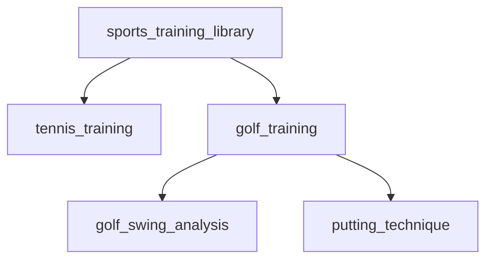

Taxonomies in Mixpeek provide a structured way to organize and classify multimodal content using customizable hierarchical categories. Each node can use multiple embedding models to capture both visual and semantic aspects of content.

## Quick Start Video
Watch this 5-minute live walkthrough to see taxonomies in action. The video covers creating, managing, and implementing taxonomies for multimodal content classification.

<iframe
  width="560"
  height="315"
  src="https://www.youtube.com/embed/e8ClUdAnrCs"
  title="YouTube video player"
  frameborder="0"
  allow="accelerometer; autoplay; clipboard-write; encrypted-media; gyroscope; picture-in-picture"
  allowfullscreen
></iframe>

---

<Accordion title="Why Use Taxonomies?">
  - **Automated Tagging**: ML-powered categorization
  - **Access Control**: Define granular permissions based on taxonomy nodes
  - **Knowledge Graph Integration**: Build relationships between different content types
  - **Compliance Management**: Enforce content classification policies
  - **Analytics & Reporting**: Track content distribution across categories
</Accordion>

## Sample Multimodal Taxonomy



## Implementation

<Tabs>
  <Tab title="Create Taxonomy">
    ```python
    POST /entities/taxonomies
    {
      "taxonomy_name": "sports_training_library",
      "description": "Hierarchical classification of sports training videos",
      "nodes": [
        {
          "name": "tennis_training",
          "description": "Tennis instruction and training videos",
          "embedding_config": [
            {
              "embedding_model": "vertex-multimodal",
              "type": "video",
              "value": "https://video.mp4"
            },
            {
              "embedding_model": "baai-bge-m3",
              "type": "text",
              "value": "Professional tennis training, serve techniques, court positioning"
            }
          ],
          "children": [
            {
              "name": "serve_technique",
              "parent_node_name": "tennis_training",
              "embedding_config": [
                {
                  "embedding_model": "vertex-multimodal",
                  "type": "video",
                  "value": "https://serving.mp4"
                },
                {
                  "embedding_model": "baai-bge-m3",
                  "type": "text",
                  "value": "Tennis serve mechanics, grip techniques, ball toss training"
                }
              ]
            },
            {
              "name": "return_practice",
              "parent_node_name": "tennis_training",
              "embedding_config": [
                {
                  "embedding_model": "vertex-multimodal",
                  "type": "video",
                  "value": "https://returning.mp4"
                },
                {
                  "embedding_model": "baai-bge-m3",
                  "type": "text",
                  "value": "Tennis return drills, footwork, anticipation training"
                }
              ],
              "children": [
                {
                  "name": "backhand_returns",
                  "parent_node_name": "return_practice",
                  "embedding_config": [
                    {
                      "embedding_model": "vertex-multimodal",
                      "type": "video",
                      "value": "https://backhand.mp4"
                    },
                    {
                      "embedding_model": "baai-bge-m3",
                      "type": "text",
                      "value": "Two-handed backhand return technique and drills"
                    }
                  ]
                }
              ]
            }
          ]
        }
      ]
    }
    ```
  </Tab>
  
  <Tab title="Response">
    ```python
    {
      "taxonomy_name": "sports_training_library",
      "description": "Hierarchical classification of sports training videos",
      "nodes": [
        {
          "name": "tennis_training",
          "taxonomy_id": "tax_6cf982d452",
          "parent_id": null,
          "children": [
            {
              "name": "serve_technique",
              "taxonomy_id": "tax_f7eb5a6491",
              "parent_id": "tax_6cf982d452",
              "children": null
            },
            {
              "name": "return_practice",
              "taxonomy_id": "tax_dfdf75f884",
              "parent_id": "tax_6cf982d452",
              "children": [
                {
                  "name": "backhand_returns",
                  "taxonomy_id": "tax_70986498b6",
                  "parent_id": "tax_dfdf75f884",
                  "children": null
                }
              ]
            }
          ]
        }
      ]
    }
    ```
  </Tab>
</Tabs>

## Advanced Implementation

<Tabs>
  <Tab title="Development Setup">
    ```bash
    # Create development namespace
    POST /namespaces
    {
      "namespace_name": "sports_training_dev",
      "embedding_models": ["text", "video", "multimodal"]
    }

    # Create collections
    POST /collections # with X-Namespace: sports_training_dev
    {
      "collection_name": "training-videos-sample"
    }
    ```
  </Tab>

  <Tab title="Testing Classifications">
    ```python
    # Test taxonomy classification
    POST /entities/taxonomies/{taxonomy}/features/classify
    {
      "collections": ["training-videos-sample"],
      "filters": {},
      "confidence_threshold": 0.8,
      "sample_size": 100
    }

    # List classification results
    POST /entities/taxonomies/{taxonomy}/classifications
    ```
  </Tab>

  <Tab title="Assign Classifications">
    ```python
    POST /entities/taxonomies/{taxonomy}/features/classify
    {
      "collections": ["training-videos-sample"],
      "filters": {},
      "confidence_threshold": 0.8,
      "assignment": {
          "enabled": true, # assign classifications to features
      },
      "sample_size": 100
    }
    ```
  </Tab>
</Tabs>

## Searching with Taxonomies

<Tabs>
  <Tab title="Basic Hierarchical Search">
    ```python
    POST /features/search
    {
        "collections": ["training-videos-sample"],
        "filters": {
            "AND": [
                {
                    "key": "node_classifications[].node",
                    "operator": "in",
                    "value": ["serve_technique"]
                }
            ]
        },
        "queries": [
            {
                "embedding_model": "vertex-multimodal",
                "value": "boy outside",
                "type": "text"
            }
        ]
    }
    ```
  </Tab>

  <Tab title="Complex Search">
    ```python
    POST /features/search
    {
      "collections": ["training-videos"],
      "filters": {
        "AND": [
          {
            "OR": [
              {
                "key": "node_classifications[].node",
                "operator": "in",
                "value": ["tennis_training"]  # Parent node
              },
              {
                "key": "node_classifications[].node",
                "operator": "in",
                "value": ["serve_technique"]  # Child node
              }
            ]
          },
          {
            "key": "metadata.difficulty_level",
            "operator": "gte",
            "value": "intermediate"
          },
          {
            "key": "metadata.duration_seconds",
            "operator": "between",
            "value": [300, 900]  # Videos between 5-15 minutes
          }
        ]
      },
      "sort": [
        {
          "key": "metadata.view_count",
          "order": "desc"
        }
      ],
      "limit": 20
    }
    ```
  </Tab>

  <Tab title="Response">
    ```python
    {
      "results": [
        {
          "feature_id": "feat_789abc",
          "score": 0.92,
          "metadata": {
            "title": "Advanced Tennis Returns",
            "difficulty_level": "advanced",
            "duration_seconds": 720,
            "view_count": 1500
          },
            "node_classifications": [
                {
                    "node_id": "node_a1fb7b9c4abb68",
                    "score": 0.27338412
                }
            ],
          }
        // ... additional matches ...
      ],
      "total": 45,
      "page": 1
    }
    ```
  </Tab>
</Tabs>

## Automatic Classification During Ingestion

```python
POST /ingest/videos/url
{
  "url": "https://example.com/tennis-lesson.mp4",
  "collection": "training-videos",
  "feature_extractors": {
    "video": [{
      "embed": [
        {
          "type": "url",
          "embedding_model": "multimodal"
        }
      ],
      "entities": {
        "taxonomies": ["sports_training_library"],
        "confidence_threshold": 0.8
      }
    }]
  }
}
```


## Best Practices for Video Taxonomies

<Steps>
  <Step title="Video Description">
    - Describe key visual elements
    - Include relevant actions and movements
    - Specify important technical details
  </Step>

  <Step title="Multimodal Configuration">
    - Use video embeddings for visual content
    - Add text embeddings for semantic context
    - Combine multiple models for better accuracy
  </Step>

  <Step title="Hierarchy Design">
    - Group similar techniques together
    - Create logical progression paths
    - Maintain consistent categorization
  </Step>
</Steps>

<Warning>
  Video embedding processing can be resource-intensive. Consider using key frames or segments for initial classification.
</Warning>

<Note>
  The vertex-multimodal model can process both video frames and text descriptions, making it ideal for video content classification.
</Note>

## Performance Considerations

<Accordion title="Video Processing Tips">
  - Use appropriate video segments for embedding
  - Consider frame sampling for long videos
  - Cache frequently accessed classifications
  - Batch process similar video content
</Accordion>