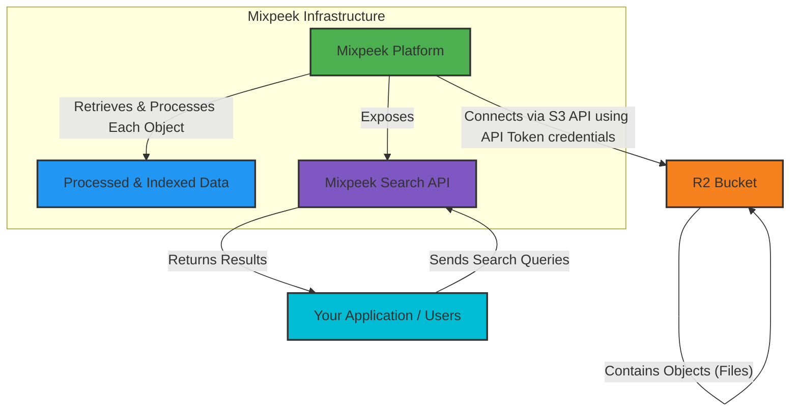

<Note>
  This guide explains how to connect your Cloudflare R2 storage buckets to Mixpeek, enabling automated data ingestion and processing. R2 is S3-compatible, so the connection process is very similar.
</Note>

## Prerequisites

*   An active Cloudflare account.
*   An R2 bucket containing the data you want Mixpeek to process.
*   Permissions to create API Tokens in your Cloudflare account with R2 access.

## Configuration Steps

Connecting Mixpeek to R2 requires granting Mixpeek read access to your bucket.

<Steps>
  <Step title="Create R2 API Token">
    First, create an API Token that grants the necessary permissions for Mixpeek to list and read objects from your R2 bucket.

    1.  Navigate to your Cloudflare Dashboard.
    2.  Go to **My Profile** > **API Tokens**.
    3.  Click **Create Token**.
    4.  You can use the "Read all R2 Buckets" template or create a custom token.
    5.  For a custom token, ensure you grant at least `Object Read` and `Bucket Read` permissions for the specific bucket(s) Mixpeek will access.
        *   **Permissions**:
            *   Account > R2 > Read
        *   **Account Resources**:
            *   Include > Specific account > Your Account
        *   **Bucket Resources** (if you want to limit access to specific buckets):
            *   Include > Specific bucket(s) > Your R2 Bucket Name(s)
    6.  Continue to summary and click **Create Token**.
    7.  **Important:** Copy the **Access Key ID** and **Secret Access Key** displayed. You will also need your **Account ID**. You will need these to configure the connection in Mixpeek. Store them securely. Cloudflare will only show you the Secret Access Key once.

  </Step>

  <Step title="Add R2 Connection in Mixpeek">
    1.  Navigate to the **Integrations** or **Data Sources** section in your Mixpeek dashboard (or Mixpeek Studio).
    2.  Click **Add Connection** or **New Source** and select **Cloudflare R2** (or **S3-Compatible Storage** if a dedicated R2 option is not available).
    3.  Enter the required details:
        *   **Bucket Name:** The name of your R2 bucket.
        *   **Endpoint URL:** Your R2 S3 API endpoint. This looks like `https://<ACCOUNT_ID>.r2.cloudflarestorage.com`. Replace `<ACCOUNT_ID>` with your Cloudflare Account ID.
        *   **Access Key ID:** The Access Key ID from the API Token you created.
        *   **Secret Access Key:** The Secret Access Key from the API Token you created.
        *   Optionally, specify a **Prefix** if you only want Mixpeek to process files within a specific folder in your bucket.
    4.  Click **Test Connection** (if available) to verify the credentials and permissions.
    5.  Click **Save** or **Connect**.
  </Step>
</Steps>

## Verification

Once connected, Mixpeek should start discovering files in your specified R2 bucket (and prefix, if provided). You can monitor the ingestion status within the Mixpeek Studio. Depending on your pipeline configuration, feature extraction and indexing will begin automatically for supported file types.

If you encounter issues, double-check the API Token permissions and the credentials provided in Mixpeek. Ensure the bucket name and S3 endpoint URL (including your Account ID) are correct.

## Conceptual Diagram: Mixpeek and R2 Integration

This diagram illustrates the workflow:
1.  Your data (objects/files) resides in your **R2 Bucket**.
2.  The **Mixpeek Platform** securely connects to your R2 Bucket using the S3 API, authenticating with the API Token credentials you provide (as detailed in the configuration steps).
3.  Mixpeek retrieves each object from the bucket, performs its processing and indexing routines, creating **Processed & Indexed Data** within its infrastructure.
4.  Mixpeek then exposes a **Mixpeek Search API**.
5.  **Your Application or Users** interact with this API by sending search queries.
6.  The API processes these queries against the indexed data and **Returns Results** to your application or users. 