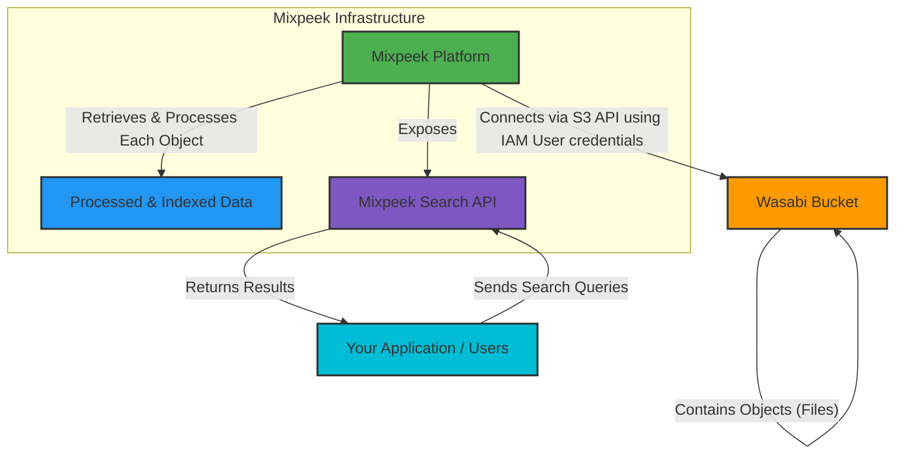

<Note>
  This guide explains how to connect your Wasabi Hot Cloud Storage buckets to Mixpeek, enabling automated data ingestion and processing. Wasabi is S3-compatible, making the integration process straightforward.
</Note>

## Prerequisites

*   An active Wasabi account.
*   A Wasabi bucket containing the data you want Mixpeek to process.
*   Permissions to create IAM users and policies within your Wasabi account.

## Configuration Steps

Connecting Mixpeek to Wasabi requires granting Mixpeek read access to your bucket. This is done by creating an IAM user with appropriate permissions.

<Steps>
  <Step title="Create IAM Policy in Wasabi">
    First, create an IAM policy in your Wasabi console that grants Mixpeek the necessary permissions to list and read objects from your bucket.

    1.  Log in to the Wasabi Console.
    2.  Navigate to **IAM** from the left-hand menu.
    3.  Select **Policies** and click **Create Policy**.
    4.  Switch to the **JSON** tab and paste the following policy document. Remember to replace `YOUR_BUCKET_NAME` with the actual name of your Wasabi bucket.

        ```json
        {
            "Version": "2012-10-17",
            "Statement": [
                {
                    "Effect": "Allow",
                    "Action": [
                        "s3:ListBucket"
                    ],
                    "Resource": [
                        "arn:aws:s3:::YOUR_BUCKET_NAME"
                    ]
                },
                {
                    "Effect": "Allow",
                    "Action": [
                        "s3:GetObject"
                    ],
                    "Resource": [
                        "arn:aws:s3:::YOUR_BUCKET_NAME/*"
                    ]
                }
            ]
        }
        ```
    5.  Click **Next: Tags** (optional), then **Next: Review**.
    6.  Give the policy a descriptive name (e.g., `MixpeekWasabiReadAccessPolicy`) and an optional description. Click **Create policy**.
  </Step>

  <Step title="Create IAM User in Wasabi">
    Next, create an IAM user and attach the policy you just created.

    1.  In the Wasabi IAM console, go to **Users** and click **Add User**.
    2.  Enter a user name (e.g., `mixpeek-wasabi-user`).
    3.  Select **Programmatic access (generates an access key ID and secret access key)** for the Access type.
    4.  Click **Next: Permissions**.
    5.  Choose **Attach existing policies directly**.
    6.  Search for and select the policy you created in the previous step (e.g., `MixpeekWasabiReadAccessPolicy`).
    7.  Click **Next: Tags** (optional), then **Next: Review**, then **Create user**.
    8.  **Important:** Copy the **Access key ID** and **Secret access key**. You will need these to configure the connection in Mixpeek. Store them securely, as the Secret Access Key will not be shown again.
  </Step>

  <Step title="Add Wasabi Connection in Mixpeek">
    1.  Navigate to the **Integrations** or **Data Sources** section in your Mixpeek dashboard (or Mixpeek Studio).
    2.  Click **Add Connection** or **New Source** and select **Wasabi** or **S3-Compatible Storage**.
    3.  Enter the required details:
        *   **Bucket Name:** The name of your Wasabi bucket (e.g., `YOUR_BUCKET_NAME`).
        *   **Region:** The Wasabi service region where your bucket is located (e.g., `us-east-1`, `eu-central-1`). Refer to Wasabi documentation for the correct service URL endpoint to determine your region or use the specific endpoint.
        *   **Endpoint URL (Optional but Recommended):** The S3 endpoint for your Wasabi region (e.g., `s3.wasabisys.com` or `s3.us-east-2.wasabisys.com`). Using the specific regional endpoint is best practice.
        *   **Access Key ID:** The Access Key ID obtained from the Wasabi IAM user.
        *   **Secret Access Key:** The Secret Access Key obtained from the Wasabi IAM user.
        *   Optionally, specify a **Prefix** if you only want Mixpeek to process files within a specific folder in your bucket.
    4.  Click **Test Connection** (if available) to verify the credentials and permissions.
    5.  Click **Save** or **Connect**.
  </Step>
</Steps>

## Verification

Once connected, Mixpeek should start discovering files in your specified Wasabi bucket (and prefix, if provided). You can monitor the ingestion status within the Mixpeek Studio. Depending on your pipeline configuration, feature extraction and indexing will begin automatically for supported file types.

If you encounter issues, double-check the IAM policy permissions, the credentials provided in Mixpeek, and ensure the bucket name and region/endpoint are correct.

## Conceptual Diagram: Mixpeek and Wasabi Integration



This diagram illustrates the workflow:
1.  Your data (objects/files) resides in your **Wasabi Bucket**.
2.  The **Mixpeek Platform** securely connects to your Wasabi Bucket using the S3 API, authenticating with the IAM user credentials you provide (as detailed in the configuration steps).
3.  Mixpeek retrieves each object from the bucket, performs its processing and indexing routines, creating **Processed & Indexed Data** within its infrastructure.
4.  Mixpeek then exposes a **Mixpeek Search API**.
5.  **Your Application or Users** interact with this API by sending search queries.
6.  The API processes these queries against the indexed data and **Returns Results** to your application or users. 