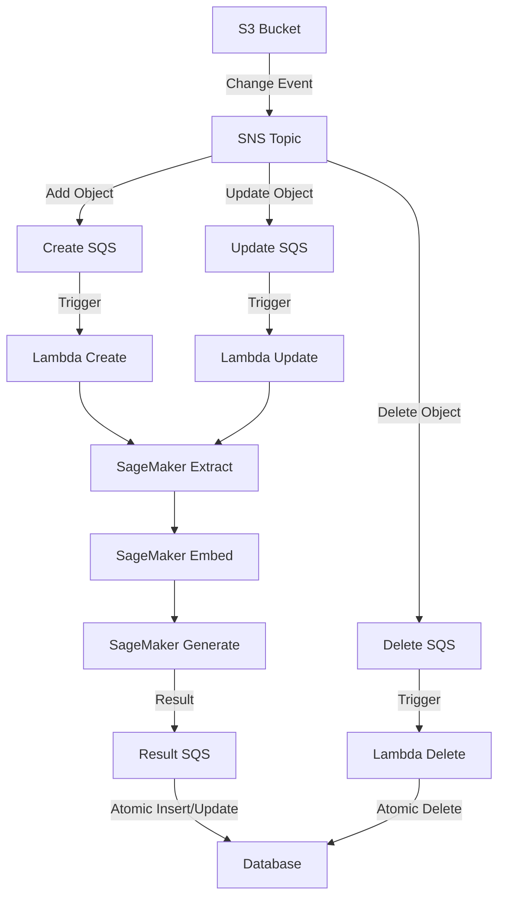

Mixpeek's architecture is designed to maintain consistency between upstream object storage (such as Amazon S3) and downstream databases while allowing for flexible processing pipelines.

## Key Features

1. **Multiple Pipelines**: Users can set up N number of pipelines for each S3 bucket, allowing different processing strategies and database destinations from the same source.
2. **Enrichment Capabilities**: Pipelines can be enriched with external data sources or lookups, enhancing the processed data.
3. **Consistency Maintenance**: The architecture ensures that downstream databases remain consistent with upstream S3 changes through create, delete, and upsert operations.
4. **Scalable Processing**: Utilizes AWS services like SNS, SQS, Lambda, and SageMaker for efficient and scalable data processing.
5. **Transactional Operations**: Implements atomic insertions with rollback capabilities to maintain data integrity in the downstream databases.

## Architecture Overview

The following diagram illustrates the high-level architecture of Mixpeek's system:

## Detailed Flow

1. **S3 Event Trigger**: When a change occurs in the S3 bucket (file added, modified, or deleted), it triggers an event.

2. **SNS Fanout**: The S3 event is sent to an SNS topic, which fans out the message to multiple SQS queues, each representing a different processing pipeline.

3. **Lambda Trigger**: Each SQS queue triggers a specific Lambda function. There are three types of Lambda functions for each pipeline:

   - Create Lambda: Handles new file creations
   - Delete Lambda: Processes file deletions
   - Upsert Lambda: Manages file modifications

4. **SageMaker Processing**: The Lambda functions interact with SageMaker for data processing. Different SageMaker services or models can be used based on the specific requirements of each pipeline.

5. **Enrichment**: During the SageMaker processing step, data can be enriched with external sources or lookups to add value to the processed information.

6. **Result Queue**: After processing, the results are placed in a dedicated SQS queue for each pipeline.

7. **Atomic Database Insertion**: The processed data is inserted into the appropriate downstream database (which could be different for each pipeline) using atomic insertions with rollback capabilities to ensure data consistency.

## Consistency Maintenance

To keep the downstream databases consistent with the upstream S3 changes:

1. **Create Operations**: When a new file is added to S3, the Create Lambda processes it and inserts the new data into the database.

2. **Delete Operations**: When a file is removed from S3, the Delete Lambda ensures that the corresponding data is removed from the database.

3. **Upsert Operations**: When a file is modified in S3, the Upsert Lambda processes the changes and updates the database accordingly.

These operations ensure that any changes in the S3 bucket are reflected in the downstream databases, maintaining consistency across the entire system.

## Scalability and Flexibility

This architecture allows for:

- Multiple pipelines per S3 bucket
- Different processing strategies for each pipeline
- Various database destinations (collections/tables) from the same S3 source
- Easy addition of new pipelines without affecting existing ones

By leveraging AWS services and implementing a modular design, Mixpeek's architecture provides a scalable and flexible solution for maintaining consistency between object storage and databases while allowing for complex data processing and enrichment.
