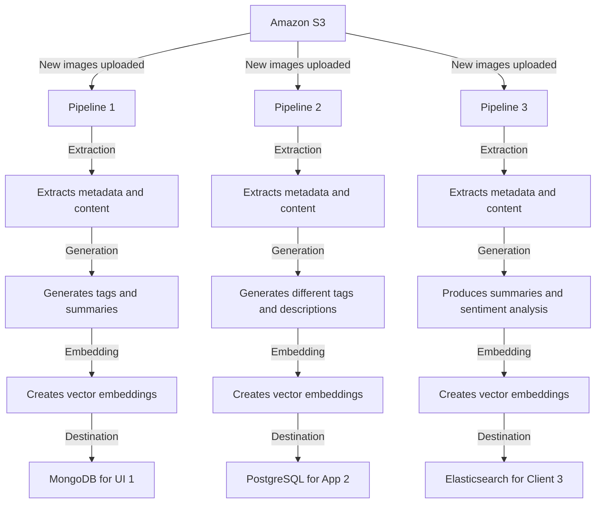

Mixpeek is designed to seamlessly integrate with various datastores and file storage systems, providing a robust pipeline to process and enrich your data. Integrations enable you to connect your existing systems with Mixpeek to extract, generate, and embed rich data across multiple modalities.

### What are Integrations?

Integrations in Mixpeek are the connections established between your datastore or file storage and Mixpeek's processing pipeline. These integrations can serve as either sources or destinations:

- **Sources**: Where your raw data originates (e.g., file storage systems, databases).
- **Destinations**: Where processed and enriched data is stored (e.g., databases).

### How Integrations Work

Whenever you add data to your source, Mixpeek automatically processes it through a connected pipeline and handles the following operations in your destination database:

- **Insertions**: New data is extracted, enriched, and inserted.
- **Updates**: Modified data is reprocessed and updated.
- **Deletions**: Removed data is also deleted in the destination.

This means you never have to worry about sync, replication, consistency, inference, etc. You can focus on your query patterns and never deal with stale data.

### Supported Integrations

<Note>
  If we're missing an integration you need{" "}
  <a href="https://mixpeek.com/contact">reach out</a>
</Note>

<CardGroup cols={2}>
  <Card title="Amazon S3" icon="cloud" href="/integrations/s3">
    Source for data such as images, videos, and documents.
  </Card>
  <Card title="MongoDB" icon="database" href="/integrations/mongodb">
    Destination for storing processed and enriched data.
  </Card>
  <Card title="Pinecone" icon="pinecone" href="/integrations/pinecone">
    Vector database for building vector search applications.
  </Card>
  <Card title="Qdrant" icon="database" href="/integrations/qdrant">
    Open-source vector search engine that supports large-scale datasets.
  </Card>
</CardGroup>

### Integration Setup

Setting up an integration in Mixpeek involves the following steps:

<Steps>
  <Step title="Connect Your Source">
    Provide the necessary credentials and configuration details for your source.
    Configure the type of files you want Mixpeek to process (e.g., images,
    videos, audio, text, documents).
    <a href="/connections/create">Create Connection</a>
  </Step>
  <Step title="Configure the Mixpeek Pipeline">
    Define the extraction, generation, and embedding processes that will be
    applied to your data.
    <a href="/pipelines/create">Create Pipeline</a>
  </Step>
  <Step title="Connect Your Destination">
    Provide the credentials and configuration details for your destination
    database.
    <a href="/connections/create">Create Connection</a>
  </Step>
  <Step title="Activate the Integration">
    Once activated, Mixpeek will start monitoring your source for new or updated
    files and process them through the pipeline to your destination.
    <a href="/pipelines/enable">Enable Pipeline</a>

  </Step>
</Steps>

### Example Integration Workflow

Here’s an example of how a typical integration workflow might look:

### Benefits of Using Mixpeek Integrations

- **Automatic Data Processing**: Effortlessly keep your data processed and up-to-date.
- **Consistency and Reliability**: Ensure your data is always in sync between sources and destinations.
- **Enhanced Querying**: Utilize enriched data for more powerful and accurate queries.
- **Scalability**: Handle large volumes of data with ease, thanks to Mixpeek’s robust pipeline.
