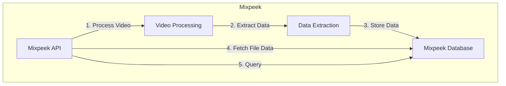

# Mixpeek Quickstart Guide

<Note>
  There is an interactive version of this guide embedded in your dashboard on
  the <a href="https://dash.mixpeek.com/notebooks">Notebooks page</a>
</Note>

<iframe
  width="560"
  height="315"
  src="https://www.youtube.com/embed/jkIXzfKBvM0"
  title="YouTube video player"
  frameborder="0"
  allow="accelerometer; autoplay; clipboard-write; encrypted-media; gyroscope; picture-in-picture"
  allowfullscreen
></iframe>

## System Flow Diagram



## Getting Started

First, import the necessary libraries and initialize the mixpeek api key:

```python
import time
import requests

api_key = "sk_123"  # Replace with your Mixpeek API key
```

## Indexing and Retrieving Video Data

### Step 1: Index a Video

Start by indexing a video URL. This process will extract various data points from the video based on your specified settings.

```python
video_url = "https://mixpeek-public-demo.s3.us-east-2.amazonaws.com/starter/aussie_agility.mp4"

index_response = requests.post(
    "https://api.mixpeek.com/index/url",
    headers={
        "Authorization": f"Bearer {api_key}",
        "Content-Type": "application/json"
    },
    json={
        "url": video_url,
        "collection_id": "quickstart",
        "video_settings": {
            "interval_sec": 10,
            "read": {"model_id": "video-descriptor-v1"},
            "embed": {"model_id": "multimodal-v1"},
            "transcribe": {"model_id": "polyglot-v1"},
            "describe": {
                "model_id": "video-descriptor-v1",
                "prompt": "Create a holistic description of the video, include sounds and screenplay"
            },
            "json_output": {
                "response_shape": {"emotions": ["str", "str"]},
                "prompt": "This is a list of emotion labels, each one should be a string representing the scene."
            }
        }
    }
)

task_id = index_response.json()["task_id"]
print(f"Indexing started. Task ID: {task_id}")
```

### Step 2: Poll for Task Status

Check the status of the indexing task until it's complete:

```python
def poll_task_status(task_id):
    while True:
        response = requests.get(
            f"https://api.mixpeek.com/tasks/{task_id}",
            headers={"Authorization": f"Bearer {mixpeek.api_key}"}
        )
        status = response.json()["status"]
        print(f"Task status: {status}")
        if status == "DONE":
            return response.json()["file_id"]
        time.sleep(10)  # Wait 10 seconds before checking again

file_id = poll_task_status(task_id)
print(f"Indexing complete. File ID: {file_id}")
```

### Step 3: Retrieve Full File Properties

Once the indexing is complete, retrieve the fully extracted video data:

```python
import json

file_properties = requests.get(
    f"https://api.mixpeek.com/collections/file/{file_id}/full",
    headers={"Authorization": f"Bearer {mixpeek.api_key}"}
).json()


{
  "file_id": "9e82b838-4c88-41b3-83c2-a83232a52024",
  "collection_id": "quickstart",
  "status": "DONE",
  "url": "https://mixpeek-public-demo.s3.us-east-2.amazonaws.com/starter/aussie_agility.mp4",
  "created_at": "2024-03-15T17:43:50.681000",
  "video_segments": [
    {
      "start_time": 0.0,
      "end_time": 10.0,
      "transcription": "An Australian Shepherd dog is running through an agility course...",
      "description": "The video starts with an Australian Shepherd dog running through an outdoor agility course. The dog is black, white, and brown in color. It's a sunny day, and the agility course is set up on grass...",
      "text": "Australian Shepherd dog agility course",
      "detect": None,
      "emotions": ["excited", "focused"]
    },
    {
      "start_time": 10.0,
      "end_time": 20.0,
      "transcription": "The dog jumps over hurdles and weaves through poles...",
      "description": "The Australian Shepherd continues its run through the agility course. It jumps over several hurdles in quick succession, then navigates a series of weave poles with precision...",
      "text": "Dog jumps hurdles and weaves through poles",
      "detect": {
        "faces": {
            "registered_face_ids: ['face_1', 'face_2'],
            "face_details": {
                "face_1": {"age": 5},
            },
        },
      },
      "emotions": ["determined", "energetic"]
    },
  ],
}
```

## Searching Indexed Content

With your video indexed, you can now perform text, video or image based searches across your collection:

```python
search_response = requests.post(
    "https://api.mixpeek.com/search/text",
    headers={
        "Authorization": f"Bearer {mixpeek.api_key}",
        "Content-Type": "application/json"
    },
    json={
        "input": "dog jumping",
        "model_id": "multimodal-v1",
        "filters": {"$or": [{"collection_id": "quickstart"}]}
    }
).json()

{
  "results": [
    {
      "modality": "video",
      "file_id": "9e82b838-4c88-41b3-83c2-a83232a52024",
      "results": [
        {
          "score": 0.8923,
          "start_time": 10.0,
          "end_time": 20.0,
          "description": "The Australian Shepherd continues its run through the agility course. It jumps over several hurdles in quick succession...",
          "transcription": "The dog jumps over hurdles and weaves through poles...",
          "text": "Dog jumps hurdles and weaves through poles"
        },
        {
          "score": 0.7845,
          "start_time": 0.0,
          "end_time": 10.0,
          "description": "The video starts with an Australian Shepherd dog running through an outdoor agility course...",
          "transcription": "An Australian Shepherd dog is running through an agility course...",
          "text": "Australian Shepherd dog agility course"
        }
      ]
    }
  ],
  "pagination": {
    "total": 1,
    "page": 1,
    "page_size": 10,
    "total_pages": 1,
    "next_page": None,
    "previous_page": None
  }
}
```

## Next Steps

- Explore more advanced indexing options in the [API documentation](/api-documentation)
- Learn about [file storage integrations](/integrations) for various cloud providers
- Discover [exciting use cases](/use-cases) like Real-Time Video Alerting and Visual Discovery
