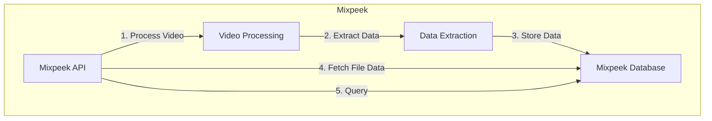

# Mixpeek Quickstart Guide

<Note>
  There is an interactive version of this guide embedded in your dashboard on
  the <a href="https://dash.mixpeek.com/notebooks">Notebooks page</a>
</Note>

<iframe
  width="560"
  height="315"
  src="https://www.youtube.com/embed/jkIXzfKBvM0"
  title="YouTube video player"
  frameborder="0"
  allow="accelerometer; autoplay; clipboard-write; encrypted-media; gyroscope; picture-in-picture"
  allowfullscreen
></iframe>

## System Flow Diagram



## Getting Started

First, install the Mixpeek Python SDK and import the necessary libraries:

`pip install mixpeek`

```python
import mixpeek
import time

# Initialize the Mixpeek client
client = mixpeek.Client(api_key="sk_123")  # Replace with your Mixpeek API key
```

## Indexing and Retrieving Video Data

### Step 1: Index a Video

Start by indexing a video URL. This process will extract various data points from the video based on your specified settings.

```python
video_url = "https://mixpeek-public-demo.s3.us-east-2.amazonaws.com/starter/aussie_agility.mp4"

task = client.index.url(
    target_url=video_url,
    collection_id="quickstart",
    video_settings={
        "interval_sec": 10,
        "read": {"model_id": "video-descriptor-v1"},
        "embed": {"model_id": "multimodal-v1"},
        "transcribe": {"model_id": "polyglot-v1"},
        "describe": {
            "model_id": "video-descriptor-v1",
            "prompt": "Create a holistic description of the video, include sounds and screenplay"
        },
        "json_output": {
            "response_shape": {"emotions": ["str", "str"]},
            "prompt": "This is a list of emotion labels, each one should be a string representing the scene."
        }
    }
)

print(f"Indexing started. Task ID: {task.id}")
```

### Step 2: Wait for Task Completion

Wait for the indexing task to complete:

```python
def on_task_update(status):
    print(f"Current task status: {status}")

status = task.wait_for_done(
    sleep_interval=10,
    callback=on_task_update
)
file_id = task.file_id
```

### Step 3: Retrieve Full File Properties

Once the indexing is complete, retrieve the fully extracted video data:

```python
client.collections.get_full_file(file_id)

{
  "index_id": "ix_123",
  "file_id": "123",
  "collection_id": "collection_123",
  "status": null,
  "url": "file.mp4",
  "metadata": {
    "file": {
      "file_size_bytes": 2074535,
      "last_modified": "Tue, 20 Aug 2024 03:24:42 GMT",
      "mime_type": "video/mp4",
      "file_type": "video"
    }
    // ... other metadata fields ...
  },
  "created_at": "2024-09-24T00:25:57.807000",
  "video_segments": {
    "groups": [
      {
        "split_interval": 1,
        "segments": [
          {
            "start_time": 0,
            "end_time": 1,
            "text": "Cooking Recipe Show"
          }
          // ... other 1-second segments ...
        ]
      },
      {
        "split_interval": 30,
        "segments": [
          {
            "start_time": 0,
            "end_time": 28.287,
            "transcription": "If you're like me..."
          }
        ]
      },
      {
        "split_interval": 120,
        "segments": [
          {
            "start_time": 0,
            "end_time": 28.287,
            "description": "The video segment shows a man..."
          }
        ]
      }
    ],
    "pagination": {
      "total": 3,
      "page": 1,
      "page_size": 10,
      "total_pages": 1,
      "next_page": null,
      "previous_page": null
    }
  }
}

```

## Searching Indexed Content

With your video indexed, you can now perform text, video or image based searches across your collection:

```python
search_results = client.search.text(
    input="dog jumping",
    model_id="multimodal-v1",
    filters={"$or": [{"collection_id": "quickstart"}]}
)

{
  "results": [
    {
      "created_at": "<timestamp>",
      "caption": "<str>",
      "file_id": "<uuid>",
      "collection_id": "<str>",
      "metadata": {},
      "url": "<url>",
      "score": <float>
    }
    // ... more results ...
  ],
  "pagination": {
    "total": <int>,
    "page": <int>,
    "page_size": <int>,
    "total_pages": <int>,
    "next_page": "https://api.mixpeek.com/search/url?page=<int>&page_size=<int>",
    "previous_page": null
  }
}

```

## Next Steps

- Explore more advanced indexing options in the [API documentation](/api-documentation)
- Learn about [file storage integrations](/integrations) for various cloud providers
- Discover [exciting use cases](/use-cases) like Real-Time Video Alerting and Visual Discovery
