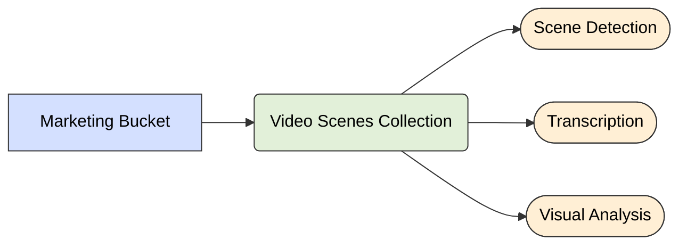

<Note>
  Collections store processed documents with a consistent schema. They are the primary containers for structured data that has been extracted from raw objects.
</Note>

## Overview

When raw objects are processed by feature extractors, the resulting structured data is stored in collections as documents.

<iframe
  width="600"
  height="310"
  src="https://d8ts56gtwtyh1.cloudfront.net/docs/warehouse/collections.mp4"
  title="YouTube video player"
  frameborder="0"
  allow="accelerometer; autoplay; muted"
  allowfullscreen
  autoplay
  muted
></iframe>

<Steps>
  <Step title="Select Source">
    Choose whether to use a bucket or another collection as your data source. Buckets provide raw files, while collections offer already processed documents.
  </Step>
  <Step title="Select Feature Extractors">
    Determine which feature extractors will process your source data. These extractors define what information will be derived from your content.
  </Step>
  <Step title="Pass Properties from Source">
    Specify which properties from your source (blobs from buckets or fields from collections) should be passed to your feature extractors.
  </Step>
  <Step title="Configure Feature Extractors">
    Customize settings for each feature extractor to optimize their performance for your specific use case and content types.
  </Step>
  <Step title="Configure Processing">
    Set up additional processing like taxonomy application to further enhance and organize the extracted features and resulting documents.
  </Step>
</Steps>

When defining a collection's source they can use buckets or existing collections for downstream feature extraction.


### Key Concepts

<AccordionGroup>
  <Accordion title="Schema Consistency" icon="table-columns">
    All documents in a collection share the same schema. Schemas are immutable, and are defined based on the feature extractors used. 
  </Accordion>

  <Accordion title="Source Configuration" icon="database">
    Collections can use buckets or other collections as their source. The source you select makes various properties (blobs if a bucket or documents if a collection) available that can optionally get passed into feature extractors. 

  </Accordion>
</AccordionGroup>


### Collection Schema

Collections maintain schema consistency across all their documents. This schema is determined by the pipeline that processes objects and writes to the collection.

```json
// Example document in a collection
{
  "document_id": "doc_pqr678",
  "collection_id": "col_mno345",
  "source_object_id": "obj_ghi789",
  
  // System metadata fields
  "__fully_enriched": true,
  "__missing_features": [],
  "__pipeline_version": 1,
  
  // Document content (determined by pipeline)
  "title": "Red Running Shoes",
  "description": "Lightweight running shoes with cushioned soles for maximum comfort...",
  "detected_objects": ["shoe", "footwear", "red", "sports equipment"],
  "product_category": "footwear",
  "price": 89.99,
  "brand": "SportStep",
  
  // Timestamps
  "created_at": "2023-05-10T14:22:00Z",
  "updated_at": "2023-05-10T14:22:00Z"
}
```

### System Metadata Fields

All documents in collections include these standard system metadata fields:

| Field | Type | Description |
|-------|------|-------------|
| `__fully_enriched` | boolean | Indicates if all expected features have been successfully extracted |
| `__missing_features` | array | Lists any features that failed to extract during processing |
| `__pipeline_version` | integer | Version of the pipeline that processed this document |
| `source_object_id` | string | Reference to the source object in a bucket |

### Populating Collections

Collections are populated by running feature extractors that process objects and output structured documents.

Once you upload an object, the connected downstream collection(s) will invoke their feature extractor processes. This sequence of actions continues until they all succeed or fail. 




## Documents

Documents are the structured outputs stored in collections after processing objects through pipelines. Each document maintains a reference to its source object and contains extracted features and metadata.


## Limitations

- **Schema Immutability**: Once a collection schema is defined, it cannot be modified without creating a new collection
- **Processing Dependencies**: Collections depend on the availability and reliability of their configured feature extractors
- **Consistency Requirements**: All documents in a collection must conform to the same schema
- **Feature Extraction Failures**: If critical features fail to extract, documents will be marked as incomplete
- **Query Performance**: Very large collections may require optimization through indexing for optimal performance
- **Cross-Collection Querying**: Native joining between collections with different schemas is limited
- **Update Constraints**: Documents in collections are primarily designed for append operations rather than frequent updates

## Caching

Collections support caching to improve performance and reduce computational overhead. For detailed information about caching configuration and best practices, see the [Caching documentation](/overview/caching).
