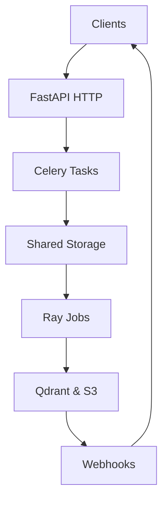
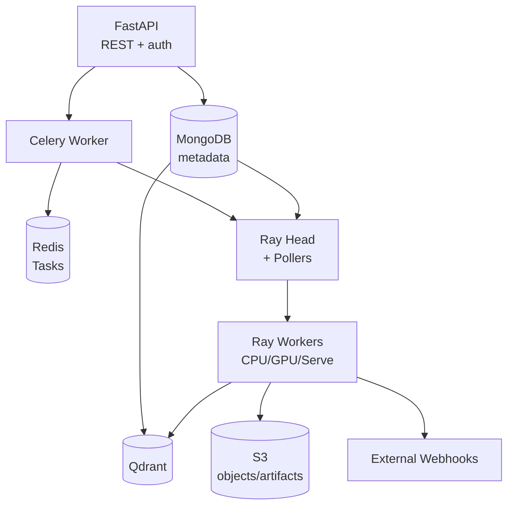

The Mixpeek platform is intentionally split across an API layer, an Engine layer, and a shared storage layer. This separation keeps ingestion, enrichment, and retrieval isolated while still sharing a common data model.

## System Overview

<Frame>

</Frame>

<CardGroup cols={3}>
  <Card title="API Layer" icon="server">
    FastAPI and Celery handle HTTP requests, validation, authorization, metadata updates, task creation, and webhook dispatch.
  </Card>
  <Card title="Engine Layer" icon="microchip">
    Ray orchestrates distributed feature extraction, inference, taxonomy materialization, clustering, and other long-running compute.
  </Card>
  <Card title="Shared Storage" icon="database">
    MongoDB, Qdrant, Redis, and S3 provide the contract between layers—no direct imports cross the API ↔ Engine boundary.
  </Card>
</CardGroup>

## Service Architecture

<Frame>

</Frame>

- Ray pollers read `batches` and `clustering_jobs` from MongoDB, submit jobs, and update status.
- Ray Serve hosts embedding, reranking, audio, and video models.
- Celery Beat scans MongoDB for webhook events and dispatches handlers.

## Layer Separation

<Callout type="warning">
  **Golden Rule:** API and Engine code never import each other. Shared models sit in a neutral library that both layers consume.
</Callout>

- API defines Pydantic schemas, orchestrates workflows, and updates MongoDB + Redis.
- Engine consumes manifests, runs ML workloads, and writes vectors/documents to Qdrant.
- A common library provides enums, models, constants, and utilities that both layers consume.

## Data Flow

### Ingestion (Object → Document)

<Steps>
  <Step title="Upload objects">
    Client uploads objects (`/v1/buckets/{bucket}/objects`)—metadata lands in MongoDB, blobs in S3.
  </Step>
  <Step title="Submit batch">
    Client submits a batch (`/v1/buckets/{bucket}/batches/{batch}/submit`); the API flattens manifests into per-extractor artifacts in S3 and creates tasks.
  </Step>
  <Step title="Process in Ray">
    Ray pollers pick up the batch, execute feature extractors tier-by-tier, write documents to Qdrant, and emit webhook events.
  </Step>
  <Step title="Dispatch events">
    Celery Beat processes webhook events, updates collection schemas, invalidates caches, and notifies external systems.
  </Step>
</Steps>

### Retrieval (Query → Results)

<Steps>
  <Step title="Execute retriever">
    Client calls `/v1/retrievers/{id}/execute` with structured inputs and optional filters.
  </Step>
  <Step title="Validate & plan">
    FastAPI loads the retriever definition, validates inputs, and walks the configured stage pipeline.
  </Step>
  <Step title="Invoke services">
    Stages call Ray Serve for inference, Qdrant for search, MongoDB for joins, and Redis for cache signatures.
  </Step>
  <Step title="Return results">
    Response includes results, stage metrics, cache hints (`ETag`), and budget usage.
  </Step>
</Steps>

## Storage Strategy

| Store | Purpose | Access Pattern |
|-------|---------|----------------|
| **MongoDB** | Metadata, configs, tasks, webhook events | CRUD + aggregation |
| **Qdrant** | Namespace-scoped vector stores + payloads | ANN search + payload filters |
| **Redis** | Task queue (Celery) + cache namespaces | Get/Set + TTL-managed cache |
| **S3** | Raw blobs, manifests, per-extractor artifacts | Large object IO |

- MongoDB indexes include `(internal_id, namespace_id)` to enforce isolation.
- Qdrant names collections `ns_<namespace_id>` and stores collection/document identifiers in payload indexes.
- Redis namespaces keys per feature (`collections`, `retrievers`, etc.) with index signatures baked into cache keys.

## Ray Cluster

- **Head node** hosts the Ray dashboard, job submission API, and pollers.
- **CPU worker pool** handles text extraction, manifest parsing, Qdrant writes.
- **GPU worker pool** runs embeddings, rerankers, video processing, and Ray Serve replicas.
- Autoscaling targets: CPU utilization ~70%, GPU utilization ~80%, with configurable min/max replica counts.
- Custom Ray resources (`{"batch": 1}`, `{"serve": 1}`) isolate heavy batch jobs from inference traffic.

## Communication Patterns

<Tabs>
  <Tab title="Task Queue (API → Engine)">
    MongoDB stores batch descriptors; Ray pollers submit jobs and track state on behalf of the Engine.
  </Tab>
  <Tab title="Webhook Events (Engine → API)">
    Engine writes webhook events to MongoDB. Celery Beat dispatches cache invalidation, schema updates, and external notifications.
  </Tab>
  <Tab title="Real-time Inference (API → Engine)">
    API calls Ray Serve HTTP endpoints for embeddings, reranking, generation, and audio transcription workloads.
  </Tab>
</Tabs>

## Scaling & Deployment

- **API**: scale FastAPI replicas horizontally via Kubernetes HPA; Celery workers scale with queue depth.
- **Engine**: autoscale Ray worker pools (CPU/GPU). Ray Serve replicates per-model deployments with independent scaling policies.
- **Storage**: MongoDB uses replica sets or sharding, Qdrant supports distributed clusters, Redis can run in cluster mode, S3 scales automatically.
- **Deployments**: local development relies on Docker Compose + `./start.sh`; production runs on Kubernetes (or Anyscale for Ray) with dedicated node groups for API, CPU workers, and GPU workers.

## Key Design Decisions

<AccordionGroup>
  <Accordion title="Strict layer boundaries">
    Keep API deployments lightweight and Engine deployments GPU-optimized by isolating codebases and deployment concerns.
  </Accordion>
  <Accordion title="MongoDB + Qdrant pairing">
    Combine flexible metadata storage with high-performance vector search to serve semantic retrieval and filtering.
  </Accordion>
  <Accordion title="Webhook-based events">
    Replace direct imports between Engine and API with durable, observable communication channels that can be retried.
  </Accordion>
  <Accordion title="Prefork Celery workers">
    Prefork workers support task termination, concurrency, and graceful shutdowns—critical for webhook dispatch and maintenance jobs.
  </Accordion>
  <Accordion title="Index signatures">
    Index signatures prevent stale caches and keep retrievers consistent without manual invalidation.
  </Accordion>
</AccordionGroup>

## Further Reading

- [Processing → Feature Extractors](/processing/feature-extractors) for extractor catalogs and configuration patterns
- [Retrieval → Retrievers](/retrieval/retrievers) for stage pipelines, caching, and execution telemetry
- [Operations → Deployment](/operations/deployment) for local and production deployment topologies
- [Operations → Observability](/operations/observability) for metrics, logging, and tracing integrations
