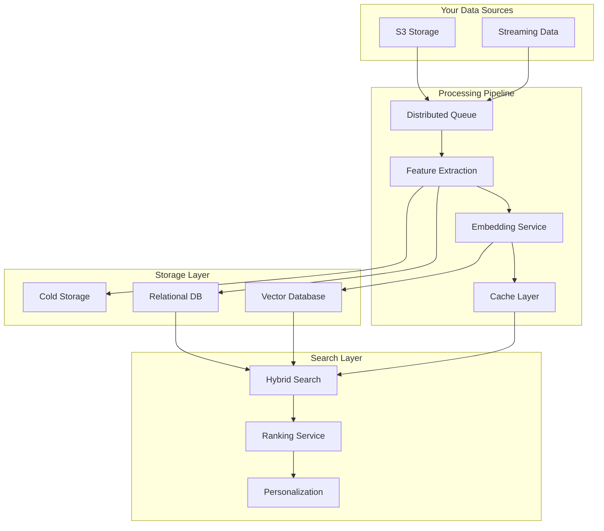

# Building Your Own Search Infrastructure

Before diving into the architecture diagram, let's understand the key components and challenges when building a general-purpose indexing tool for high-cardinality systems like S3:

## Core Components

### Feature Extraction & Processing

- Custom feature extraction configurations for different content types
- Model versioning and embedding updates
- Handling multiple modalities (text, image, video)

**Implementation:** Model inference using open-source models (BERT, ResNet, etc.) deployed on Amazon SageMaker, with automated model registry and versioning

### Queuing & Caching

- Distributed queuing to handle high-volume processing
- Cache management to ensure performance
- Ensuring all content gets processed reliably

**Implementation:** Celery workers for distributed task processing, Redis for caching and task queues, with automatic retry mechanisms

### Hybrid Storage

- Vector databases for similarity search (KNN)
- Transactional databases for metadata
- Cold storage for original content
- Cache layer for frequent access

**Implementation:** MongoDB for metadata storage, Qdrant for vector similarity search, S3 for cold storage, Redis for hot cache

### Synchronization

- Real-time sync with source object stores
- Handling streaming data
- Maintaining consistency across storage types

**Implementation:** S3 Event Notifications → SQS → Lambda for real-time updates, scheduled polling jobs for consistency checks, DynamoDB for state management

### Search Capabilities

- Multi-vector search across modalities
- Simplified retrieval syntax
- Personalization through:
  - Reranking
  - Learning to Rank (LTR)
  - Model fine-tuning

**Implementation:** Query parity across vector stores, custom ranking algorithms, A/B testing framework for search optimization

### Performance Optimization

- Query analytics
- Dynamic indexing
- Scale management
- System stability

**Implementation:** ClickHouse for query analytics and performance tracking, automated index creation based on query patterns, horizontal scaling with Kubernetes

## System Architecture

Below is a visualization of how these components interact:



## DIY Implementation Challenges

### 1. Infrastructure Components

- **Feature Extraction Pipeline**

  - Multiple model deployments
  - Version management
  - Embedding updates
  - Custom extraction configurations

- **Storage & Queuing**

  - Distributed queue management
  - Multi-database synchronization
  - Cache invalidation
  - Cold storage optimization

- **Search Implementation**
  - Vector similarity search
  - Keyword search
  - Metadata filtering
  - Result merging logic

### 2. Operational Challenges

- High availability across all components
- Scaling with data growth
- Error handling and recovery
- Model versioning and updates
- Data consistency across stores
- Performance optimization
- Security implementation

## Mixpeek Simplification

### Two API Calls

1. **Index API**

```python
# Single call to index any content
response = mixpeek.index(
    url="your-content-url",
    collection_id="your-collection",
    feature_extractors=["text", "image", "video"]
)
```

2. **Search API**

```python
# Single call to search across all modalities
results = mixpeek.search(
    queries=["your search query"],
    collection_ids=["your-collection"],
    vector_index="multimodal"
)
```

### Key Benefits

- No infrastructure management
- Automatic scaling
- Built-in version management
- Pre-optimized performance
- Unified API for all modalities
- Automatic synchronization
- Built-in security and compliance
