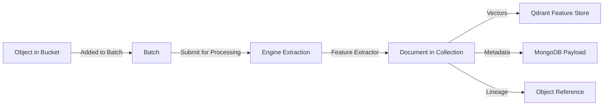

Mixpeek's data model is built around a clear transformation pipeline: **Objects → Documents → Features**. Each entity has a specific purpose, and lineage metadata ensures you can always trace results back to their source.

## Core Entities

<CardGroup cols={3}>
  <Card title="Objects" icon="box">
    Raw inputs registered in buckets. Objects hold blobs (video, image, text, audio) and metadata but are **not processed** until added to a batch.
  </Card>
  <Card title="Documents" icon="file-lines">
    Processed representations created by feature extractors. Documents live in collections and include vectors, metadata, and lineage references.
  </Card>
  <Card title="Features" icon="microchip">
    Extracted representations (embeddings, classifications, segments) stored as Qdrant vectors and referenced by feature URIs.
  </Card>
</CardGroup>

## Transformation Flow



### 1. Object Registration

Objects are created via the Buckets API and validated against the bucket's JSON schema:

```bash
POST /v1/buckets/{bucket_id}/objects
```

**Object Structure:**
- `object_id` – unique identifier
- `bucket_id` – parent bucket reference
- `key_prefix` – logical path/grouping
- `blobs[]` – array of file references or inline data
- `metadata` – custom JSON validated against bucket schema
- `created_at` / `updated_at` – audit timestamps

Objects remain **inert** until processed. They exist as metadata records and S3 blob references only.

### 2. Batch Processing

Batches group objects for efficient parallel processing:

```bash
POST /v1/buckets/{bucket_id}/batches
POST /v1/buckets/{bucket_id}/batches/{batch_id}/submit
```

When submitted, the API:
1. Resolves all collections that consume the bucket
2. Generates per-extractor artifacts (manifests) and uploads to S3
3. Dispatches Ray tasks to the Engine with S3 artifact URIs

### 3. Document Creation

The Engine runs feature extractors in parallel. For each object and each collection:

1. **Download manifest** – fetch extractor config and input mappings
2. **Execute extractor** – run model inference (embeddings, classifications, etc.)
3. **Write to Qdrant** – upsert vectors and payload with `internal_id` tenant filter
4. **Update metadata** – set `__fully_enriched`, `__pipeline_version`, `source_object_id`

**Document Structure:**
- `document_id` – Qdrant point ID
- `collection_id` – parent collection
- `source_object_id` – lineage back to originating object
- `root_object_id` – if object was derived, traces to original input
- `feature_refs[]` – array of feature URIs (e.g., `mixpeek://text_extractor@v1/text_embedding`)
- `metadata` – passthrough fields + enrichments from taxonomies/clusters
- `__fully_enriched` – boolean flag indicating all extractors succeeded
- `__missing_features` – array of feature addresses that failed
- `__pipeline_version` – integer tracking collection schema version

### 4. Feature Storage

Features are stored as Qdrant vectors with named indexes:

**Feature URI Format:**
```
mixpeek://<extractor_name>@<version>/<output_name>
```

Example:
```
mixpeek://text_extractor@v1/text_embedding
mixpeek://video_extractor@v1/scene_embeddings
mixpeek://image_extractor@v1/clip_embedding
```

These URIs are used in:
- Retriever stage configurations (`feature_address`)
- Taxonomy input mappings
- Join enrichment strategies

## Lineage Tracking

Every document maintains lineage metadata for auditability and debugging:

| Field | Purpose |
|-------|---------|
| `source_object_id` | The immediate parent object |
| `root_object_id` | The original root object (for derived documents) |
| `collection_id` | Which collection produced this document |
| `__pipeline_version` | Collection schema version at processing time |

### Querying Lineage

Use the Document Lineage API to trace provenance:

```bash
# Get full lineage tree for a document
GET /v1/collections/{collection_id}/documents/{document_id}/lineage

# Find all documents derived from an object
GET /v1/documents/by-object/{object_id}

# Visualize decomposition tree (for hierarchical processing)
GET /v1/documents/{document_id}/lineage/tree
```

## Multi-Level Decomposition

Some extractors produce **multiple documents per object** (e.g., video → scenes, PDF → pages):

```
Object: video_file.mp4
  └─ Document: full_video_summary
       ├─ Document: scene_001 (0:00-0:15)
       ├─ Document: scene_002 (0:15-0:32)
       └─ Document: scene_003 (0:32-1:00)
```

Each scene document includes:
- `source_object_id` → points to `video_file.mp4` object
- `root_object_id` → same as `source_object_id` (unless video itself was derived)
- `parent_document_id` → points to `full_video_summary` document (if hierarchical)
- `segment_metadata` → `{ start_time: 0.0, end_time: 15.0 }`

## Tenant Isolation

All entities are scoped by:
- **`internal_id`** (organization) – injected at API layer from `Authorization` header
- **`namespace_id`** – resolved from `X-Namespace` header

Qdrant collections map 1:1 to namespaces, and all queries/writes automatically include `internal_id` filters. This ensures hard multi-tenancy without application-level filtering.

## Schema Evolution

Collections track `__pipeline_version` to handle schema changes:

1. Update collection definition (add/remove extractors, change mappings)
2. Increment `pipeline_version` automatically
3. New batches write documents with updated version
4. Old documents remain queryable with legacy schema
5. Optional: Trigger reprocessing to backfill with new extractors

## Feature Reuse Across Collections

Feature extractors are **reusable**. Multiple collections can reference the same extractor with different input mappings:

```json
// Collection A: Product descriptions
{
  "feature_extractor": {
    "feature_extractor_name": "text_extractor",
    "input_mappings": { "text": "product_description" }
  }
}

// Collection B: Customer reviews
{
  "feature_extractor": {
    "feature_extractor_name": "text_extractor",
    "input_mappings": { "text": "review_text" }
  }
}
```

Both produce `mixpeek://text_extractor@v1/text_embedding` features, enabling **cross-collection search** via retrievers that span multiple collection IDs.

## Document Lifecycle States

| State | Meaning |
|-------|---------|
| `pending` | Batch submitted but Engine hasn't started processing |
| `processing` | Feature extraction in progress |
| `completed` | All extractors succeeded (`__fully_enriched: true`) |
| `partial` | Some extractors failed (`__missing_features` populated) |
| `enriching` | Materialized taxonomy/cluster enrichment running |

Query `__fully_enriched` in retriever filters to exclude incomplete documents.

## Best Practices

<AccordionGroup>
  <Accordion title="Design bucket schemas for validation, not storage">
    Bucket schemas enforce input shape but don't constrain downstream processing. Keep them minimal and use collection `field_passthrough` to propagate only what's needed.
  </Accordion>

  <Accordion title="Use key_prefix for logical grouping">
    Organize objects with `key_prefix` (e.g., `/catalog/electronics`, `/users/avatars`) to enable bulk operations and filtering without custom metadata.
  </Accordion>

  <Accordion title="Batch efficiently">
    Group 100-1000 objects per batch for optimal throughput. Smaller batches add orchestration overhead; larger batches delay feedback and complicate retries.
  </Accordion>

  <Accordion title="Leverage lineage for debugging">
    When retrieval results are unexpected, use lineage APIs to trace documents back to source objects and inspect raw input data and processing history.
  </Accordion>

  <Accordion title="Version collections explicitly">
    When changing extractors or mappings, create a new collection rather than mutating the existing one. This preserves reproducibility and simplifies rollback.
  </Accordion>
</AccordionGroup>

## Example: E-Commerce Product Pipeline

```json
1. Register object in "products" bucket:
   - blobs: [{ property: "image", type: "image", url: "s3://..." }]
   - metadata: { sku: "HD-9000", category: "headphones", price: 299 }

2. Process through "product-embeddings" collection:
   - Extractor: image_extractor@v1 → CLIP embeddings
   - Extractor: text_extractor@v1 → description embeddings
   - Passthrough: sku, category, price

3. Resulting document in Qdrant:
   - document_id: "doc_abc123"
   - source_object_id: "obj_prod_001"
   - feature_refs: [
       "mixpeek://image_extractor@v1/clip_embedding",
       "mixpeek://text_extractor@v1/text_embedding"
     ]
   - metadata: { sku: "HD-9000", category: "headphones", price: 299 }
   - __fully_enriched: true

4. Query with hybrid retriever:
   - Stage 1: semantic_search on text_embedding
   - Stage 2: filter by category = "headphones"
   - Stage 3: sort by price ascending
```

## Next Steps

- Learn how [Feature Extractors](/processing/feature-extractors) transform objects into features
- Explore [Collections](/ingestion/collections) configuration and output schemas
- Review [Document Lineage API](/api-reference/document-lineage/get-document-lineage) for tracing provenance
- Understand [Namespaces](/ingestion/namespaces) for tenant isolation

