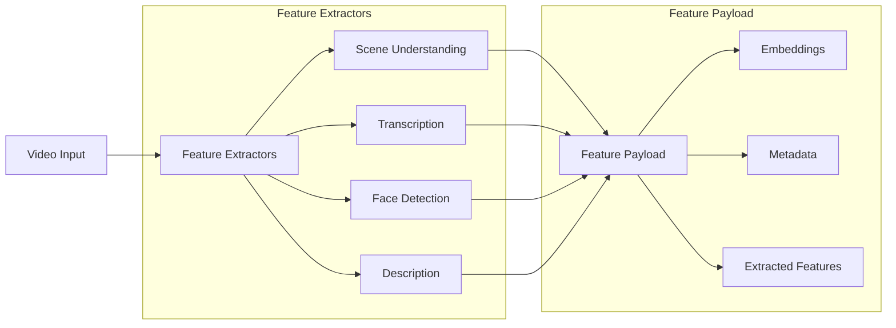
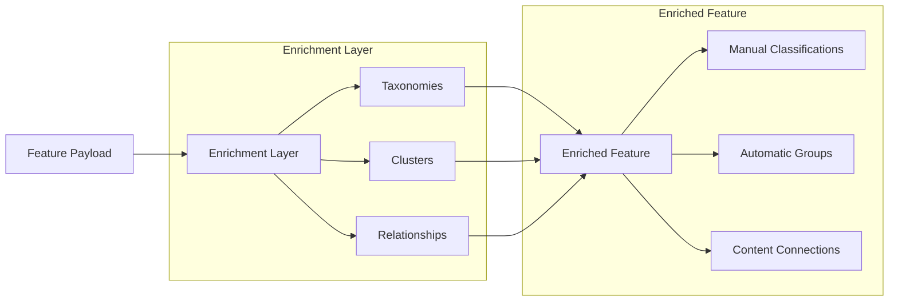
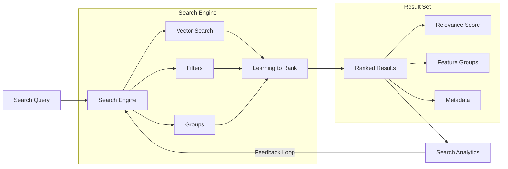

Mixpeek provides infrastructure that allows developers to construct their own search experiences, aligned to their business. It enables this via three layers:

1. **Feature Extraction** - Extract meaningful information from any content type using state-of-the-art models (OSS, BYO, or Mixpeek proprietary)
2. **Entity Enrichment** - Enhance extracted features with domain knowledge through manual classification, automatic clustering, and relationship mapping
3. **Search & Discovery** - Build powerful search experiences with vector similarity, filtering, grouping, and advanced capabilities like Learning to Rank and Fine-Tuning. 

## 1. Multimodal Feature Extraction

Features are the core primitive in Mixpeek. They represent extracted information from any content type using state-of-the-art AI models.



### Asset Processing Examples

<CodeGroup>
```json Video Feature Extraction
{
  "feature_extractors": [
    {
      "interval_sec": 5,
      "embed": [
        {
          "type": "url",
          "embedding_model": "vertex-multimodal"  // Scene understanding
        },
        {
          "type": "text",
          "value": "red dog",
          "embedding_model": "vertex-multimodal"  // Append additional data about the scene
        }
      ],
      "transcribe": { 
        "enabled": true,
        "embedding_model": "bge-m5" // transcribe and embed the transcription using a multilingual model
      },
      "detect": {
        "faces": {
          "enabled": true, // grab the faces out and match against your internally enrolled face collection
          "confidence_threshold": 0.8
        }
      },
      "describe": { "enabled": true } // create a description of the video
    }
  ]
}
```

```json Image Feature Extraction
{
  "feature_extractors": {
    "embed": [
      {
        "embedding_model": "multimodal",
        "type": "url"  // Generate embeddings for visual similarity search
      },
      {
        "embedding_model": "image",
        "type": "url"  // Specialized image embedding model
      }
    ],
    "describe": {
      "enabled": true,  // Generate natural language description
      "max_length": 1000
    },
    "detect": {
      "faces": {
        "enabled": true,  // Detect and analyze faces
        "confidence_threshold": 0.8
      }
    },
    "json_output": {
      "response_shape": {
        "colors": ["str"],  // Extract dominant colors
        "objects": ["str"]  // Detect objects in image
      }
    }
  }
}
```

```json Text Feature Extraction
{
  "feature_extractors": {
    "embed": [
      {
        "embedding_model": "multimodal",
        "type": "text",  // Generate embeddings for semantic search
        "value": "content"
      },
      {
        "embedding_model": "keyword",  // Keyword-focused embedding
        "type": "text",
        "value": "content"
      }
    ],
    "json_output": {
      "response_shape": {
        "key_phrases": ["str"],  // Extract important phrases
        "sentiment": "str"  // Analyze sentiment
      }
    },
    "entities": {
      "taxonomy_extraction": {
        "taxonomy_ids": ["tax_123"],  // Classify content using taxonomies
        "confidence_threshold": 0.8,
        "embedding_models": ["multimodal", "text"]
      }
    }
  }
}
```
</CodeGroup>

[Learn more about Feature Extraction →](/ingestion/extractors)

## 2. Feature Enrichment

Once features are extracted, they can be enriched with domain knowledge through three main mechanisms:

<CardGroup cols={3}>
  <Card title="Taxonomies" icon="sitemap">
    Manual classification using predefined hierarchies for strict content organization
    
    [Learn More →](/entities/taxonomies)
  </Card>
  
  <Card title="Clusters" icon="object-group">
    Automatic content grouping using similarity and patterns
    
    [Learn More →](/entities/clusters)
  </Card>
  
  <Card title="Relationships" icon="diagram-project">
    Define connections between features, nodes, and clusters
    
    [Learn More →](/entities/relationships)
  </Card>
</CardGroup>



## 3. Search & Discovery

Enriched features enable powerful search capabilities:

<AccordionGroup>
  <Accordion title="Core Search Features">
    - Vector similarity search
    - Filtering by metadata and entities
    - Result grouping
    - Pagination and sorting
    
    [Learn More →](/search/overview)
  </Accordion>

  <Accordion title="Advanced Capabilities">
    - Learning to Rank (LTR)
    - Search interaction tracking
    - Collaborative filtering
    - Model fine-tuning
    
    [Learn More →](/search/rerank)
  </Accordion>
</AccordionGroup>




### Search Configuration Example

<CodeGroup>
```json Search with Filters and Groups
{
  "queries": [
    {
      "type": "text",
      "value": "product demonstration",
      "embedding_model": "text"
    }
  ],
  "filters": {
    "AND": [
      {
        "key": "entities[].node",
        "operator": "in",
        "value": ["training_videos"]
      }
    ]
  },
  "group_by": {
    "field": "asset_id",
    "max_features": 10
  }
}
```
</CodeGroup>


[Learn about Filtering →](/search/filters)

[Learn about Grouping →](/search/group)

## Best Practices

<Steps>
  <Step title="Plan Your Feature Extraction">
    Choose appropriate models and intervals based on your content type and needs
  </Step>
  <Step title="Design Your Domain Model">
    Create taxonomies and relationships that reflect your business logic
  </Step>
  <Step title="Optimize Search">
    Use filters, grouping, and reranking to improve result relevance
  </Step>
  <Step title="Monitor & Iterate">
    Track search interactions and refine your implementation
  </Step>
</Steps>

<Note>
  Need help getting started? Check out our [Quick Start Guide](/overview/quickstart) or contact our support team.
</Note>
