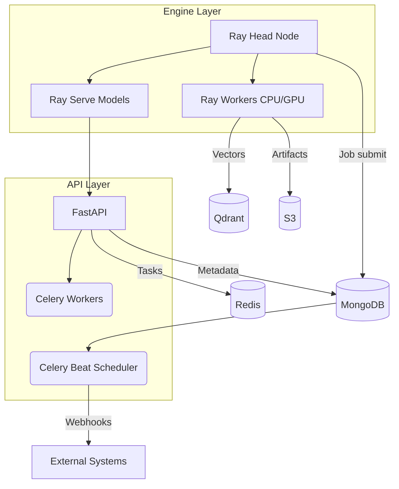

<Note>
  Mixpeek turns raw multimodal inputs—text, images, video, audio, PDFs—into structured documents, reusable features, and query-ready indexes. **Skip 6-12 months of infrastructure work**: Mixpeek replaces 15+ tools (vector DBs, ML orchestration, feature stores, search infrastructure) with a single API. No ops, no ML deployment, no pipeline code—just configuration.
</Note>

## What Mixpeek Replaces

<CardGroup cols={3}>
  <Card title="ML Orchestration" icon="diagram-project">
    Airflow, Prefect, Temporal, Kubeflow
  </Card>
  <Card title="Vector & Search" icon="magnifying-glass">
    Qdrant, Pinecone, Weaviate, Elasticsearch
  </Card>
  <Card title="Feature Infrastructure" icon="database">
    Feast, Tecton, custom feature stores
  </Card>
</CardGroup>

## Zero Infrastructure, Maximum Power

<CardGroup cols={2}>
  <Card title="No ML Ops Required" icon="robot">
    Deploy CLIP, Whisper, LayoutLM, or custom models **without infrastructure**. Mix extractors across collections. [Model Registry](/processing/model-registry) handles versions, GPU allocation, and autoscaling. You write JSON configs, not Kubernetes manifests.
  </Card>
  <Card title="Retrievers = Semantic JOINs" icon="link">
    Search is a **JOIN operation** using vector similarity instead of foreign keys. Chain stages (search → filter → rank → enrich → transform) into [multi-hop graphs](/retrieval/retrievers). Connect documents across collections—no ETL code required.
  </Card>
  <Card title="Versioned & Immutable" icon="code-branch">
    Taxonomies, extractors, and pipelines are versioned snapshots. A/B test retrieval strategies, roll back configs, and track complete lineage from result → document → object → source file.
  </Card>
  <Card title="Production-Grade Observability" icon="chart-line">
    **ClickHouse analytics**, multi-channel notifications (email, Slack, SMS, webhooks), audit logs, and real-time task monitoring. Built-in caching delivers sub-100ms retrieval latency.
  </Card>
  <Card title="Multi-Database Orchestration" icon="database">
    One API, five databases underneath: MongoDB (metadata), Qdrant (vectors), ClickHouse (analytics), Redis (cache), S3 (files). Cross-database queries, transactions, and routing handled automatically.
  </Card>
  <Card title="Parallel Enrichment at Scale" icon="gauge-high">
    [Taxonomy enrichment](/enrichment/taxonomies) runs as parallel joins across Qdrant collections. Process thousands of documents concurrently. Hierarchical taxonomies and flat tags use the same JOIN stage—just configuration.
  </Card>
</CardGroup>

## Time Saved

| Task | Without Mixpeek | With Mixpeek |
|------|----------------|--------------|
| Setup vector search | 2-4 weeks | 5 minutes |
| Build feature extraction pipeline | 4-8 weeks | 1 hour |
| Implement multi-modal search | 6-12 weeks | 30 minutes |
| Add new ML model | 2-4 weeks | Config change |
| Multi-tenant architecture | 4-8 weeks | Built-in |
| Taxonomies & semantic joins | 4-8 weeks | 1 hour |
| **Total engineering effort** | **6-12 months** | **Days** |

## Core Workflows

<Steps>
  <Step title="Isolate tenants with namespaces">
    Provision namespaces (or use the default) to keep tenants and environments separate. Pass `X-Namespace` on every authenticated request.
  </Step>
  <Step title="Register raw objects">
    Store files or JSON payloads as [Objects](/ingestion/objects) inside schema-backed [Buckets](/ingestion/buckets). Mixpeek tracks blobs, metadata, and lineage without processing yet.
  </Step>
  <Step title="Define collections and extract features">
    Create [Collections](/ingestion/collections) to map object fields into feature extractor inputs. The Engine downloads per-extractor artifacts, runs Ray tasks, and writes documents plus vectors to Qdrant.
  </Step>
  <Step title="Enrich with taxonomies and clustering">
    Apply [Taxonomies](/enrichment/taxonomies) (flat or hierarchical) or [Clusters](/enrichment/clusters) to attach structured metadata. Both reuse the JOIN stage for fast, parallel enrichment.
  </Step>
  <Step title="Retrieve with multi-stage pipelines">
    Compose [Retrievers](/retrieval/retrievers) from search, filter, rank, enrich, transform, and compose stages. Fetch presigned URLs, execution metrics, and cache-aware responses in a single API call.
  </Step>
</Steps>

## Architecture Snapshot

<Frame>

</Frame>

## Request Headers

```bash
Authorization: Bearer sk_live_xxx
X-Namespace: ns_production  # required when multi-tenancy is enabled
```

## Next Steps

- Follow the [Quickstart](/overview/quickstart) to stand up Mixpeek locally or in the cloud
- Review [Core Concepts](/overview/concepts) for namespaces, objects, documents, and lineage patterns
- Study the complete [Architecture](/overview/architecture) and [Caching](/overview/caching) strategies
- Explore ready-made [Recipes](https://mixpeek.com/recipes) or jump straight into the [API Reference](/api-reference/introduction)

Looking for real-world help? Use the “Talk to Engineers” CTA in the top bar and we’ll walk you through deployment or integration planning.
