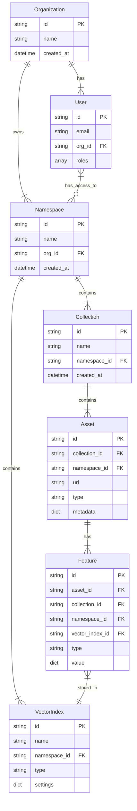

Mixpeek is a developer platform for building multimodal search applications, this enables natural language queries that can understand intention to retrieve results that span multiple types of media. With Mixpeek, you can:

- Extract meaningful features from images, videos, and text
- Build powerful search experiences across different content types
- Create custom search experiences tailored to your use case
- Deploy production-ready applications with scalable infrastructure

## How It Works

1. **Index Your Content**: Upload your media (images, videos, text) to Mixpeek
2. **Extract Features**: Mixpeek automatically processes your content to extract meaningful features
3. **Search & Analyze**: Use our APIs to build search, recommendation, and analytics applications

## Key Features

### 🔍 Multimodal Search

Build sophisticated search experiences:

- Natural language queries across all media types
- Visual similarity search for images and videos
- Cross-modal search (find images with text, or vice versa)
- Semantic understanding of content

Learn more in our [Search documentation](/search/queries).

### 🎯 Feature Extraction

Extract valuable insights automatically:

- Object and scene detection
- Text extraction from images and videos
- Face detection and recognition
- Custom extraction pipelines

Explore our [Features documentation](/concepts/features) to learn more.

### 🏗️ Core Concepts

- **[Namespaces](/concepts/namespaces)**: Isolated environments for your applications
- **[Collections](/concepts/collections)**: Logical groupings of related content
- **[Vector Indexes](/concepts/vector-indexes)**: Efficient similarity search infrastructure
- **[Assets](/concepts/assets)**: Your indexed media content
- **[Features](/concepts/features)**: Extracted data points from your content
- **[Tasks](/concepts/tasks)**: Background processing jobs

### Key Concepts

- **Content Types**: Different types of media content
- **Feature Extraction**: Automated processing and analysis
- **Metadata**: Additional information about assets
- **Lifecycle Management**: Asset creation to deletion

#### How Everything Relates

The Mixpeek system is organized hierarchically, with Organizations at the top level managing access and resources across the platform. Here's how the different components interact:

#### Component Relationships

1. **Organizations & Users**

   - Organizations are the top-level entities that contain users and namespaces
   - Users belong to organizations and can have access to multiple namespaces

2. **Namespaces**

   - Act as containers for collections and vector indexes
   - Provide isolation and organization of resources
   - Can be accessed by multiple users

3. **Collections & Assets**

   - Collections organize related assets
   - Assets are stored within collections and can have multiple features

4. **Features & Vector Indexes**
   - Features are extracted from assets and stored in vector indexes
   - Vector indexes enable efficient similarity search and retrieval
   - Each feature is associated with a specific vector index type

### 🔌 Existing Integrations

Connect with your existing stack:

- **Databases**: MongoDB, PostgreSQL, Supabase
- **Vector Stores**: Pinecone, Weaviate, Qdrant
- **Caching**: Redis integration for high performance

View all [Integrations](/integrations).

## Common Use Cases

- **[Video Alerting](/use-cases/video-alerting)**: Real-time monitoring and detection of objects, events, or anomalies in video streams.

- **[Visual Discovery](/use-cases/visual-discovery)**: Power visual search engines and recommendation systems based on image similarity and style matching.

- **[Multimodal Search](/use-cases/multimodal-search)**: Enable users to search across all content types using natural language or visual inputs.

- **[Content Recommendation](/use-cases/content-recommendation)**: Build personalized recommendation systems using visual and semantic understanding.

- **[Media Analytics](/use-cases/media-analytics)**: Gain insights through automated content analysis, object detection, and categorization.

- **[Multimodal RAG](/use-cases/multimodal-rag)**: Create AI applications that can understand and process information across text, images, and videos.

- **[Content Organization](/use-cases/content-organization)**: Automatically organize and tag media libraries using AI-powered content understanding.

## Getting Started

1. **[Quickstart Guide](/overview/quickstart)**: Set up your first Mixpeek application
2. **[Client Libraries](/overview/client-libraries)**: Integrate using our SDKs
3. **[API Reference](/api-reference)**: Explore our REST API
4. **[Studio](/studio/overview)**: Use our visual interface to manage content

## Resources

- [Learning Center](https://mixpeek.com/learn)
- [Release Notes](https://learn.mixpeek.com/release-notes/)
- [Usage Limits](/overview/limits)
- [Contact Support](https://mixpeek.com/contact)

Ready to build? [Create your account](https://mixpeek.com/start) or check out our [Quickstart Guide](/overview/quickstart).
