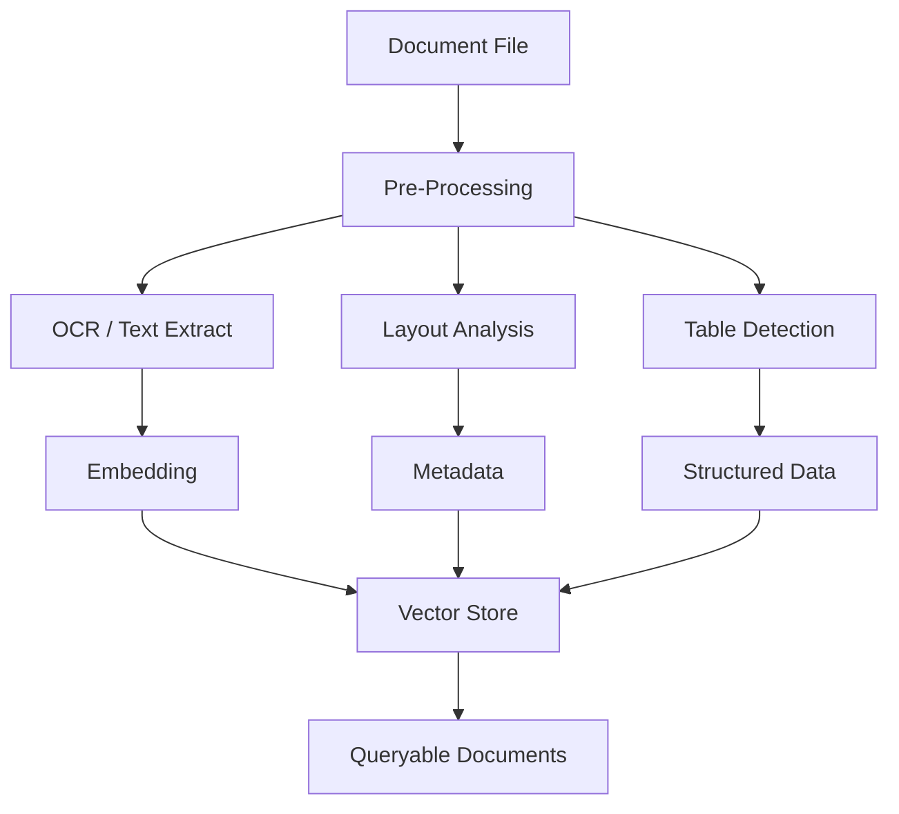

<Note>
  **Business Impact:** Make 100,000 PDFs searchable like a database. Find "all contracts with 30-day termination clauses" or "invoices over $10K mentioning Acme Corp" in seconds. Extract tables, entities, and clauses automatically—no manual data entry.
</Note>

Document intelligence transforms unstructured files (PDFs, images, scanned documents) into queryable, analyzable data. This pattern combines OCR, layout analysis, table extraction, and semantic embeddings to unlock insights from document archives.

## vs Building It Yourself

| Task | Without Mixpeek | With Mixpeek |
|------|-----------------|--------------|
| OCR pipeline (Tesseract/Cloud Vision) | 3-4 weeks | Instant |
| PDF text extraction & layout analysis | 4-5 weeks | Instant |
| Table detection & structure extraction | 5-6 weeks | Config change |
| NER (Named Entity Recognition) | 3-4 weeks | Config change |
| Semantic search across documents | 6-8 weeks | 1 hour |
| Multi-page document reassembly | 2-3 weeks | Built-in lineage |

**Engineering time saved: 5-7 months** • **ML Ops: Zero**

<Tip>
  **Key Differentiator:** Process native PDFs, scanned documents, and images with the same API. Extractors detect document type and apply OCR only when needed. Query by semantic meaning ("termination clauses") or exact entities (dollar amounts, company names).
</Tip>

## Architecture Overview



## Feature Extractors

| Extractor | Capabilities | Use Cases |
|-----------|--------------|-----------|
| **document_extractor@v1** | OCR (Tesseract/Cloud Vision), layout detection, page segmentation | Scanned documents, invoices, forms |
| **pdf_extractor@v1** | Native PDF text extraction, metadata, page-level chunking | Digital PDFs, reports, papers |
| **table_extractor@v1** | Table detection, cell extraction, structure preservation | Financial statements, data sheets |
| **image_extractor@v1** | Visual embeddings (CLIP), object detection, caption generation | Diagrams, charts, photos in documents |
| **text_extractor@v1** | Text embeddings, named entity recognition (NER), summarization | Extracted text enrichment |

## Implementation Steps

### 1. Create a Document Bucket

```bash
POST /v1/buckets
{
  "bucket_name": "contracts-archive",
  "description": "Legal contracts and agreements",
  "schema": {
    "properties": {
      "document_url": { "type": "url", "required": true },
      "document_type": { "type": "text", "required": true },
      "contract_date": { "type": "datetime" },
      "parties": { "type": "array" },
      "jurisdiction": { "type": "text" }
    }
  }
}
```

### 2. Define Multi-Extractor Collections

**Text & Layout Collection:**

```bash
POST /v1/collections
{
  "collection_name": "contracts-text",
  "description": "Extracted text with layout metadata",
  "source": { "type": "bucket", "bucket_id": "bkt_contracts" },
  "feature_extractor": {
    "feature_extractor_name": "pdf_extractor",
    "version": "v1",
    "input_mappings": {
      "document_url": "document_url"
    },
    "parameters": {
      "extract_images": true,
      "preserve_layout": true,
      "chunk_strategy": "page",
      "enable_ocr_fallback": true
    },
    "field_passthrough": [
      { "source_path": "document_type" },
      { "source_path": "contract_date" },
      { "source_path": "jurisdiction" }
    ]
  }
}
```

**Table Extraction Collection:**

```bash
POST /v1/collections
{
  "collection_name": "contracts-tables",
  "description": "Structured table data",
  "source": { "type": "bucket", "bucket_id": "bkt_contracts" },
  "feature_extractor": {
    "feature_extractor_name": "table_extractor",
    "version": "v1",
    "input_mappings": {
      "document_url": "document_url"
    },
    "parameters": {
      "detection_model": "table-transformer",
      "output_format": "json",
      "min_confidence": 0.7
    }
  }
}
```

### 3. Register Documents

```bash
POST /v1/buckets/{bucket_id}/objects
{
  "key_prefix": "/2025/vendor-agreements",
  "metadata": {
    "document_type": "vendor_agreement",
    "contract_date": "2025-01-15T00:00:00Z",
    "parties": ["Acme Corp", "Supplier Inc"],
    "jurisdiction": "California"
  },
  "blobs": [
    {
      "property": "document_url",
      "type": "document",
      "url": "s3://my-bucket/contracts/vendor-2025-001.pdf"
    }
  ]
}
```

### 4. Process Documents

```bash
POST /v1/buckets/{bucket_id}/batches
{ "object_ids": ["obj_contract_001", "obj_contract_002"] }

POST /v1/buckets/{bucket_id}/batches/{batch_id}/submit
```

The Engine will:
1. Download PDFs from S3
2. Extract text with OCR fallback for scanned pages
3. Detect tables and extract structured data
4. Generate embeddings for each page/section
5. Create documents with lineage to source objects

### 5. Build a Document Search Retriever

```bash
POST /v1/retrievers
{
  "retriever_name": "contract-search",
  "collection_ids": ["col_contracts_text", "col_contracts_tables"],
  "input_schema": {
    "properties": {
      "query": { "type": "text", "required": true },
      "document_type": { "type": "text" },
      "date_from": { "type": "datetime" },
      "date_to": { "type": "datetime" }
    }
  },
  "stages": [
    {
      "stage_name": "filter",
      "version": "v1",
      "parameters": {
        "filters": {
          "operator": "and",
          "conditions": [
            {
              "field": "metadata.document_type",
              "operator": "eq",
              "value": "{{inputs.document_type}}"
            },
            {
              "field": "metadata.contract_date",
              "operator": "between",
              "value": ["{{inputs.date_from}}", "{{inputs.date_to}}"]
            }
          ]
        }
      }
    },
    {
      "stage_name": "knn_search",
      "version": "v1",
      "parameters": {
        "feature_address": "mixpeek://pdf_extractor@v1/text_embedding",
        "input_mapping": { "text": "query" },
        "limit": 50
      }
    },
    {
      "stage_name": "llm_generation",
      "version": "v1",
      "parameters": {
        "model": "gpt-4o-mini",
        "prompt": "Summarize the following contract excerpt in 2-3 sentences: {{DOCUMENT.text}}",
        "output_field": "summary"
      }
    }
  ]
}
```

### 6. Query Documents

**Find relevant clauses:**
```bash
POST /v1/retrievers/{retriever_id}/execute
{
  "inputs": {
    "query": "termination clauses with 30-day notice period",
    "document_type": "vendor_agreement",
    "date_from": "2025-01-01T00:00:00Z",
    "date_to": "2025-12-31T23:59:59Z"
  },
  "limit": 10
}
```

**Extract tables from specific documents:**
```bash
POST /v1/collections/col_contracts_tables/documents/list
{
  "filters": {
    "field": "source_object_id",
    "operator": "eq",
    "value": "obj_contract_001"
  }
}
```

## Advanced Patterns

### Multi-Page Document Assembly

For documents chunked by page, use lineage to reassemble:

```bash
GET /v1/documents/{document_id}/lineage
```

Returns all pages derived from the same root object, enabling full document reconstruction.

### Named Entity Recognition (NER)

Extract entities like dates, amounts, party names:

```bash
POST /v1/collections
{
  "feature_extractor": {
    "feature_extractor_name": "text_extractor",
    "version": "v1",
    "parameters": {
      "enable_ner": true,
      "entity_types": ["PERSON", "ORG", "DATE", "MONEY", "GPE"]
    }
  }
}
```

Documents will include:
```json
{
  "metadata": {
    "entities": {
      "PERSON": ["John Doe", "Jane Smith"],
      "ORG": ["Acme Corp", "Supplier Inc"],
      "MONEY": ["$50,000", "$2,500/month"]
    }
  }
}
```

Filter by entity:
```bash
{
  "filters": {
    "field": "metadata.entities.ORG",
    "operator": "contains",
    "value": "Acme Corp"
  }
}
```

### Document Comparison

Use vector similarity to find similar clauses across contracts:

```bash
POST /v1/retrievers/{retriever_id}/execute
{
  "inputs": {
    "query": "{{CONTRACT_A_CLAUSE_TEXT}}"
  },
  "filters": {
    "field": "source_object_id",
    "operator": "ne",
    "value": "obj_contract_a"
  },
  "limit": 5
}
```

### Template Matching

Create a taxonomy of standard clauses:

```bash
POST /v1/taxonomies
{
  "taxonomy_name": "contract-clauses",
  "taxonomy_type": "flat",
  "retriever_id": "ret_clause_templates",
  "input_mappings": {
    "query_embedding": "mixpeek://pdf_extractor@v1/text_embedding"
  },
  "source_collection": {
    "collection_id": "col_standard_clauses",
    "enrichment_fields": [
      { "field_path": "metadata.clause_type", "merge_mode": "append" },
      { "field_path": "metadata.risk_level", "merge_mode": "replace" }
    ]
  }
}
```

Attach taxonomy to contracts collection for automatic clause classification during ingestion.

### Visual Document Search

For documents with diagrams, charts, or images:

```bash
POST /v1/collections
{
  "feature_extractor": {
    "feature_extractor_name": "image_extractor",
    "version": "v1",
    "input_mappings": {
      "images": "extracted_images"  # From pdf_extractor
    },
    "parameters": {
      "generate_captions": true,
      "detect_objects": ["chart", "diagram", "table"]
    }
  }
}
```

Search by image:
```bash
POST /v1/retrievers/{retriever_id}/execute
{
  "inputs": {
    "query_image": "s3://my-bucket/reference-chart.jpg"
  },
  "limit": 10
}
```

### Document Summarization Pipeline

Generate executive summaries for long documents:

```bash
{
  "stages": [
    {
      "stage_name": "filter",
      "parameters": {
        "filters": {
          "field": "metadata.document_type",
          "operator": "eq",
          "value": "annual_report"
        }
      }
    },
    {
      "stage_name": "llm_generation",
      "parameters": {
        "model": "gpt-4o",
        "prompt": "Read this annual report and extract: 1) Key financial metrics, 2) Strategic initiatives, 3) Risk factors. Document: {{DOCUMENT.text}}",
        "max_tokens": 1000,
        "output_format": "json"
      }
    }
  ]
}
```

## Output Schema Examples

**PDF Page Document:**
```json
{
  "document_id": "doc_page_005",
  "source_object_id": "obj_contract_001",
  "metadata": {
    "document_type": "vendor_agreement",
    "page_number": 5,
    "total_pages": 12,
    "text": "This agreement may be terminated...",
    "layout": {
      "sections": [
        { "type": "header", "text": "Section 7: Termination" },
        { "type": "paragraph", "text": "..." }
      ]
    }
  },
  "feature_refs": [
    "mixpeek://pdf_extractor@v1/text_embedding"
  ]
}
```

**Table Document:**
```json
{
  "document_id": "doc_table_003",
  "source_object_id": "obj_invoice_123",
  "metadata": {
    "table_index": 0,
    "page_number": 2,
    "table_data": {
      "headers": ["Item", "Quantity", "Unit Price", "Total"],
      "rows": [
        ["Widget A", "10", "$25.00", "$250.00"],
        ["Widget B", "5", "$50.00", "$250.00"]
      ]
    },
    "total_amount": "$500.00"
  }
}
```

## Performance Considerations

| Optimization | Impact |
|--------------|--------|
| **OCR model selection** | Tesseract (fast, moderate accuracy) vs Cloud Vision (slower, high accuracy) |
| **Chunk strategy** | Page-level chunks reduce granularity; paragraph-level increases precision |
| **Enable OCR fallback** | Only for scanned pages; add 2-5s per page |
| **Image extraction** | Doubles processing time; disable if diagrams not needed |
| **Table detection** | Resource-intensive; apply only to document types with tables |

## Use Case Examples

<AccordionGroup>
  <Accordion title="Legal Contract Analysis">
    Extract clauses, identify key terms (termination, liability, indemnification), and compare across contracts. Use NER to track parties and dates. Generate risk scores with LLM analysis.
  </Accordion>

  <Accordion title="Invoice Processing">
    Extract line items, totals, vendor info, and payment terms. Use table extraction for itemized billing. Match invoices to purchase orders via semantic search.
  </Accordion>

  <Accordion title="Research Paper Discovery">
    Index academic papers with citation extraction. Search by abstract, methods, or findings. Cluster related papers and generate literature review summaries.
  </Accordion>

  <Accordion title="Medical Records Management">
    OCR scanned patient records, extract diagnoses and medications via NER. Enable HIPAA-compliant search with namespace isolation and audit logging.
  </Accordion>

  <Accordion title="Insurance Claims Processing">
    Extract policy numbers, claim amounts, and incident descriptions. Match claims to policy documents. Flag anomalies with taxonomy-based risk classification.
  </Accordion>
</AccordionGroup>

## Compliance & Security

### Data Retention

Configure lifecycle policies for sensitive documents:

```bash
POST /v1/buckets/{bucket_id}
{
  "lifecycle_policy": {
    "delete_after_days": 90,
    "archive_to_cold_storage_after_days": 30
  }
}
```

### Redaction

Use LLM stages to detect and redact PII:

```bash
{
  "stage_name": "llm_generation",
  "parameters": {
    "prompt": "Redact all PII (names, SSNs, addresses) from this text: {{DOCUMENT.text}}",
    "output_field": "redacted_text"
  }
}
```

### Access Control

Use namespaces to isolate document sets by department:

```bash
# Finance team
X-Namespace: ns_finance

# Legal team
X-Namespace: ns_legal
```

Configure API keys with permission scoping to restrict access.

## Monitoring & Troubleshooting

### Track Extraction Quality

Monitor `__fully_enriched` and `__missing_features`:

```bash
POST /v1/collections/{collection_id}/documents/aggregate
{
  "group_by": ["__fully_enriched"],
  "metrics": ["count"]
}
```

If `__fully_enriched: false` rate is high:
- Check OCR quality (increase resolution, use better model)
- Review extractor logs for errors
- Verify document formats are supported

### Validate Extracted Data

Sample documents and inspect:

```bash
GET /v1/collections/{collection_id}/documents/{document_id}
```

Review `metadata.text` and `metadata.table_data` for accuracy.

## Next Steps

- Explore [Feature Extractors](/processing/feature-extractors) for OCR and layout models
- Learn [Taxonomies](/enrichment/taxonomies) for clause classification
- Review [Filters](/retrieval/filters) for complex document queries
- Check [Security](/operations/security) for compliance best practices

