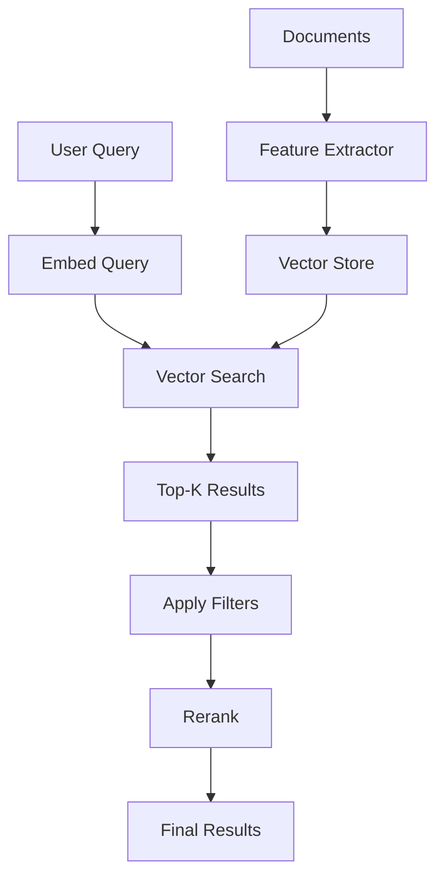

Semantic search goes beyond keyword matching to understand query intent and find conceptually relevant results. This pattern combines dense vector embeddings, sparse representations (BM25), and optional reranking for state-of-the-art retrieval accuracy.

## Why Semantic Search?

Traditional keyword search fails when:
- Queries use different terminology than documents ("car" vs "automobile")
- Users ask questions instead of keywords ("what's the best laptop for coding?")
- Context matters ("jaguar" the animal vs the car brand)
- Multilingual content requires cross-language matching

Semantic search solves these by mapping text to high-dimensional vectors where semantically similar content clusters together, regardless of exact word matches.

## Architecture Overview



## Implementation Steps

### 1. Create a Bucket for Content

```bash
POST /v1/buckets
{
  "bucket_name": "knowledge-base",
  "description": "Product documentation and FAQs",
  "schema": {
    "properties": {
      "title": { "type": "text", "required": true },
      "content": { "type": "text", "required": true },
      "category": { "type": "text" },
      "tags": { "type": "array" },
      "published_at": { "type": "datetime" }
    }
  }
}
```

### 2. Define a Collection with Text Embeddings

```bash
POST /v1/collections
{
  "collection_name": "docs-search",
  "description": "Semantic search over documentation",
  "source": { "type": "bucket", "bucket_id": "bkt_kb" },
  "feature_extractor": {
    "feature_extractor_name": "text_extractor",
    "version": "v1",
    "input_mappings": {
      "text": "content"
    },
    "parameters": {
      "model": "multilingual-e5-large-instruct",
      "chunk_strategy": "sentence",
      "chunk_size": 512,
      "chunk_overlap": 50
    },
    "field_passthrough": [
      { "source_path": "title" },
      { "source_path": "category" },
      { "source_path": "tags" },
      { "source_path": "published_at" }
    ]
  }
}
```

**Chunking Strategies:**
- `sentence` – Split on sentence boundaries (best for Q&A)
- `paragraph` – Preserve larger context (best for long-form content)
- `fixed` – Fixed token windows (predictable chunk sizes)
- `semantic` – Use model to detect topic shifts (experimental)

### 3. Ingest Documents

```bash
POST /v1/buckets/{bucket_id}/objects
{
  "key_prefix": "/docs/api",
  "metadata": {
    "title": "Authentication Guide",
    "content": "Mixpeek uses Bearer token authentication...",
    "category": "getting-started",
    "tags": ["auth", "security", "api-keys"],
    "published_at": "2025-10-01T12:00:00Z"
  }
}
```

For bulk ingestion, use batch operations:

```bash
POST /v1/buckets/{bucket_id}/objects/batch
{
  "objects": [
    { "metadata": {...}, "key_prefix": "/docs/api" },
    { "metadata": {...}, "key_prefix": "/docs/sdk" }
  ]
}
```

### 4. Create a Basic Semantic Retriever

```bash
POST /v1/retrievers
{
  "retriever_name": "docs-semantic-search",
  "collection_ids": ["col_docs"],
  "input_schema": {
    "properties": {
      "query": { "type": "text", "required": true }
    }
  },
  "stages": [
    {
      "stage_name": "knn_search",
      "version": "v1",
      "parameters": {
        "feature_address": "mixpeek://text_extractor@v1/text_embedding",
        "input_mapping": { "text": "query" },
        "limit": 50
      }
    },
    {
      "stage_name": "sort",
      "version": "v1",
      "parameters": {
        "sort_by": [{ "field": "score", "direction": "desc" }]
      }
    }
  ],
  "cache_config": {
    "enabled": true,
    "ttl_seconds": 300
  }
}
```

### 5. Execute Search

```bash
POST /v1/retrievers/{retriever_id}/execute
{
  "inputs": { "query": "how do I authenticate API requests?" },
  "limit": 10,
  "return_urls": false
}
```

**Response:**
```json
{
  "results": [
    {
      "document_id": "doc_auth_guide",
      "score": 0.89,
      "metadata": {
        "title": "Authentication Guide",
        "category": "getting-started",
        "tags": ["auth", "security"]
      }
    }
  ],
  "execution_id": "exec_123",
  "cache_hit": false,
  "stage_statistics": {
    "knn_search": { "duration_ms": 45, "results_count": 50 }
  }
}
```

## Advanced Patterns

### Hybrid Search (Dense + Sparse)

Combine vector embeddings with BM25 keyword matching for best-of-both-worlds:

```bash
{
  "stages": [
    {
      "stage_name": "hybrid_search",
      "version": "v1",
      "parameters": {
        "queries": [
          {
            "feature_address": "mixpeek://text_extractor@v1/text_embedding",
            "input_mapping": { "text": "query" },
            "weight": 0.7
          },
          {
            "feature_address": "mixpeek://text_extractor@v1/bm25_sparse",
            "input_mapping": { "text": "query" },
            "weight": 0.3
          }
        ],
        "fusion_method": "rrf",
        "limit": 50
      }
    }
  ]
}
```

**When to use:**
- Queries mixing natural language + exact terminology ("React hooks API reference")
- Domain-specific jargon where semantics struggle (product SKUs, error codes)
- Multilingual content where BM25 handles exact matches and vectors handle translations

### Filter Before Search (for Efficiency)

Apply structured filters before expensive vector operations:

```bash
{
  "stages": [
    {
      "stage_name": "filter",
      "version": "v1",
      "parameters": {
        "filters": {
          "operator": "and",
          "conditions": [
            {
              "field": "metadata.category",
              "operator": "eq",
              "value": "getting-started"
            },
            {
              "field": "metadata.published_at",
              "operator": "gte",
              "value": "2025-01-01T00:00:00Z"
            }
          ]
        }
      }
    },
    {
      "stage_name": "knn_search",
      "version": "v1",
      "parameters": {
        "feature_address": "mixpeek://text_extractor@v1/text_embedding",
        "input_mapping": { "text": "query" },
        "limit": 50
      }
    }
  ]
}
```

### Rerank with Cross-Encoder

Use a cross-encoder model for final reranking (higher accuracy, slower):

```bash
{
  "stages": [
    {
      "stage_name": "knn_search",
      "version": "v1",
      "parameters": {
        "limit": 100  # Retrieve more candidates
      }
    },
    {
      "stage_name": "rerank",
      "version": "v1",
      "parameters": {
        "model": "cross-encoder/ms-marco-MiniLM-L-12-v2",
        "input_mapping": {
          "query": "query",
          "document": "metadata.content"
        },
        "top_k": 20  # Return top 20 after reranking
      }
    }
  ]
}
```

### Query Expansion

Generate multiple query variations to improve recall:

```bash
{
  "stages": [
    {
      "stage_name": "llm_generation",
      "version": "v1",
      "parameters": {
        "model": "gpt-4o-mini",
        "prompt": "Generate 3 alternative phrasings of this query: {{inputs.query}}",
        "output_format": "json_array"
      }
    },
    {
      "stage_name": "knn_search",
      "version": "v1",
      "parameters": {
        "feature_address": "mixpeek://text_extractor@v1/text_embedding",
        "input_mapping": { "text": "STAGE.llm_generation.expanded_queries" },
        "limit": 50
      }
    }
  ]
}
```

### Feedback Loop with Interactions

Record user interactions to improve relevance over time:

```bash
# User clicks on result
POST /v1/retrievers/{retriever_id}/interactions
{
  "execution_id": "exec_123",
  "document_id": "doc_auth_guide",
  "interaction_type": "click",
  "metadata": {
    "position": 1,
    "query": "how do I authenticate API requests?"
  }
}

# User provides explicit feedback
POST /v1/retrievers/{retriever_id}/interactions
{
  "execution_id": "exec_123",
  "document_id": "doc_auth_guide",
  "interaction_type": "positive_feedback"
}
```

Use signals in analytics:

```bash
GET /v1/analytics/retrievers/{retriever_id}/signals
```

Identify low-CTR queries or high-negative-feedback documents to refine taxonomy mappings or retrain models.

## Chunking Best Practices

| Content Type | Recommended Strategy | Chunk Size | Overlap |
|--------------|---------------------|------------|---------|
| **Technical docs** | `sentence` | 256-512 tokens | 50 tokens |
| **Long-form articles** | `paragraph` | 512-1024 tokens | 100 tokens |
| **FAQs** | `semantic` (detect Q&A boundaries) | Variable | 0 |
| **Code snippets** | `fixed` (preserve syntax) | 256 tokens | 20 tokens |
| **Product descriptions** | `sentence` | 128-256 tokens | 25 tokens |

**General rules:**
- Smaller chunks = better precision, worse recall
- Larger chunks = more context, but noisier matches
- Overlap prevents splitting relevant context across boundaries

## Model Selection

| Model | Latency | Accuracy | Use Case |
|-------|---------|----------|----------|
| **multilingual-e5-base** | Fast | Good | High-volume, cost-sensitive |
| **multilingual-e5-large-instruct** | Medium | Excellent | General-purpose semantic search |
| **bge-large-en-v1.5** | Medium | Excellent | English-only, high accuracy |
| **openai/text-embedding-3-large** | Slow | Best | Premium use cases, multilingual |
| **cohere/embed-english-v3** | Medium | Excellent | Domain-specific fine-tuning |

**Test with your data:**
```bash
POST /v1/retrievers/debug-inference
{
  "model": "multilingual-e5-large-instruct",
  "text": "sample query",
  "return_embedding": true
}
```

## Performance Optimization

### 1. Cache Aggressively

```bash
{
  "cache_config": {
    "enabled": true,
    "ttl_seconds": 600,  # 10 minutes for stable queries
    "cache_stage_names": ["knn_search", "rerank"]  # Only cache expensive stages
  }
}
```

### 2. Tune Limit Values

```bash
# Retrieve more candidates for reranking
{
  "stages": [
    { "stage_name": "knn_search", "parameters": { "limit": 200 } },
    { "stage_name": "rerank", "parameters": { "top_k": 20 } }
  ]
}
```

### 3. Use Pre-Filters

Filter by category, date, or other metadata before vector search to reduce search space.

### 4. Monitor Analytics

```bash
GET /v1/analytics/retrievers/{retriever_id}/performance
GET /v1/analytics/retrievers/{retriever_id}/stages
```

Identify slow stages and optimize (e.g., disable reranking for low-value queries).

## Use Case Examples

<AccordionGroup>
  <Accordion title="Customer Support Knowledge Base">
    Ingest help articles, FAQs, and troubleshooting guides. Use hybrid search to handle both natural language questions ("Why isn't my API key working?") and exact error codes ("401 Unauthorized").
  </Accordion>

  <Accordion title="E-Commerce Product Search">
    Embed product descriptions and use semantic search to match queries like "comfortable running shoes for long distances" to products without exact keyword matches. Add filters for price, brand, and availability.
  </Accordion>

  <Accordion title="Research Paper Discovery">
    Chunk academic papers by section, embed abstracts and full text. Enable researchers to find relevant papers by concept ("neural architecture search for vision transformers") rather than exact citation matching.
  </Accordion>

  <Accordion title="Internal Document Search">
    Index company wikis, Slack archives, and meeting notes. Use namespaces to isolate teams and apply fine-grained access control. Track interactions to surface most-helpful content.
  </Accordion>

  <Accordion title="Legal Document Retrieval">
    Chunk legal contracts and case law. Use reranking to prioritize exact precedent matches. Apply filters for jurisdiction, date ranges, and case types.
  </Accordion>
</AccordionGroup>

## Evaluation & Tuning

### Offline Evaluation

Create a golden dataset with query-document pairs:

```bash
POST /v1/retrievers/{retriever_id}/evaluations
{
  "test_queries": [
    {
      "query": "how to authenticate",
      "relevant_doc_ids": ["doc_auth_guide", "doc_api_keys"]
    }
  ],
  "metrics": ["precision@10", "recall@10", "mrr", "ndcg"]
}
```

### A/B Testing

Create retriever variants and compare:

```bash
# Variant A: Vector-only
POST /v1/retrievers { ... "retriever_name": "search-vector" }

# Variant B: Hybrid
POST /v1/retrievers { ... "retriever_name": "search-hybrid" }
```

Split traffic and monitor:
- Click-through rate (CTR)
- Time to first click
- Zero-result queries
- Negative feedback rate

## Next Steps

- Explore [Retrievers](/retrieval/retrievers) for full stage catalog
- Learn [Filters](/retrieval/filters) syntax for advanced queries
- Review [Interactions](/retrieval/interactions) for tracking user signals
- Check [Feature Extractors](/processing/feature-extractors) for model options

