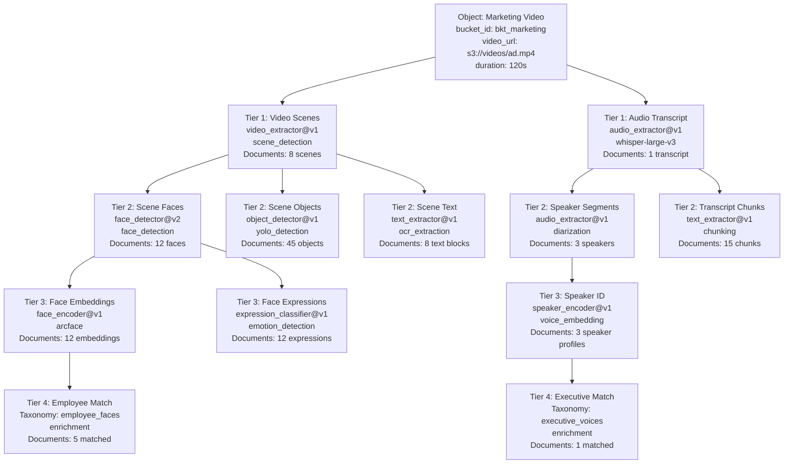

Processing pipelines are simply collections referencing other collections. By setting `source.type` to `"collection"`, you create a tiered DAG that Mixpeek processes in dependency order.

## Tiered DAG Execution

1. API builds a dependency graph when you submit a batch.
2. Ray poller processes Tier 0 collections (bucket sources) in parallel.
3. Once Tier 0 completes, Tier 1 collections (collection sources) execute.
4. The cycle continues until the deepest tier finishes.



Documents at every tier retain `root_object_id`, `source_collection_id`, `source_document_id`, and `lineage_path`, enabling complete traceability back to the original object. The DAG executes in parallel where possible—Tier 1 collections process simultaneously, then all Tier 2 collections execute once their parents complete.

## Configuration Pattern

```json
{
  "collection_name": "video_frames",
  "source": { "type": "bucket", "bucket_id": "bkt_videos" },
  "feature_extractor": {
    "feature_extractor_name": "video_extractor",
    "version": "v1",
    "parameters": { "scene_detection": true }
  }
}
```

```json
{
  "collection_name": "frame_faces",
  "source": { "type": "collection", "collection_id": "col_video_frames" },
  "feature_extractor": {
    "feature_extractor_name": "face_detector",
    "version": "v2",
    "input_mappings": { "image": "frame_image" }
  }
}
```

## Manifest Flattening

When you submit a batch Mixpeek:

1. Flattens objects into per-extractor row artifacts (Parquet).
2. Stores artifacts in S3 (`manifest_key`, `extractor_row_artifacts`).
3. Passes artifact references to Ray jobs for each collection tier.
4. Ensures each extractor processes the correct subset of inputs.

This design allows thousands of objects and multiple collections to be processed efficiently without duplicating raw blobs.

## Enrichment Within Pipelines

- Add taxonomy applications to collections to materialize enrichment immediately after extractor runs.
- Trigger clustering jobs on collection outputs to assign cluster metadata.
- Downstream collections can reference enriched fields from upstream tiers (e.g., taxonomy tags).

## Observability

- `GET /v1/collections/{id}` shows `document_count`, `taxonomy_count`, and `retriever_count`.
- Ray poller logs and task metadata (`/v1/tasks/{task_id}`) capture job IDs and timing.
- Use `/v1/objects/{object_id}/decomposition-tree` to inspect the entire pipeline lineage for a single object.

## Upgrade & Versioning Strategy

- Clone a collection with a new name/version (e.g., `video_frames_v2`) when changing extractors or parameters.
- Update downstream collections to point at the new version.
- Run batches through both versions for A/B testing before deprecating the old one.

## Best Practices

1. Keep each collection focused on a single concern (frame extraction, face detection, embeddings).
2. Use metadata passthrough to share relevant fields between tiers.
3. Submit batches that contain all objects needed for a multi-tier run to avoid partial states.
4. Monitor webhook events to trigger downstream automation once documents land.
5. Use retriever JOIN stages to traverse tiers during query time if you prefer on-demand joins over materialization.

Pipelines give you the freedom to build complex multimodal workflows while keeping each stage modular, observable, and upgradeable.
