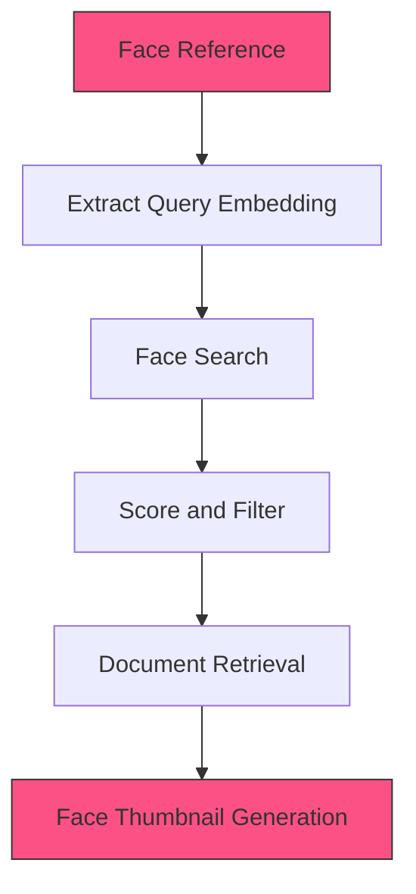

<Note>
  The Face Search retriever stage identifies and retrieves documents containing faces that match a specified reference image or face embedding.
</Note>

## Overview

Face Search uses facial recognition technology to find documents containing specific individuals. It works by comparing face embeddings from a query image or stored reference against faces detected in the document collection. This enables powerful person-specific content retrieval across images and videos.

## Required Inputs

| Parameter | Type | Required | Default | Description |
|-----------|------|----------|---------|-------------|
| face_reference | string/object | Yes | - | Either a URL to a reference image or a face embedding vector |
| k | integer | No | 10 | Number of matching faces to retrieve |
| feature_store_id | string | Yes | - | ID of the feature store containing face embeddings |
| similarity_threshold | float | No | 0.6 | Minimum similarity score for a match (0.0-1.0) |
| include_faces | boolean | No | true | Whether to include face thumbnails in results |

## Configurations

### Reference Types

| Reference Type | Description | Use Case |
|----------------|-------------|----------|
| `image_url` | URL pointing to an image containing a face | When you have a reference photo |
| `face_embedding` | Pre-computed face embedding vector | When face is already enrolled |
| `person_id` | ID of a person in a taxonomy | When person is in a people taxonomy |
| `document_id` | ID of a document with a face to match | When reference is in the collection |

### Match Criteria

| Criterion | Description |
|-----------|-------------|
| `similarity_threshold` | Minimum similarity score (0.0-1.0) for faces to be considered a match |
| `max_faces_per_document` | Maximum number of matched faces to return from a single document |
| `min_face_size` | Minimum size of face (as % of image) to consider |
| `pose_tolerance` | Tolerance for face angle/pose differences |

### Configuration Examples

```json Basic Face Search
{
  "reference_type": "image_url",
  "face_reference": "https://storage.example.com/references/person1.jpg",
  "k": 10,
  "similarity_threshold": 0.65,
  "feature_store_id": "fs_faces_123",
  "include_faces": true
}
```

```json Advanced Configuration
{
  "reference_type": "person_id",
  "face_reference": "person_abc123",
  "taxonomy_id": "tax_people",
  "k": 25,
  "similarity_threshold": 0.7,
  "feature_store_id": "fs_faces_123",
  "include_faces": true,
  "min_face_size": 0.05,
  "max_faces_per_document": 3,
  "pose_tolerance": "medium",
  "collections": ["col_videos", "col_images"]
}
```

### Advanced Options

| Option | Type | Default | Description |
|--------|------|---------|-------------|
| `collections` | array | `[]` | Specific collections to search (empty = all) |
| `pose_tolerance` | string | `"medium"` | Tolerance for pose variation (`"strict"`, `"medium"`, `"relaxed"`) |
| `age_filter` | object | `null` | Filter faces by estimated age range |
| `gender_filter` | string | `null` | Filter faces by detected gender |

## Processing Flow



## Output Schema

```json
{
  "results": [
    {
      "document_id": "doc_abc123",
      "collection_id": "col_videos",
      "face_matches": [
        {
          "face_id": "face_456",
          "similarity": 0.89,
          "bbox": {"x": 0.23, "y": 0.45, "width": 0.12, "height": 0.18},
          "timestamp": 42.5,
          "confidence": 0.97,
          "thumbnail_url": "https://storage.example.com/faces/face_456.jpg",
          "attributes": {
            "estimated_age": 35,
            "gender": "male",
            "expression": "neutral"
          }
        }
      ],
      "metadata": {
        "filename": "board_meeting_2023.mp4",
        "duration": 1825.4
      }
    },
    {
      "document_id": "doc_def456",
      "collection_id": "col_images",
      "face_matches": [
        {
          "face_id": "face_789",
          "similarity": 0.78,
          "bbox": {"x": 0.52, "y": 0.31, "width": 0.15, "height": 0.22},
          "confidence": 0.95,
          "thumbnail_url": "https://storage.example.com/faces/face_789.jpg",
          "attributes": {
            "estimated_age": 36,
            "gender": "male",
            "expression": "smiling"
          }
        }
      ],
      "metadata": {
        "filename": "team_photo_2023.jpg",
        "width": 1920,
        "height": 1080
      }
    }
    // Additional results...
  ],
  "metadata": {
    "reference_type": "image_url",
    "total_matches": 2,
    "processing_time_ms": 124.8,
    "feature_store": "fs_faces_123"
  }
}
``` 