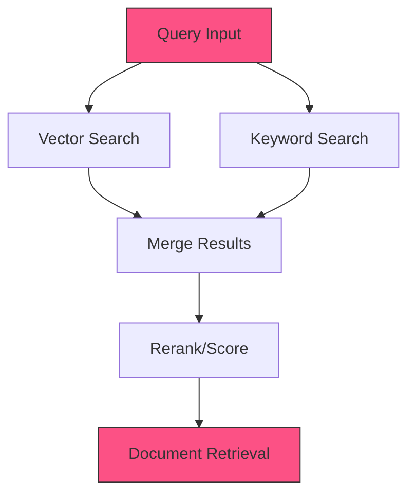

<Note>
  The Hybrid Search retriever stage combines semantic vector search with keyword-based search to balance precision and recall.
</Note>

## Overview

Hybrid Search combines the strengths of both semantic (vector) and lexical (keyword) search methods. This approach leverages vector embeddings for understanding context and meaning, while using keyword matching for precision with specific terms. The combined approach provides more robust search results than either method alone.

## Required Inputs

| Parameter | Type | Required | Default | Description |
|-----------|------|----------|---------|-------------|
| query | string | Yes | - | The search query text |
| k | integer | No | 10 | Number of results to retrieve |
| feature_store_id | string | Yes | - | ID of the feature store containing vector embeddings |
| index_id | string | Yes | - | ID of the keyword index |
| vector_weight | float | No | 0.5 | Weight given to vector search results (0.0-1.0) |
| keyword_weight | float | No | 0.5 | Weight given to keyword search results (0.0-1.0) |

## Configurations

### Search Weighting

The hybrid search combines results from both methods using a weighted approach:

| Parameter | Description | Impact |
|-----------|-------------|--------|
| `vector_weight` | Weight assigned to vector search results | Higher values favor semantic similarity |
| `keyword_weight` | Weight assigned to keyword search results | Higher values favor exact keyword matches |

### Merging Methods

| Method | Description | Use Case |
|--------|-------------|----------|
| `linear_combination` | Weighted average of both search scores | General purpose, balanced approach |
| `reciprocal_rank_fusion` | Combines result rankings rather than scores | When score scales differ significantly |
| `cross_encoder_reranking` | Uses a model to rerank combined results | When highest precision is required |

### Configuration Examples

```json Basic Hybrid Search
{
  "k": 10,
  "vector_weight": 0.6,
  "keyword_weight": 0.4,
  "merging_method": "linear_combination",
  "feature_store_id": "fs_embeddings_123",
  "index_id": "idx_docs_456"
}
```

```json Advanced Configuration
{
  "k": 25,
  "vector_weight": 0.7,
  "keyword_weight": 0.3,
  "merging_method": "cross_encoder_reranking",
  "reranker_model": "mixpeek/reranker-v1",
  "feature_store_id": "fs_embeddings_123",
  "index_id": "idx_docs_456",
  "min_score": 0.2,
  "vector_k": 50,
  "keyword_k": 50
}
```

### Advanced Options

| Option | Type | Default | Description |
|--------|------|---------|-------------|
| `min_score` | float | `0.1` | Minimum combined score threshold for results |
| `vector_k` | integer | `k * 3` | Number of candidates to retrieve from vector search |
| `keyword_k` | integer | `k * 3` | Number of candidates to retrieve from keyword search |
| `reranker_model` | string | `null` | Model identifier for cross-encoder reranking |

## Processing Flow



## Output Schema

```json
{
  "results": [
    {
      "document_id": "doc_abc123",
      "collection_id": "col_xyz789",
      "combined_score": 0.875,
      "vector_score": 0.923,
      "keyword_score": 0.803,
      "metadata": {
        "title": "Hybrid Search Systems",
        "timestamp": "2023-06-12T10:15:43Z"
      },
      "content": "Hybrid search systems combine the strengths of multiple retrieval methods..."
    },
    {
      "document_id": "doc_def456",
      "collection_id": "col_xyz789",
      "combined_score": 0.842,
      "vector_score": 0.791,
      "keyword_score": 0.919,
      "metadata": {
        "title": "Implementing Keyword and Vector Search",
        "timestamp": "2023-07-04T16:30:22Z"
      },
      "content": "When implementing a search system, combining keyword and vector approaches..."
    }
    // Additional results...
  ],
  "metadata": {
    "query": "hybrid search implementation techniques",
    "total_results": 2,
    "processing_time_ms": 38.7,
    "vector_weight": 0.6,
    "keyword_weight": 0.4,
    "merging_method": "linear_combination"
  }
}
``` 