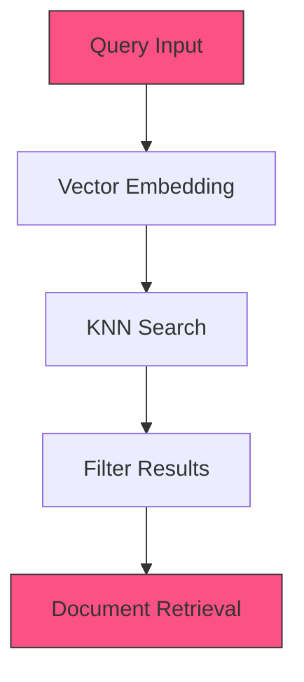

<Note>
  The KNN Search retriever stage performs vector similarity search to find the most semantically similar documents to a query.
</Note>

## Overview

KNN Search utilizes vector embeddings to find documents that are semantically similar to a query. It calculates the distance between the query vector and document vectors in a high-dimensional space, returning the k-nearest neighbors according to the specified distance metric.

## Required Inputs

| Parameter | Type | Required | Default | Description |
|-----------|------|----------|---------|-------------|
| query | string | Yes | - | The search query text that will be converted to a vector embedding |
| k | integer | No | 10 | Number of nearest neighbors to retrieve |
| feature_store_id | string | Yes | - | ID of the feature store containing the vector embeddings |
| distance_metric | string | No | "cosine" | Distance metric for similarity calculation |
| score_threshold | float | No | 0.75 | Minimum similarity score threshold for results |

## Configurations

### Distance Metrics

| Metric | Description | Use Case |
|--------|-------------|----------|
| `cosine` | Measures the cosine of the angle between vectors | Text similarity, general purpose |
| `euclidean` | Computes the Euclidean distance between vectors | Geometric embeddings |
| `dot_product` | Calculates the dot product of vectors | When vectors are normalized |
| `manhattan` | Computes Manhattan (L1) distance | Feature spaces with distinct dimensions |

### Configuration Examples

```json Basic KNN Search
{
  "k": 10,
  "distance_metric": "cosine",
  "score_threshold": 0.75,
  "feature_store_id": "fs_embeddings_123"
}
```

```json Advanced Configuration
{
  "k": 50,
  "distance_metric": "euclidean",
  "score_threshold": 0.6,
  "feature_store_id": "fs_embeddings_123",
  "ef_search": 100,
  "ef_construction": 200,
  "m": 16
}
```

### Performance Tuning

| Option | Type | Default | Description |
|--------|------|---------|-------------|
| `ef_search` | integer | `100` | HNSW index search depth (higher values: more accurate, slower) |
| `ef_construction` | integer | `200` | HNSW index construction parameter (higher values: more accurate index) |
| `m` | integer | `16` | HNSW index maximum number of connections per layer |

## Processing Flow



## Output Schema

```json
{
  "results": [
    {
      "document_id": "doc_abc123",
      "collection_id": "col_xyz789",
      "score": 0.923,
      "distance": 0.077,
      "metadata": {
        "title": "Understanding Vector Search",
        "timestamp": "2023-04-15T14:22:31Z"
      },
      "content": "Vector search is a technique used for finding similar items..."
    },
    {
      "document_id": "doc_def456",
      "collection_id": "col_xyz789",
      "score": 0.897,
      "distance": 0.103,
      "metadata": {
        "title": "Implementing KNN for Document Retrieval",
        "timestamp": "2023-05-02T09:45:12Z"
      },
      "content": "K-nearest neighbors (KNN) is an efficient algorithm for..."
    }
    // Additional results...
  ],
  "metadata": {
    "query": "how does vector search work",
    "total_results": 2,
    "processing_time_ms": 24.5,
    "feature_store": "fs_embeddings_123"
  }
}
``` 