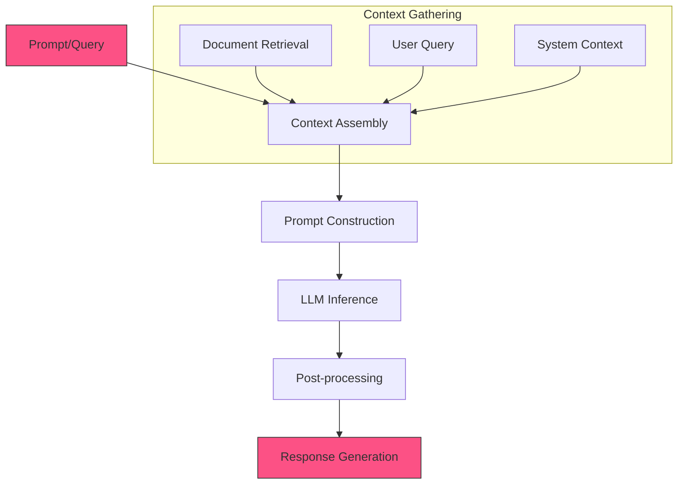

<Note>
  The LLM Generation retriever stage uses large language models to generate new content based on retrieved documents or custom prompts.
</Note>

## Overview

LLM Generation leverages powerful language models to generate content, summarize documents, answer questions, or perform other text-generation tasks as part of a retrieval pipeline. This stage can enhance search results with AI-generated insights, explanations, or transformations of the retrieved content.

## Required Inputs

| Parameter | Type | Required | Default | Description |
|-----------|------|----------|---------|-------------|
| prompt | string | Yes | - | The prompt template or instruction for the LLM |
| documents | array | No | [] | Array of document IDs or content to include in context |
| model | string | No | "mixpeek/llm-v1" | The LLM model to use for generation |
| max_tokens | integer | No | 1024 | Maximum number of tokens to generate |
| temperature | float | No | 0.7 | Temperature for generation (0.0-1.0) |

## Configurations

### Generation Modes

| Mode | Description | Use Case |
|------|-------------|----------|
| `standalone` | Generate content based only on the prompt | Creative content, initial responses |
| `document_context` | Use retrieved documents as context for generation | Question answering, summarization |
| `rag` | Retrieval-Augmented Generation with dynamically retrieved content | Knowledge-intensive tasks |
| `agent` | Run as an agent with tool-use capabilities | Complex reasoning, multi-step tasks |

### Prompt Templates

The system supports various prompt formats and structures:

| Template Type | Description |
|---------------|-------------|
| `simple` | Direct text prompt without special formatting |
| `chat` | JSON array of messages with role and content |
| `jinja2` | Jinja2 template with variables for document content |
| `handlebars` | Handlebars template with document variables |

### Configuration Examples

```json Simple Generation
{
  "mode": "standalone",
  "model": "mixpeek/llm-v1",
  "prompt": "Generate a summary of vector database technology.",
  "max_tokens": 500,
  "temperature": 0.3
}
```

```json RAG Configuration
{
  "mode": "rag",
  "model": "mixpeek/llm-v2",
  "prompt_template": "Answer the following question based on the provided documents:\n\nQuestion: {{query}}\n\nDocuments:\n{{#each documents}}{{content}}\n\n{{/each}}",
  "template_format": "handlebars",
  "retriever_config": {
    "type": "knn_search",
    "k": 5,
    "feature_store_id": "fs_embeddings_123"
  },
  "max_tokens": 1024,
  "temperature": 0.2
}
```

### Model Parameters

| Parameter | Type | Default | Description |
|-----------|------|---------|-------------|
| `temperature` | float | `0.7` | Controls randomness (0.0-1.0) |
| `top_p` | float | `0.95` | Nucleus sampling parameter |
| `top_k` | integer | `50` | Limits vocabulary for next token selection |
| `repetition_penalty` | float | `1.0` | Penalizes repeated tokens |
| `max_tokens` | integer | `1024` | Maximum length of generated text |
| `stop_sequences` | array | `[]` | Sequences that stop generation when encountered |

## Processing Flow



## Output Schema

```json
{
  "generation": {
    "text": "Vector databases are specialized database systems designed to efficiently store and query high-dimensional vectors...",
    "model": "mixpeek/llm-v1",
    "tokens_generated": 487,
    "finish_reason": "length"
  },
  "context": {
    "documents": [
      {
        "document_id": "doc_abc123",
        "collection_id": "col_xyz789",
        "relevance_score": 0.92
      },
      {
        "document_id": "doc_def456",
        "collection_id": "col_xyz789",
        "relevance_score": 0.88
      }
    ],
    "prompt_tokens": 218
  },
  "metadata": {
    "processing_time_ms": 856.2,
    "model_parameters": {
      "temperature": 0.3,
      "max_tokens": 500,
      "top_p": 0.95
    }
  }
}
``` 