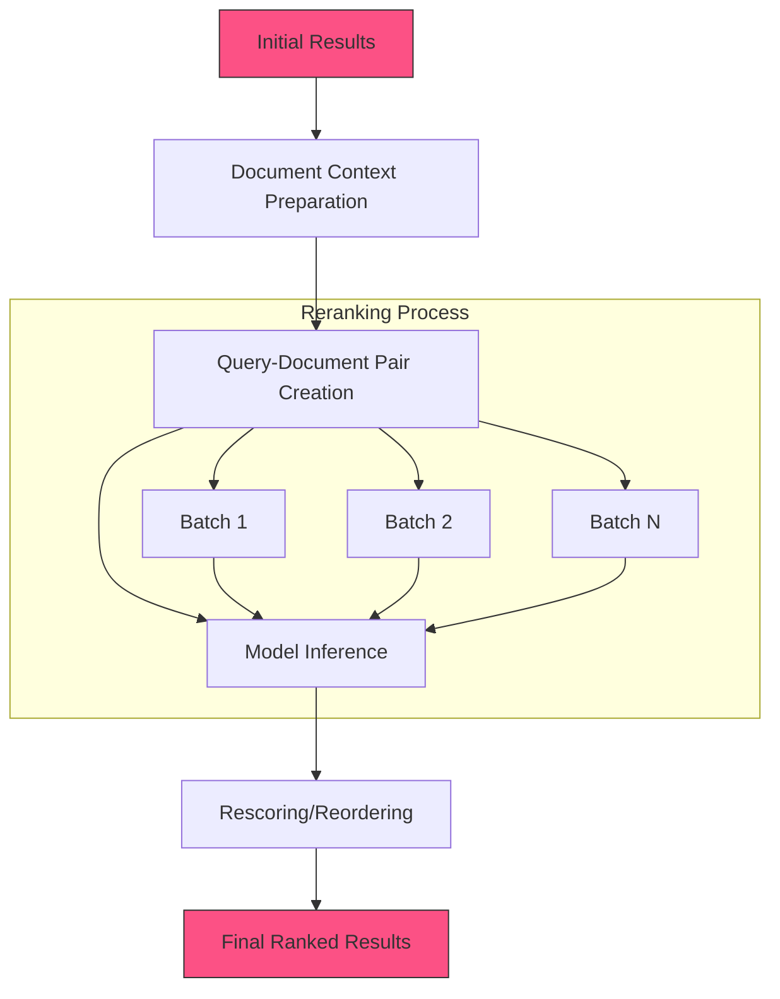

<Note>
  The Reranking stage refines search results by applying more sophisticated scoring models to reorder documents based on their relevance to the query.
</Note>

## Overview

Reranking improves search quality by applying a more computationally intensive model to reorder an initial set of search results. While initial retrieval stages like KNN or keyword search focus on recall (finding potentially relevant documents), reranking focuses on precision (sorting results by true relevance). This two-stage approach balances efficiency with accuracy.

## Required Inputs

| Parameter | Type | Required | Default | Description |
|-----------|------|----------|---------|-------------|
| query | string | Yes | - | The search query text |
| documents | array | Yes | - | Initial set of document IDs or search results to rerank |
| model | string | No | "mixpeek/reranker-v1" | Reranking model to use |
| k | integer | No | 10 | Number of top results to return after reranking |
| score_threshold | float | No | 0.0 | Minimum relevance score threshold for results |

## Configurations

### Reranker Types

| Type | Description | Use Case |
|------|-------------|----------|
| `cross_encoder` | Uses query-document pairs for direct relevance scoring | Highest precision needs |
| `pointwise` | Scores documents individually without comparing them | Faster processing |
| `listwise` | Considers entire result set for optimal ordering | Complex ranking needs |
| `hybrid` | Combines multiple reranking approaches | Balancing precision and recall |

### Model Options

| Model | Description | Strength |
|-------|-------------|----------|
| `mixpeek/reranker-v1` | General-purpose cross-encoder model | Balanced performance |
| `mixpeek/reranker-domain-v1` | Domain-optimized for specific content types | Industry/domain-specific content |
| `mixpeek/reranker-multilingual` | Optimized for cross-language search | Multi-language content |
| `custom` | User-provided custom reranker model | Specialized use cases |

### Configuration Examples

```json Basic Reranking
{
  "model": "mixpeek/reranker-v1",
  "k": 10,
  "reranker_type": "cross_encoder",
  "score_threshold": 0.5
}
```

```json Advanced Configuration
{
  "model": "mixpeek/reranker-domain-v1",
  "k": 25,
  "reranker_type": "hybrid",
  "score_threshold": 0.4,
  "weights": {
    "cross_encoder": 0.7,
    "semantic_similarity": 0.3
  },
  "max_context_length": 512,
  "normalize_scores": true,
  "preserve_original_order_weight": 0.1
}
```

### Advanced Options

| Option | Type | Default | Description |
|--------|------|---------|-------------|
| `max_context_length` | integer | `512` | Maximum token length for document context |
| `normalize_scores` | boolean | `true` | Whether to normalize final scores to 0-1 range |
| `preserve_original_order_weight` | float | `0.0` | Weight given to preserving original result order |
| `batching` | boolean | `true` | Whether to process documents in batches for efficiency |
| `batch_size` | integer | `16` | Number of documents to process in each batch |

## Processing Flow



## Output Schema

```json
{
  "results": [
    {
      "document_id": "doc_abc123",
      "collection_id": "col_xyz789",
      "reranker_score": 0.953,
      "original_score": 0.821,
      "original_rank": 3,
      "metadata": {
        "title": "Advanced Search Result Ranking",
        "timestamp": "2023-05-18T09:12:43Z"
      },
      "content": "Reranking search results is a powerful technique for improving relevance..."
    },
    {
      "document_id": "doc_def456",
      "collection_id": "col_xyz789",
      "reranker_score": 0.891,
      "original_score": 0.865,
      "original_rank": 1,
      "metadata": {
        "title": "Implementing Cross-Encoders for Search",
        "timestamp": "2023-06-02T14:35:22Z"
      },
      "content": "Cross-encoder models evaluate query-document pairs directly, providing more accurate..."
    }
    // Additional results...
  ],
  "metadata": {
    "query": "how to improve search relevance",
    "total_results": 2,
    "original_results_count": 25,
    "processing_time_ms": 205.3,
    "model": "mixpeek/reranker-v1",
    "reranker_type": "cross_encoder"
  }
}
``` 