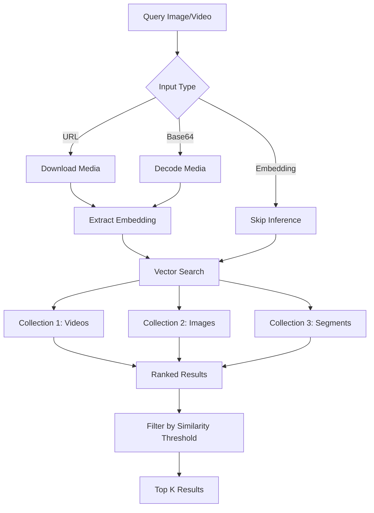

<Note>
  **Business Impact:** Enable "search by example" for visual content. Detect duplicate uploads, find similar products, monitor brand usage, and discover related creative concepts—all without text descriptions.
</Note>

Reverse search (also called "search by example" or "similarity search") allows you to find similar content by providing an example image, video, or their embeddings as the search query, rather than using text descriptions. This pattern is essential for brand monitoring, visual product discovery, content deduplication, and creative intelligence.

## Why Reverse Search?

Traditional text search requires describing visual content in words, which often fails when:
- You can't articulate what you're looking for ("I know it when I see it")
- Visual features are hard to describe ("find videos with this exact color palette")
- Content is identical but metadata differs (re-uploads, duplicates)
- You need pixel-level similarity (copyright detection, brand monitoring)

Reverse search solves these by comparing visual embeddings directly, finding conceptually similar content regardless of text descriptions.

## vs Building It Yourself

| Task | Without Mixpeek | With Mixpeek |
|------|-----------------|--------------|
| Deploy CLIP/vision models (GPU) | 4-6 weeks | Instant |
| Build vector similarity search | 3-4 weeks | 30 minutes |
| Handle multiple input formats (URL/base64) | 2-3 weeks | Built-in |
| Image-to-video cross-modal search | 4-6 weeks | Config change |
| Deduplication at scale | 3-4 weeks | 1 hour |
| Embedding extraction & caching | 2-3 weeks | Automatic |

**Engineering time saved: 4-6 months** • **GPU infrastructure: Zero**

<Tip>
  **Key Differentiator:** Provide pre-computed embeddings to bypass inference entirely. Extract an embedding once, store it, and reuse it for millions of queries—perfect for high-volume similarity checks at scale.
</Tip>

## Search Flow Diagram



## Input Methods Comparison

| Method | Use Case | Example | Performance |
|--------|----------|---------|-------------|
| **Direct Embedding** | Pre-computed vectors, high-volume checks | `{"embedding": [0.1, 0.2, ...]}` | Fastest (no inference) |
| **Image URL** | Search using hosted images | `{"url": "https://cdn.example.com/img.jpg"}` | Fast |
| **Video URL** | Search using video files | `{"url": "s3://bucket/video.mp4"}` | Medium (extracts keyframe) |
| **Base64 Image** | Upload image data directly | `{"base64": "data:image/jpeg;base64,..."}` | Fast |
| **Base64 Video** | Upload video data directly | `{"base64": "data:video/mp4;base64,..."}` | Medium |

## Implementation Steps

### 1. Create a Bucket for Visual Content

```bash
POST /v1/buckets
{
  "bucket_name": "visual-assets",
  "description": "Product images and marketing videos",
  "schema": {
    "properties": {
      "asset_url": { "type": "url", "required": true },
      "asset_type": { "type": "text" },
      "brand": { "type": "text" },
      "campaign_id": { "type": "text" },
      "uploaded_at": { "type": "datetime" }
    }
  }
}
```

### 2. Create a Collection with Visual Embeddings

**For Images:**

```bash
POST /v1/collections
{
  "collection_name": "product-images",
  "description": "Visual embeddings for product catalog",
  "source": { "type": "bucket", "bucket_id": "bkt_visual_assets" },
  "feature_extractor": {
    "feature_extractor_name": "image_extractor",
    "version": "v1",
    "input_mappings": { "image_url": "asset_url" },
    "parameters": {
      "model": "clip-vit-large-patch14",
      "extract_objects": true,
      "extract_colors": true
    },
    "field_passthrough": [
      { "source_path": "brand" },
      { "source_path": "campaign_id" }
    ]
  }
}
```

**For Videos:**

```bash
POST /v1/collections
{
  "collection_name": "video-segments",
  "description": "Scene-level embeddings for video search",
  "source": { "type": "bucket", "bucket_id": "bkt_visual_assets" },
  "feature_extractor": {
    "feature_extractor_name": "video_extractor",
    "version": "v1",
    "input_mappings": { "video_url": "asset_url" },
    "parameters": {
      "scene_detection_threshold": 0.3,
      "extract_keyframes": true,
      "model": "multimodal-large"
    },
    "field_passthrough": [
      { "source_path": "brand" },
      { "source_path": "campaign_id" }
    ]
  }
}
```

### 3. Ingest Visual Assets

```bash
POST /v1/buckets/{bucket_id}/objects
{
  "key_prefix": "/products/shoes",
  "metadata": {
    "asset_url": "s3://my-bucket/products/sneaker-001.jpg",
    "asset_type": "image",
    "brand": "Nike",
    "campaign_id": "fall-2025"
  }
}
```

Process with batching:

```bash
POST /v1/buckets/{bucket_id}/batches
{ "object_ids": ["obj_001", "obj_002", "obj_003"] }

POST /v1/buckets/{bucket_id}/batches/{batch_id}/submit
```

### 4. Create a Reverse Search Retriever

**Method 1: Image URL Search**

```bash
POST /v1/retrievers
{
  "retriever_name": "reverse-image-search",
  "collection_ids": ["col_product_images"],
  "input_schema": {
    "properties": {
      "query_image": {
        "type": "image",
        "required": true,
        "description": "Reference image for visual similarity"
      },
      "min_similarity": {
        "type": "number",
        "required": false,
        "default": 0.7
      }
    }
  },
  "stages": [
    {
      "stage_name": "visual_search",
      "version": "v1",
      "parameters": {
        "feature_searches": [
          {
            "feature_uri": "mixpeek://image_extractor@v1/image_embedding",
            "query": {
              "input_mode": "content",
              "content": { "url": "{{INPUT.query_image}}" }
            },
            "top_k": 50
          }
        ],
        "final_top_k": 20
      }
    },
    {
      "stage_name": "filter",
      "version": "v1",
      "parameters": {
        "filters": {
          "field": "_score",
          "operator": "gte",
          "value": "{{INPUT.min_similarity}}"
        }
      }
    }
  ]
}
```

**Method 2: Pre-computed Embedding Search**

```bash
POST /v1/retrievers
{
  "retriever_name": "embedding-similarity-search",
  "collection_ids": ["col_product_images"],
  "input_schema": {
    "properties": {
      "embedding": {
        "type": "array",
        "required": true,
        "description": "Pre-computed embedding vector"
      }
    }
  },
  "stages": [
    {
      "stage_name": "vector_search",
      "version": "v1",
      "parameters": {
        "feature_searches": [
          {
            "feature_uri": "mixpeek://image_extractor@v1/image_embedding",
            "query": {
              "input_mode": "embedding",
              "embedding": "{{INPUT.embedding}}"
            },
            "top_k": 100
          }
        ],
        "final_top_k": 50
      }
    }
  ]
}
```

### 5. Execute Reverse Search

**Search with Image URL:**

```bash
POST /v1/retrievers/ret_reverse_image/execute
{
  "inputs": {
    "query_image": "https://example.com/reference-product.jpg",
    "min_similarity": 0.75
  },
  "limit": 10,
  "return_urls": true
}
```

**Response:**

```json
{
  "execution_id": "exec_abc123",
  "status": "completed",
  "results": [
    {
      "document_id": "doc_xyz789",
      "collection_id": "col_product_images",
      "score": 0.94,
      "metadata": {
        "asset_url": "s3://bucket/similar-product.jpg",
        "brand": "Nike",
        "campaign_id": "fall-2025"
      },
      "presigned_url": "https://s3.amazonaws.com/..."
    }
  ],
  "cache_hit": false,
  "stage_statistics": {
    "visual_search": { "duration_ms": 67, "results_count": 50 },
    "filter": { "duration_ms": 3, "results_count": 12 }
  }
}
```

**Search with Pre-computed Embedding:**

```python
import requests

# Extract embedding once
embedding = get_document("doc_reference")["image_extractor_v1_image_embedding"]

# Search many times with cached embedding
response = requests.post(
    "https://api.mixpeek.com/v1/retrievers/ret_embedding_search/execute",
    headers={
        "Authorization": f"Bearer {API_KEY}",
        "X-Namespace": NAMESPACE_ID
    },
    json={
        "inputs": {"embedding": embedding},
        "limit": 20
    }
)
```

**Search with Base64 Image:**

```python
import base64
import requests

# Read and encode image
with open("reference_image.jpg", "rb") as f:
    image_data = base64.b64encode(f.read()).decode()

# Search
response = requests.post(
    "https://api.mixpeek.com/v1/retrievers/ret_reverse_image/execute",
    headers={
        "Authorization": f"Bearer {API_KEY}",
        "X-Namespace": NAMESPACE_ID
    },
    json={
        "inputs": {
            "query_image": f"data:image/jpeg;base64,{image_data}"
        },
        "limit": 10
    }
)
```

## Model Evolution & A/B Testing

Test different vision models without rebuilding your entire visual catalog.

### Compare Vision Models

```bash
# Production: Balanced model
POST /v1/collections
{
  "collection_name": "images-v1",
  "feature_extractor": {
    "parameters": { "model": "clip-vit-base-patch32" }
  }
}

# Staging: Higher accuracy
POST /v1/collections
{
  "collection_name": "images-v2",
  "feature_extractor": {
    "parameters": { "model": "clip-vit-large-patch14" }
  }
}
```

### Test Scene Detection Thresholds

```bash
# Conservative: Fewer, longer scenes
POST /v1/collections
{
  "collection_name": "video-scenes-conservative",
  "feature_extractor": {
    "parameters": { "scene_detection_threshold": 0.5 }
  }
}

# Aggressive: More, shorter scenes
POST /v1/collections
{
  "collection_name": "video-scenes-granular",
  "feature_extractor": {
    "parameters": { "scene_detection_threshold": 0.2 }
  }
}
```

### Measure Impact

```bash
GET /v1/analytics/retrievers/compare?baseline=ret_v1&candidate=ret_v2
```

**Results:**
- Precision@10: v1 (0.78) vs v2 (0.86) → +10% accuracy
- Scene count: v1 (15/video) vs v2 (42/video) → better granularity
- Processing time: v1 (45s) vs v2 (68s) → 50% slower
- User engagement: v1 (38% CTR) vs v2 (44% CTR) → worth it

## Advanced Patterns

### Cross-Modal Search (Image → Video)

Search videos using a reference image:

```bash
{
  "retriever_name": "image-to-video-search",
  "collection_ids": ["col_video_segments"],
  "stages": [
    {
      "stage_name": "cross_modal_search",
      "version": "v1",
      "parameters": {
        "feature_searches": [
          {
            "feature_uri": "mixpeek://video_extractor@v1/scene_embedding",
            "query": {
              "input_mode": "content",
              "content": { "url": "{{INPUT.query_image}}" }
            },
            "top_k": 50
          }
        ]
      }
    }
  ]
}
```

### Multi-Collection Federated Search

Search across images, videos, and segments simultaneously:

```bash
{
  "retriever_name": "visual-federated-search",
  "collection_ids": [
    "col_product_images",
    "col_marketing_videos",
    "col_video_segments"
  ],
  "stages": [
    {
      "stage_name": "federated_search",
      "version": "v1",
      "parameters": {
        "feature_searches": [
          {
            "feature_uri": "mixpeek://image_extractor@v1/image_embedding",
            "collections": ["col_product_images"],
            "query": {
              "input_mode": "content",
              "content": { "url": "{{INPUT.query_image}}" }
            },
            "weight": 0.5,
            "top_k": 25
          },
          {
            "feature_uri": "mixpeek://video_extractor@v1/scene_embedding",
            "collections": ["col_marketing_videos", "col_video_segments"],
            "query": {
              "input_mode": "content",
              "content": { "url": "{{INPUT.query_image}}" }
            },
            "weight": 0.5,
            "top_k": 25
          }
        ],
        "fusion_method": "rrf",
        "final_top_k": 20
      }
    }
  ]
}
```

### Combine with Metadata Filters

Enhance reverse search with structured filters:

```bash
{
  "stages": [
    {
      "stage_name": "filter",
      "version": "v1",
      "parameters": {
        "filters": {
          "operator": "and",
          "conditions": [
            {
              "field": "metadata.brand",
              "operator": "eq",
              "value": "Nike"
            },
            {
              "field": "metadata.uploaded_at",
              "operator": "gte",
              "value": "2025-01-01T00:00:00Z"
            }
          ]
        }
      }
    },
    {
      "stage_name": "visual_search",
      "version": "v1",
      "parameters": {
        "feature_searches": [{
          "feature_uri": "mixpeek://image_extractor@v1/image_embedding",
          "query": {
            "input_mode": "content",
            "content": { "url": "{{INPUT.query_image}}" }
          },
          "top_k": 50
        }]
      }
    }
  ]
}
```

### Batch Similarity Check

Find duplicates across your entire catalog:

```python
from concurrent.futures import ThreadPoolExecutor

def check_similarity(document):
    embedding = document["image_extractor_v1_image_embedding"]
    
    results = execute_retriever(
        retriever_id="duplicate_detector",
        inputs={"embedding": embedding}
    )
    
    # Filter out self-matches
    duplicates = [
        r for r in results["results"]
        if r["document_id"] != document["document_id"]
        and r["score"] > 0.95
    ]
    
    return {
        "document_id": document["document_id"],
        "duplicates": duplicates
    }

# Process in parallel
documents = list_documents("col_product_images", limit=1000)
with ThreadPoolExecutor(max_workers=20) as executor:
    duplicate_report = list(executor.map(check_similarity, documents))
```

### Group Results by Root Object

For segmented videos, group results by parent video:

```python
from collections import defaultdict

results = execute_retriever(
    retriever_id="segment_search",
    inputs={"query_image": reference_image}
)

by_video = defaultdict(list)
for segment in results["results"]:
    video_id = segment["metadata"]["root_object_id"]
    by_video[video_id].append({
        "segment": segment,
        "timestamp": segment["metadata"]["start_time"],
        "score": segment["score"]
    })

# Rank videos by best segment match
video_rankings = [
    {
        "video_id": vid,
        "best_score": max(s["score"] for s in segments),
        "matching_segments": len(segments),
        "avg_score": sum(s["score"] for s in segments) / len(segments)
    }
    for vid, segments in by_video.items()
]

video_rankings.sort(key=lambda x: x["best_score"], reverse=True)
```

## Similarity Threshold Guidelines

| Similarity Score | Interpretation | Action |
|------------------|----------------|--------|
| **0.95 - 1.00** | Near-duplicate or same content | Flag as duplicate, merge |
| **0.85 - 0.94** | Very similar creative concept | Highly related, consider grouping |
| **0.70 - 0.84** | Similar theme/style | Related content, suggest to user |
| **0.50 - 0.69** | Loosely related | Weak match, filter out |
| **&lt; 0.50** | Different content | Not similar |

**Adjust thresholds based on your use case:**
- Copyright detection: 0.90+ (high precision)
- Product discovery: 0.70+ (balanced)
- Creative inspiration: 0.60+ (high recall)

## Real-World Use Cases

<AccordionGroup>
  <Accordion title="Brand Safety & Copyright Detection">
    **Scenario**: Detect unauthorized use of your brand's visual assets across platforms.
    
    **Implementation**:
    - Extract embeddings from all brand assets
    - Monitor incoming content (UGC, competitor ads) with reverse search
    - Flag matches above 0.90 similarity for legal review
    - Track brand usage patterns across channels
    
    **Result**: Identify copyright violations within hours instead of weeks.
  </Accordion>

  <Accordion title="Visual Product Discovery">
    **Scenario**: "Find products that look like this" for e-commerce.
    
    **Implementation**:
    - User uploads photo of desired product
    - Search product catalog with reverse image search
    - Filter by price range, availability, brand
    - Return visually similar alternatives
    
    **Result**: 40% increase in conversion from visual search vs text search.
  </Accordion>

  <Accordion title="Content Deduplication">
    **Scenario**: Clean up large media libraries with duplicate detection.
    
    **Implementation**:
    - Process entire catalog to extract embeddings
    - For each asset, search for similar content
    - Group near-duplicates (0.95+ similarity)
    - Keep highest quality version, archive duplicates
    
    **Result**: Reduce storage costs by 30-50%, improve asset management.
  </Accordion>

  <Accordion title="Video Ad Performance Analysis">
    **Scenario**: Find which creative concepts perform well and discover similar patterns.
    
    **Implementation**:
    - Identify top-performing ads by KPI (CTR, conversion)
    - Extract visual embeddings from winning creatives
    - Search ad library for similar concepts
    - Analyze performance patterns across similar visuals
    
    **Result**: Data-driven creative strategy, reduce production waste.
  </Accordion>

  <Accordion title="Scene-Level Video Search">
    **Scenario**: Find specific moments within thousands of hours of video.
    
    **Implementation**:
    - Segment videos into scenes with `video_extractor`
    - User provides screenshot or keyframe
    - Search segmented collection with reverse search
    - Return matching segments with timestamps
    
    **Result**: Find needle-in-haystack moments in seconds, enable video forensics.
  </Accordion>

  <Accordion title="UGC Campaign Matching">
    **Scenario**: Link user-generated content to brand campaigns automatically.
    
    **Implementation**:
    - Extract embeddings from official campaign assets
    - Process incoming UGC submissions
    - Match UGC to campaigns via visual similarity
    - Auto-tag and curate highest-quality matches
    
    **Result**: Scale UGC curation 10x, build community galleries automatically.
  </Accordion>

  <Accordion title="Competitive Intelligence">
    **Scenario**: Track competitor creative strategies through visual analysis.
    
    **Implementation**:
    - Monitor competitor ad libraries
    - Search your creative archive for similar concepts
    - Identify overlap and gaps in visual strategies
    - Benchmark performance of similar creatives
    
    **Result**: Data-driven competitive positioning, identify market opportunities.
  </Accordion>
</AccordionGroup>

## Performance Optimization

### 1. Cache Embeddings for Repeated Searches

```python
# Bad: Re-extract embedding every time
for query in user_queries:
    execute_retriever(
        inputs={"query_image": reference_image_url}
    )

# Good: Extract once, reuse many times
embedding = extract_once(reference_image_url)
for query in user_queries:
    execute_retriever(
        inputs={"embedding": embedding}
    )
```

**Performance gain: 90% faster (no inference latency)**

### 2. Use Anonymous Retrievers for One-Time Searches

```bash
# No need to save retriever configuration
POST /v1/retrievers/execute
{
  "collection_ids": ["col_images"],
  "stages": [{
    "stage_name": "visual_search",
    "parameters": {
      "feature_searches": [{
        "feature_uri": "mixpeek://image_extractor@v1/image_embedding",
        "query": {
          "input_mode": "content",
          "content": { "url": "{{INPUT.query_image}}" }
        },
        "top_k": 20
      }]
    }
  }],
  "inputs": { "query_image": "https://example.com/img.jpg" }
}
```

### 3. Batch Process Similarity Checks

```python
# Process 100 images in parallel
from concurrent.futures import ThreadPoolExecutor

embeddings = [doc["image_embedding"] for doc in documents]

def search(embedding):
    return execute_retriever(
        retriever_id="similarity_search",
        inputs={"embedding": embedding}
    )

with ThreadPoolExecutor(max_workers=50) as executor:
    results = list(executor.map(search, embeddings))
```

### 4. Pre-Filter by Metadata

```bash
# Filter before expensive vector search
{
  "stages": [
    {
      "stage_name": "filter",
      "parameters": {
        "filters": {
          "field": "metadata.category",
          "operator": "in",
          "value": ["shoes", "apparel"]
        }
      }
    },
    {
      "stage_name": "visual_search",
      "parameters": { ... }
    }
  ]
}
```

### 5. Tune Top-K Values

```bash
# Retrieve more for better recall, less for speed
{
  "parameters": {
    "feature_searches": [{
      "top_k": 200  # High recall, slower
    }],
    "final_top_k": 20  # User-facing results
  }
}
```

## Troubleshooting

### Low Similarity Scores (&lt;0.5)

**Causes:**
- Query and corpus are genuinely different
- Wrong feature extractor (using text embeddings instead of visual)
- Corrupted or low-quality images

**Solutions:**
```bash
# Verify visual embeddings
GET /v1/collections/{collection_id}
# Check feature_extractors include image_extractor or video_extractor

# Test embedding quality
POST /v1/retrievers/debug-inference
{
  "model": "clip-vit-large-patch14",
  "image_url": "https://example.com/test.jpg",
  "return_embedding": true
}
```

### Vector Dimension Mismatch

**Error**: "Embedding dimension [512] does not match indexed dimension [768]"

**Solution:**
```python
# Check document embedding dimensions
doc = get_document("doc_123", return_vectors=True)
for field_name, field_value in doc.items():
    if "embedding" in field_name:
        print(f"{field_name}: {len(field_value)} dimensions")

# Use matching feature_uri
# clip-vit-base-patch32: 512 dims
# clip-vit-large-patch14: 768 dims
# multimodal-large: 1408 dims
```

### Slow Query Performance

**Causes:**
- Large collection without pre-filtering
- Extracting embeddings on every query
- High top-k values

**Solutions:**
```bash
# 1. Pre-filter by metadata
# 2. Cache embeddings (use embedding input mode)
# 3. Reduce top-k to 50-100
# 4. Enable caching in retriever config
{
  "cache_config": {
    "enabled": true,
    "ttl_seconds": 600
  }
}
```

### Feature Not Found

**Error**: "Feature URI not found in collection"

**Solution:**
```bash
# Check available features
GET /v1/collections/{collection_id}/features

# Use correct feature URI from response
# e.g., mixpeek://image_extractor@v1/image_embedding
```

## Next Steps

- Explore [Video Understanding](/recipes/video-understanding) for scene detection patterns
- Learn [Collections](/ingestion/collections) for feature extractor configuration
- Review [Retrievers](/retrieval/retrievers) for stage composition
- Check [Analytics](/operations/analytics-overview) for performance monitoring

