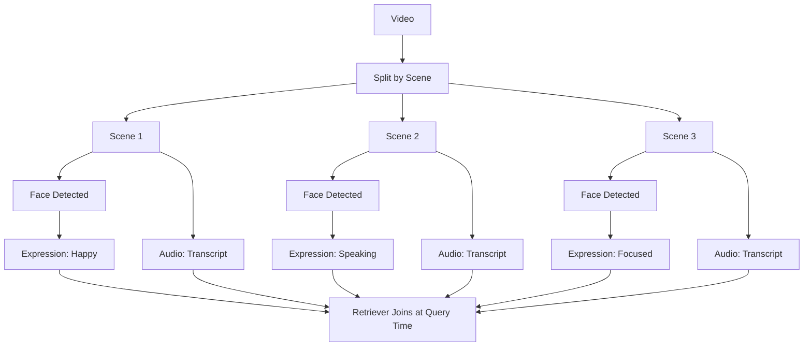

<Note>
  **Business Impact:** Transform hours of video into searchable moments. Find "scenes where someone mentions pricing" across 10,000 videos in milliseconds. Enable visual search, auto-moderation, highlight reels, and compliance monitoring without watching a single frame.
</Note>

Video understanding combines multiple feature extractors to transform raw video files into searchable, analyzable documents. This pattern enables applications like content moderation, highlight generation, video search engines, and automated metadata tagging.

## vs Building It Yourself

| Task | Without Mixpeek | With Mixpeek |
|------|-----------------|--------------|
| Video processing pipeline (FFmpeg, codecs) | 6-8 weeks | Instant |
| GPU cluster for CLIP embeddings | 4-6 weeks | Instant |
| Whisper transcription deployment | 3-4 weeks | Instant |
| Scene detection & keyframe extraction | 4-5 weeks | Config change |
| Multi-modal search (visual + audio) | 6-8 weeks | 1 hour |
| Distributed processing at scale | 8-12 weeks | Built-in |

**Engineering time saved: 6-9 months** • **GPU infrastructure: Zero**

<Tip>
  **Key Differentiator:** Process scenes, audio, faces, and on-screen text in parallel with one API call. Ray handles distribution, GPU scheduling, and retries—you just configure extractors and query results.
</Tip>

## Object Decomposition



## Feature Extractors

| Extractor | Outputs | Use Cases |
|-----------|---------|-----------|
| **video_extractor@v1** | Scene embeddings (CLIP), keyframes, timestamps | Visual search, scene similarity, highlight detection |
| **audio_extractor@v1** | Transcription (Whisper), audio embeddings, speaker diarization | Dialogue search, podcast indexing, accessibility |
| **text_extractor@v1** | Text embeddings (E5), OCR text from frames | On-screen text search, subtitle generation |
| **face_extractor@v1** | Face embeddings (ArcFace), bounding boxes | Character tracking, person search |

## Implementation Steps

### 1. Create a Bucket for Videos

```bash
POST /v1/buckets
{
  "bucket_name": "video-catalog",
  "description": "Video content repository",
  "schema": {
    "properties": {
      "video_url": { "type": "url", "required": true },
      "title": { "type": "text" },
      "category": { "type": "text" },
      "duration_seconds": { "type": "number" }
    }
  }
}
```

### 2. Define Collections for Different Modalities

**Scene-Level Collection:**

```bash
POST /v1/collections
{
  "collection_name": "video-scenes",
  "description": "Visual scene embeddings",
  "source": { "type": "bucket", "bucket_id": "bkt_videos" },
  "feature_extractor": {
    "feature_extractor_name": "video_extractor",
    "version": "v1",
    "input_mappings": { "video_url": "video_url" },
    "parameters": {
      "scene_detection_threshold": 0.3,
      "keyframe_interval": 30,
      "max_scenes": 100
    },
    "field_passthrough": [
      { "source_path": "title" },
      { "source_path": "category" }
    ]
  }
}
```

**Transcript Collection:**

```bash
POST /v1/collections
{
  "collection_name": "video-transcripts",
  "description": "Audio transcription embeddings",
  "source": { "type": "bucket", "bucket_id": "bkt_videos" },
  "feature_extractor": {
    "feature_extractor_name": "audio_extractor",
    "version": "v1",
    "input_mappings": { "audio_url": "video_url" },
    "parameters": {
      "transcription_model": "whisper-large-v3",
      "language": "en",
      "enable_diarization": true
    },
    "field_passthrough": [
      { "source_path": "title" },
      { "source_path": "category" }
    ]
  }
}
```

### 3. Register Video Objects

```bash
POST /v1/buckets/{bucket_id}/objects
{
  "key_prefix": "/marketing/product-demos",
  "metadata": {
    "title": "Product Launch Q4 2025",
    "category": "marketing",
    "duration_seconds": 180
  },
  "blobs": [
    {
      "property": "video_url",
      "type": "video",
      "url": "s3://my-bucket/demos/product-launch.mp4"
    }
  ]
}
```

### 4. Process with Batch

```bash
POST /v1/buckets/{bucket_id}/batches
{ "object_ids": ["obj_video_001"] }

POST /v1/buckets/{bucket_id}/batches/{batch_id}/submit
```

The Engine will:
1. Download the video from S3
2. Run scene detection and extract keyframes
3. Generate CLIP embeddings for each scene
4. Transcribe audio with Whisper
5. Create documents in both collections with lineage references

### 5. Build a Hybrid Retriever

Combine visual and textual search for comprehensive video queries:

```bash
POST /v1/retrievers
{
  "retriever_name": "video-hybrid-search",
  "collection_ids": ["col_video_scenes", "col_video_transcripts"],
  "input_schema": {
    "properties": {
      "query_text": { "type": "text", "required": true },
      "query_image": { "type": "url", "required": false },
      "category": { "type": "text", "required": false }
    }
  },
  "stages": [
    {
      "stage_name": "hybrid_search",
      "version": "v1",
      "parameters": {
        "queries": [
          {
            "feature_address": "mixpeek://video_extractor@v1/scene_embedding",
            "input_mapping": { "image": "query_image" },
            "weight": 0.6
          },
          {
            "feature_address": "mixpeek://audio_extractor@v1/transcript_embedding",
            "input_mapping": { "text": "query_text" },
            "weight": 0.4
          }
        ],
        "fusion_method": "rrf",
        "limit": 20
      }
    },
    {
      "stage_name": "filter",
      "version": "v1",
      "parameters": {
        "filters": {
          "field": "metadata.category",
          "operator": "eq",
          "value": "{{inputs.category}}"
        }
      }
    },
    {
      "stage_name": "sort",
      "version": "v1",
      "parameters": {
        "sort_by": [{ "field": "score", "direction": "desc" }]
      }
    }
  ]
}
```

### 6. Execute Searches

**Text Query:**
```bash
POST /v1/retrievers/{retriever_id}/execute
{
  "inputs": {
    "query_text": "someone explaining product features",
    "category": "marketing"
  },
  "limit": 10,
  "return_urls": true
}
```

**Image Query (find similar scenes):**
```bash
POST /v1/retrievers/{retriever_id}/execute
{
  "inputs": {
    "query_image": "s3://my-bucket/reference-scene.jpg",
    "query_text": "product demonstration"
  },
  "limit": 10
}
```

## Model Evolution & A/B Testing

Test different scene detection thresholds, transcription models, and embedding versions without rebuilding your entire video catalog.

### Test Scene Detection Parameters

```bash
# Production: Conservative scene detection
POST /v1/collections
{
  "collection_name": "video-scenes-v1",
  "feature_extractor": {
    "feature_extractor_name": "video_extractor",
    "parameters": { "scene_detection_threshold": 0.4 }
  }
}

# Staging: More granular scenes
POST /v1/collections
{
  "collection_name": "video-scenes-v2",
  "feature_extractor": {
    "parameters": { "scene_detection_threshold": 0.2 }
  }
}
```

### Compare Transcription Models

```bash
# Baseline: Fast transcription
POST /v1/collections
{
  "collection_name": "video-transcripts-v1",
  "feature_extractor": {
    "feature_extractor_name": "audio_extractor",
    "parameters": { "transcription_model": "whisper-base" }
  }
}

# Candidate: Higher accuracy
POST /v1/collections
{
  "collection_name": "video-transcripts-v2",
  "feature_extractor": {
    "parameters": { "transcription_model": "whisper-large-v3" }
  }
}
```

### Measure Impact

```bash
GET /v1/analytics/retrievers/compare?baseline=ret_v1&candidate=ret_v2
```

**Results:**
- Scenes per video: v1 (12) vs v2 (28) → better granularity
- Transcription accuracy: v1 (92%) vs v2 (97%) → fewer search misses
- Processing cost: v1 (0.05 credits) vs v2 (0.12 credits) → 2.4x cost
- User satisfaction: v1 (3.2/5) vs v2 (4.1/5) → worth the upgrade

### Seamless Migration

```bash
# Point retriever to new collections
PATCH /v1/retrievers/{retriever_id}
{
  "collection_ids": ["col_video_scenes_v2", "col_video_transcripts_v2"]
}
```

**No reprocessing of old videos. New uploads use v2. Gradual rollover.**

## Advanced Patterns

### Highlight Generation

Use clustering to identify key moments:

```bash
POST /v1/clusters
{
  "cluster_name": "video-highlights",
  "collection_id": "col_video_scenes",
  "algorithm": "kmeans",
  "parameters": {
    "n_clusters": 5,
    "feature_address": "mixpeek://video_extractor@v1/scene_embedding"
  }
}
```

Execute clustering to group similar scenes, then select representative keyframes from each cluster.

### Moment-Level Search

Filter by timestamp to find specific segments:

```bash
POST /v1/retrievers/{retriever_id}/execute
{
  "inputs": { "query_text": "product pricing discussion" },
  "filters": {
    "field": "segment_metadata.start_time",
    "operator": "gte",
    "value": 60.0
  }
}
```

### Speaker-Specific Search

If audio extractor enables diarization:

```bash
{
  "filters": {
    "field": "metadata.speaker_id",
    "operator": "eq",
    "value": "SPEAKER_001"
  }
}
```

### Cross-Video Analysis

Search across multiple videos by omitting object-level filters:

```bash
POST /v1/collections/{collection_id}/documents/list
{
  "filters": {
    "field": "metadata.category",
    "operator": "eq",
    "value": "product-demos"
  },
  "limit": 100
}
```

## Output Schema Example

Scene documents produced by `video_extractor@v1`:

```json
{
  "document_id": "doc_scene_123",
  "source_object_id": "obj_video_001",
  "collection_id": "col_video_scenes",
  "metadata": {
    "title": "Product Launch Q4 2025",
    "category": "marketing",
    "scene_index": 3,
    "start_time": 45.2,
    "end_time": 58.7,
    "duration": 13.5,
    "keyframe_url": "s3://my-bucket/keyframes/scene_003.jpg"
  },
  "feature_refs": [
    "mixpeek://video_extractor@v1/scene_embedding"
  ],
  "__fully_enriched": true
}
```

## Performance Considerations

| Optimization | Impact |
|--------------|--------|
| **Scene detection threshold** | Lower = more scenes but slower processing. Tune between 0.2-0.5 |
| **Keyframe interval** | Extract fewer frames (every 60s vs 30s) for faster processing |
| **Max scenes limit** | Cap scenes per video to control document count and cost |
| **Transcription model** | Use `whisper-base` for speed, `whisper-large-v3` for accuracy |
| **Batch size** | Process 10-50 videos per batch for optimal throughput |

## Use Case Examples

<AccordionGroup>
  <Accordion title="Video Search Engine">
    Enable users to search video libraries by text ("find scenes with dogs") or image ("find similar product shots"). Combine `video_extractor` scenes with `audio_extractor` transcripts for comprehensive coverage.
  </Accordion>

  <Accordion title="Content Moderation">
    Use `image_extractor` on keyframes to detect inappropriate content. Filter documents with taxonomy tags like "violence" or "adult_content" and flag for review.
  </Accordion>

  <Accordion title="Automated Captioning">
    Use `audio_extractor` transcripts to generate SRT/VTT caption files. Enrich with `text_extractor` OCR to capture on-screen text not spoken aloud.
  </Accordion>

  <Accordion title="Video Summarization">
    Cluster scenes with `kmeans`, select one keyframe per cluster, and use `llm_generation` stage to create a textual summary based on transcript segments.
  </Accordion>

  <Accordion title="Character Tracking">
    Use `face_extractor` to identify characters across scenes. Group by `face_embedding` to track appearances and generate character timelines.
  </Accordion>
</AccordionGroup>

## Next Steps

- Explore [Feature Extractors](/processing/feature-extractors) for full parameter documentation
- Learn [Hybrid Search](/retrieval/retrievers#hybrid-search) fusion strategies
- Review [Clusters](/enrichment/clusters) for highlight generation workflows
- Check [Batching Best Practices](/processing/batching) for efficient video ingestion

